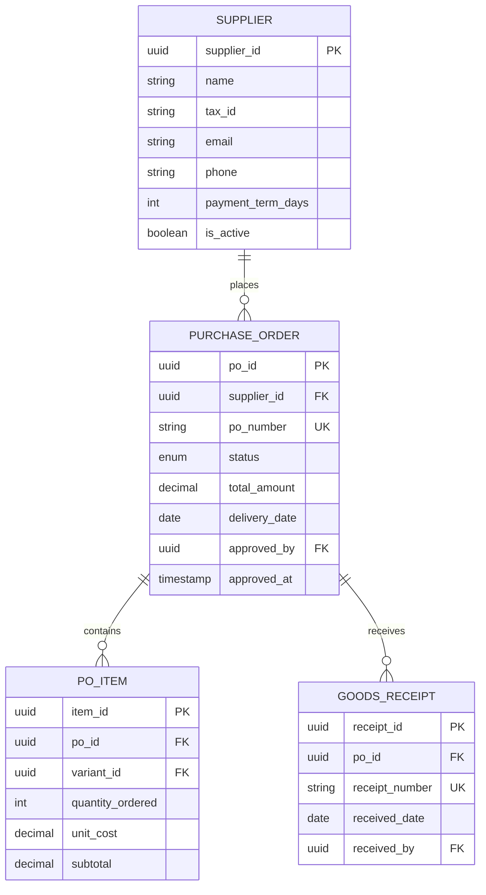

# Modelo de Datos - Procurement Service

## Diagrama ER



## Tablas Principales

### suppliers

```sql
CREATE TABLE suppliers (
    supplier_id UUID PRIMARY KEY,
    organization_id UUID NOT NULL,
    name VARCHAR(255) NOT NULL,
    tax_id VARCHAR(50),
    email VARCHAR(255),
    phone VARCHAR(20),
    payment_term_days INTEGER DEFAULT 30,
    is_active BOOLEAN DEFAULT true,
    notes TEXT,
    created_at TIMESTAMP DEFAULT NOW()
);
```

### purchase_orders

```sql
CREATE TABLE purchase_orders (
    po_id UUID PRIMARY KEY,
    organization_id UUID NOT NULL,
    supplier_id UUID REFERENCES suppliers(supplier_id),
    po_number VARCHAR(50) UNIQUE NOT NULL,
    status VARCHAR(30) DEFAULT 'draft',
    subtotal DECIMAL(12,2) NOT NULL,
    tax_amount DECIMAL(12,2) DEFAULT 0,
    total_amount DECIMAL(12,2) NOT NULL,
    currency VARCHAR(3) DEFAULT 'USD',
    delivery_date DATE,
    notes TEXT,
    approved_by UUID,
    approved_at TIMESTAMP,
    created_at TIMESTAMP DEFAULT NOW(),

    CONSTRAINT check_po_status CHECK (
        status IN ('draft', 'pending_approval', 'approved', 'ordered', 'partially_received', 'received', 'cancelled')
    )
);

CREATE INDEX idx_po_supplier ON purchase_orders(supplier_id);
CREATE INDEX idx_po_status ON purchase_orders(status);
```

### po_items

```sql
CREATE TABLE po_items (
    item_id UUID PRIMARY KEY,
    po_id UUID REFERENCES purchase_orders(po_id) ON DELETE CASCADE,
    variant_id UUID NOT NULL,
    sku VARCHAR(100) NOT NULL,
    product_name VARCHAR(255) NOT NULL,
    quantity_ordered INTEGER NOT NULL CHECK (quantity_ordered > 0),
    quantity_received INTEGER DEFAULT 0,
    unit_cost DECIMAL(12,2) NOT NULL,
    subtotal DECIMAL(12,2) NOT NULL,
    created_at TIMESTAMP DEFAULT NOW()
);

CREATE INDEX idx_po_items_po ON po_items(po_id);
CREATE INDEX idx_po_items_variant ON po_items(variant_id);
```

### goods_receipts

```sql
CREATE TABLE goods_receipts (
    receipt_id UUID PRIMARY KEY,
    organization_id UUID NOT NULL,
    po_id UUID REFERENCES purchase_orders(po_id),
    receipt_number VARCHAR(50) UNIQUE NOT NULL,
    received_date DATE NOT NULL,
    received_by UUID NOT NULL,
    notes TEXT,
    created_at TIMESTAMP DEFAULT NOW()
);

CREATE INDEX idx_gr_po ON goods_receipts(po_id);
```

## Próximos Pasos

- [API Suppliers](./03-api-suppliers.md)
- [API Purchases](./04-api-purchases.md)
