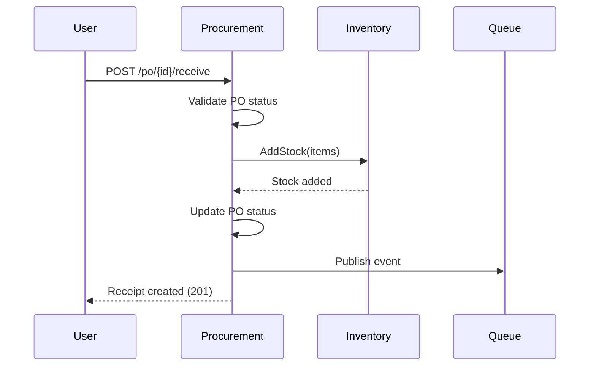

# API de Recepción de Mercancía

```http
POST   /api/v1/goods-receipts
GET    /api/v1/goods-receipts
GET    /api/v1/goods-receipts/{receiptId}
POST   /api/v1/purchase-orders/{poId}/receive
```

## Recibir Mercancía de PO

```http
POST /api/v1/purchase-orders/{poId}/receive
```

**Request:**

```json
{
  "received_date": "2025-12-01",
  "warehouse_id": "wh_101",
  "items": [
    {
      "po_item_id": "item_001",
      "quantity_received": 100,
      "notes": "Todo en buen estado"
    }
  ],
  "notes": "Recibido completo"
}
```

**Response:** `201 Created`

```json
{
  "status": "success",
  "data": {
    "receipt_id": "gr_001",
    "receipt_number": "GR-2025-0001",
    "po_id": "po_001",
    "po_number": "PO-2025-0001",
    "received_date": "2025-12-01",
    "received_by": "user_warehouse",
    "items": [
      {
        "variant_id": "var_789",
        "product_name": "Producto X",
        "quantity_received": 100,
        "quantity_ordered": 100,
        "fully_received": true
      }
    ],
    "inventory_updated": true,
    "created_at": "2025-12-01T09:00:00Z"
  }
}
```

**Flujo:**



## Listar Recepciones

```http
GET /api/v1/goods-receipts?po_id=po_001
```

**Response:** `200 OK`

```json
{
  "status": "success",
  "data": {
    "receipts": [
      {
        "receipt_id": "gr_001",
        "receipt_number": "GR-2025-0001",
        "po_number": "PO-2025-0001",
        "received_date": "2025-12-01",
        "items_count": 1,
        "received_by": "user_warehouse"
      }
    ]
  }
}
```

## Próximos Pasos

- [Eventos Publicados](./06-eventos-publicados.md)
- [Integraciones](./08-integraciones.md)
