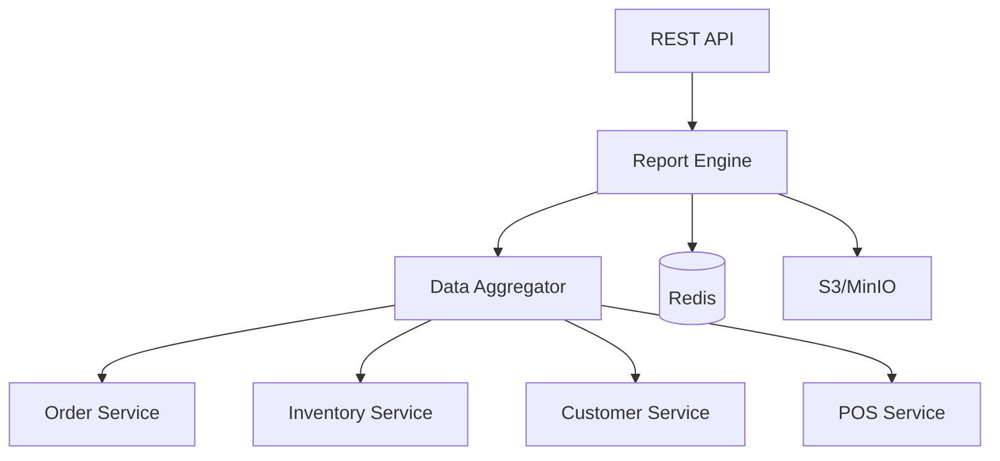

# Overview - Reports Service

## Descripción

El **Reports Service** es el microservicio encargado de generar, gestionar y distribuir reportes analíticos del ERP zenLogic. Consolida información de múltiples servicios para proporcionar insights del negocio.

## Características Principales

- **Reportes Predefinidos**: Ventas, inventario, clientes, finanzas
- **Reportes Personalizados**: Query builder para reportes ad-hoc
- **Exportación**: PDF, Excel, CSV
- **Programación**: Reportes automáticos por email
- **Dashboards**: Visualizaciones interactivas
- **Filtros Avanzados**: Por fecha, local, categoría, cliente
- **Permisos Granulares**: Control de acceso por reporte

## Arquitectura

## Tipos de Reportes

### Ventas
- Ventas por período
- Ventas por cajera/vendedor
- Productos más vendidos
- Análisis de ticket promedio

### Inventario
- Stock actual por local
- Movimientos de inventario
- Productos bajo stock mínimo
- Rotación de inventario

### Clientes
- Clientes por segmento
- Top clientes por compras
- Análisis RFM
- Programa de lealtad

### Financieros
- Cuentas por cobrar
- Cuentas por pagar
- Flujo de caja
- Rentabilidad por producto

## Puerto

- **REST**: 8010

## Próximos Pasos

- [Arquitectura](./01-arquitectura.md)
- [Tipos de Reportes](./05-tipos-reportes.md)
