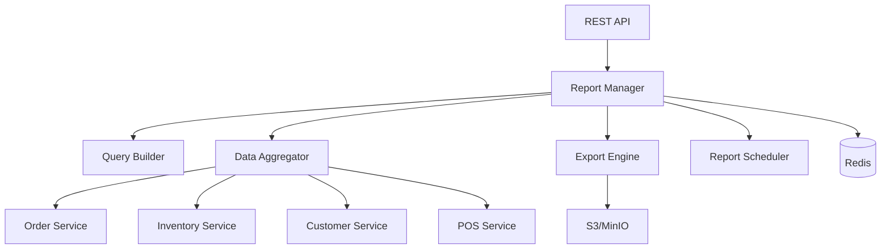

# Arquitectura - Reports Service

## Componentes



## Report Manager

```python
class ReportManager:
    async def generate_report(
        self,
        report_type: str,
        filters: ReportFilters,
        format: str = 'json'
    ) -> Report

    async def schedule_report(
        self,
        report_config: ReportConfig,
        schedule: str  # cron expression
    ) -> ScheduledReport

    async def export_report(
        self,
        report_id: UUID,
        format: str  # 'pdf', 'excel', 'csv'
    ) -> str  # URL del archivo
```

## Data Aggregator

```python
class DataAggregator:
    async def aggregate_sales_data(
        self,
        start_date: date,
        end_date: date,
        group_by: str
    ) -> List[Dict]

    async def aggregate_inventory_data(
        self,
        local_id: Optional[UUID] = None
    ) -> List[Dict]
```

## Próximos Pasos

- [Modelo de Datos](./02-modelo-datos.md)
- [API Reports](./03-api-reports.md)
