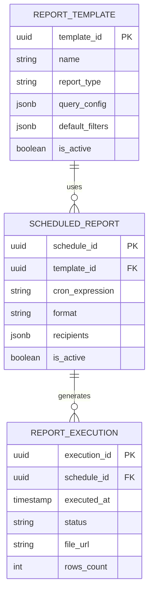

# Modelo de Datos - Reports Service

## Diagrama ER



## Tablas

### report_templates

```sql
CREATE TABLE report_templates (
    template_id UUID PRIMARY KEY,
    organization_id UUID NOT NULL,
    name VARCHAR(255) NOT NULL,
    description TEXT,
    report_type VARCHAR(50) NOT NULL,
    query_config JSONB NOT NULL,
    default_filters JSONB,
    permissions_required VARCHAR(255)[],
    is_active BOOLEAN DEFAULT true,
    created_by UUID,
    created_at TIMESTAMP DEFAULT NOW(),

    CONSTRAINT check_report_type CHECK (
        report_type IN ('sales', 'inventory', 'customers', 'financial', 'custom')
    )
);
```

### scheduled_reports

```sql
CREATE TABLE scheduled_reports (
    schedule_id UUID PRIMARY KEY,
    organization_id UUID NOT NULL,
    template_id UUID REFERENCES report_templates(template_id),
    name VARCHAR(255) NOT NULL,
    cron_expression VARCHAR(100) NOT NULL,
    format VARCHAR(20) DEFAULT 'pdf',
    recipients JSONB NOT NULL,
    is_active BOOLEAN DEFAULT true,
    last_executed_at TIMESTAMP,
    next_execution_at TIMESTAMP,
    created_at TIMESTAMP DEFAULT NOW()
);
```

### report_executions

```sql
CREATE TABLE report_executions (
    execution_id UUID PRIMARY KEY,
    schedule_id UUID REFERENCES scheduled_reports(schedule_id),
    template_id UUID REFERENCES report_templates(template_id),
    executed_at TIMESTAMP DEFAULT NOW(),
    status VARCHAR(30) DEFAULT 'running',
    file_url TEXT,
    file_size_bytes INTEGER,
    rows_count INTEGER,
    execution_time_ms INTEGER,
    error_message TEXT,

    CONSTRAINT check_status CHECK (
        status IN ('running', 'completed', 'failed')
    )
);

CREATE INDEX idx_executions_schedule ON report_executions(schedule_id);
CREATE INDEX idx_executions_executed_at ON report_executions(executed_at DESC);
```

## Próximos Pasos

- [API Reports](./03-api-reports.md)
- [Tipos de Reportes](./05-tipos-reportes.md)
