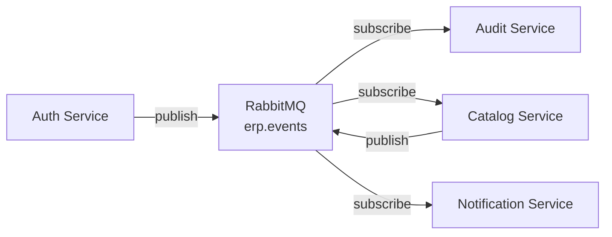

# ADR-003: Arquitectura Event-Driven

**Estado**: Aceptado
**Fecha**: 2025-11-23
**Decisores**: Equipo de Arquitectura zenLogic

## Contexto

zenLogic tiene múltiples microservicios que necesitan comunicarse entre sí:

1. **Auth Service** publica eventos cuando se crea/desactiva un usuario
2. **Catalog Service** necesita reaccionar a cambios en locales (Auth)
3. **Audit Service** registra todos los eventos del sistema
4. **Order Service** (futuro) necesita validar productos del Catalog

### Desafíos

- **Acoplamiento**: Llamadas síncronas crean dependencias fuertes
- **Disponibilidad**: Si Catalog Service cae, ¿Auth Service puede seguir funcionando?
- **Escalabilidad**: Picos de tráfico en un servicio no deben afectar otros
- **Auditoría**: Necesitamos registrar todos los eventos de negocio
- **Eventual Consistency**: Algunos casos aceptan consistencia eventual

### Requisitos

1. Desacoplamiento entre servicios
2. Entrega garantizada de mensajes (at-least-once)
3. Orden de mensajes por entidad
4. Dead Letter Queue para errores
5. Replay de eventos históricos

## Decisión

**Implementaremos arquitectura Event-Driven usando RabbitMQ** como message broker principal.

### Patrón: Topic Exchange

```yaml
Exchange: erp.events (topic)
Routing Key Format: {service}.{entity}.{action}
Examples:
  - auth.user.created
  - auth.user.deactivated
  - catalog.product.created
  - catalog.product.updated
  - catalog.product.deleted
```

### Modelo de Comunicación



## Alternativas Consideradas

### 1. Comunicación REST Síncrona

**Pros**:
- Simple de implementar
- Request/response directo
- Fácil debugging

**Contras**:
- **Acoplamiento fuerte**: Si Catalog cae, Auth no puede publicar eventos relacionados
- **Cascading failures**: Falla en un servicio propaga a todos
- **No retry automático**: Necesitas implementar retry logic
- **No escalabilidad de consumers**: Un solo endpoint procesa todo

**Razón de rechazo**: Crea dependencias fuertes que violan microservices principles.

### 2. Apache Kafka

**Pros**:
- Throughput masivo (millones msg/s)
- Retention persistente (días/semanas)
- Replay de eventos fácil
- Particionamiento para paralelismo

**Contras**:
- **Complejidad operacional alta**: ZooKeeper (o KRaft), partitions, rebalancing
- **Overkill para nuestro caso**: No necesitamos millones msg/s
- **Latencia mayor que RabbitMQ** (optimizado para throughput, no latency)
- **Más recursos**: RAM y disk considerables

**Razón de rechazo**: Over-engineering. RabbitMQ es suficiente para nuestro volumen (`<10k msg/s`).

### 3. AWS SNS/SQS

**Pros**:
- Managed service, no ops
- Escalabilidad automática
- Integración nativa AWS

**Contras**:
- **Vendor lock-in**: Difícil migrar a on-premise
- **Costo**: Pay-per-message puede ser alto
- **Latencia**: Mayor que RabbitMQ on-premise
- **No topic exchange nativo**: SNS→SQS menos flexible

**Razón de rechazo**: Queremos evitar vendor lock-in. RabbitMQ es cloud-agnostic.

### 4. Redis Pub/Sub

**Pros**:
- Extremadamente rápido (latencia `<1ms`)
- Simple de configurar
- Ya usamos Redis para cache

**Contras**:
- **No persistencia**: Si Redis cae, mensajes se pierden
- **No garantía de entrega**: Fire-and-forget
- **No Dead Letter Queue**
- **No message acknowledgment**

**Razón de rechazo**: Crítico que mensajes no se pierdan. Redis Pub/Sub no es confiable.

## Consecuencias

### Positivas

1. **Desacoplamiento Total**
   ```python
   # Auth Service publica evento sin saber quién lo consume
   await event_publisher.publish(
       event_name="auth.user.deactivated",
       data={
           "user_id": user_id,
           "email": user.email,
           "organization_id": org_id
       }
   )
   # Catalog, Audit, Notification consumen independientemente
   ```

2. **Entrega Garantizada (At-Least-Once)**
   ```python
   # Consumer ACK después de procesar
   async def process_message(message):
       try:
           await handle_event(message.body)
           await message.ack()  # Solo ACK si éxito
       except Exception:
           await message.nack(requeue=True)  # Reintenta
   ```

3. **Dead Letter Queue Automático**
   ```python
   # Configuración de queue con DLQ
   await channel.declare_queue(
       "catalog.events",
       arguments={
           "x-dead-letter-exchange": "dlx.events",
           "x-message-ttl": 3600000,  # 1 hora
           "x-max-retries": 3
       }
   )
   ```

4. **Escalabilidad de Consumers**
   ```bash
   # Múltiples consumers de la misma queue
   # RabbitMQ distribuye mensajes (round-robin)
   kubectl scale deployment audit-service --replicas=5
   ```

5. **Routing Flexible**
   ```python
   # Audit Service: todos los eventos
   await queue.bind("erp.events", routing_key="#")

   # Catalog Service: solo eventos de auth.user y auth.local
   await queue.bind("erp.events", routing_key="auth.user.*")
   await queue.bind("erp.events", routing_key="auth.local.*")
   ```

6. **Event Sourcing Simplificado**
   - Audit Service registra todos los eventos
   - Puede reconstruir estado reproduciendo eventos
   - Timeline completo de cada entidad

### Negativas

1. **Eventual Consistency**
   - Evento publicado → consumer procesa después (10-100ms)
   - **Ejemplo problemático**:
     ```python
     # Auth Service desactiva usuario
     user.is_active = False
     await db.commit()
     await publish("auth.user.deactivated", user_id)

     # 50ms después, request a Catalog Service
     # Catalog aún no procesó el evento → ve usuario activo
     ```
   - **Mitigación**:
     - Para casos críticos: validación síncrona vía gRPC
     - Cache con TTL corto (5-10s)
     - UI indica "cambios procesándose"

2. **Debugging Más Complejo**
   - Tracing distribuido requerido
   - No hay stack trace único
   - **Mitigación**:
     - Correlation ID en todos los eventos
     - Distributed tracing (Jaeger/Zipkin)
     - Logs estructurados con correlation_id

3. **Orden de Mensajes No Garantizado (entre queues)**
   - Usuario creado → Usuario actualizado
   - Si van a queues diferentes, pueden procesarse fuera de orden
   - **Mitigación**:
     - Usar routing key consistente por entidad
     - Versioning en eventos (version field)
     - Idempotencia en consumers

4. **Requiere Message Broker Operacional**
   - RabbitMQ debe estar siempre disponible
   - **Mitigación**:
     - RabbitMQ cluster (3 nodos)
     - Health checks y auto-restart
     - Mirrored queues para HA

### Riesgos

1. **Message Broker SPOF (Single Point of Failure)**
   - Si RabbitMQ cae, eventos no se publican
   - **Mitigación**:
     - RabbitMQ cluster con mirrored queues
     - Fallback: escribir eventos en tabla local, replay posterior
     ```python
     try:
         await rabbitmq.publish(event)
     except RabbitMQUnavailable:
         await db.execute("INSERT INTO outbox_events ...")
     ```

2. **Message Loss en Crash**
   - Publicador publica evento → crash antes de ACK
   - **Mitigación**:
     - Persistent messages (delivery_mode=2)
     - Publisher confirms
     ```python
     await channel.confirm_delivery()
     await channel.basic_publish(
         exchange="erp.events",
         routing_key="auth.user.created",
         body=json.dumps(event),
         properties=pika.BasicProperties(delivery_mode=2)  # Persistent
     )
     ```

3. **Duplicate Messages (At-Least-Once)**
   - Consumer procesa mensaje → crash antes de ACK → redelivery
   - **Mitigación**: Idempotencia
     ```python
     async def handle_event(event):
         # Verificar si ya procesamos este event_id
         if await db.exists("processed_events", event["event_id"]):
             logger.info(f"Event {event['event_id']} already processed")
             return

         # Procesar
         await process(event)

         # Registrar como procesado
         await db.insert("processed_events", {"event_id": event["event_id"]})
     ```

4. **Poison Messages**
   - Mensaje mal formado causa excepción → requeue infinito
   - **Mitigación**:
     - Max retries (x-max-retries: 3)
     - Dead Letter Queue
     - Alertas en DLQ no vacía

## Implementación

### Publisher

```python
# app/events/publisher.py
import aio_pika
import json
from datetime import datetime
from app.config import settings

class EventPublisher:
    def __init__(self):
        self.connection = None
        self.channel = None
        self.exchange = None

    async def connect(self):
        self.connection = await aio_pika.connect_robust(settings.rabbitmq_url)
        self.channel = await self.connection.channel()
        self.exchange = await self.channel.declare_exchange(
            "erp.events",
            aio_pika.ExchangeType.TOPIC,
            durable=True
        )

    async def publish(self, event_type: str, data: dict):
        event = {
            "event_id": str(uuid4()),
            "event": event_type,
            "timestamp": datetime.utcnow().isoformat(),
            "service": settings.service_name,
            "version": "1.0",
            "data": data
        }

        message = aio_pika.Message(
            body=json.dumps(event).encode(),
            delivery_mode=aio_pika.DeliveryMode.PERSISTENT,
            content_type="application/json"
        )

        await self.exchange.publish(
            message,
            routing_key=event_type
        )

        logger.info(f"Published event: {event_type}", extra={"event": event})
```

### Consumer

```python
# app/events/consumer.py
import aio_pika
import json
from app.handlers import event_handlers

class EventConsumer:
    def __init__(self, queue_name: str, routing_keys: list):
        self.queue_name = queue_name
        self.routing_keys = routing_keys

    async def start(self):
        connection = await aio_pika.connect_robust(settings.rabbitmq_url)
        channel = await connection.channel()
        await channel.set_qos(prefetch_count=10)

        exchange = await channel.declare_exchange(
            "erp.events",
            aio_pika.ExchangeType.TOPIC
        )

        queue = await channel.declare_queue(
            self.queue_name,
            durable=True,
            arguments={
                "x-dead-letter-exchange": "dlx.events",
                "x-message-ttl": 3600000
            }
        )

        for routing_key in self.routing_keys:
            await queue.bind(exchange, routing_key=routing_key)

        await queue.consume(self.process_message)
        logger.info(f"Consumer started: {self.queue_name}")

    async def process_message(self, message: aio_pika.IncomingMessage):
        async with message.process():
            event_data = json.loads(message.body.decode())
            event_name = event_data["event"]

            handler = event_handlers.get(event_name)
            if handler:
                await handler(event_data)
            else:
                logger.warning(f"No handler for event: {event_name}")
```

## Patrón de Eventos

### Estructura de Evento

```json
{
  "event_id": "550e8400-e29b-41d4-a716-446655440000",
  "event": "catalog.product.created",
  "timestamp": "2025-11-23T10:30:00Z",
  "service": "catalog-service",
  "version": "1.0",
  "organization_id": "org-uuid",
  "data": {
    "product_id": "prod-uuid",
    "name": "Camiseta Básica",
    "sku": "CAM-001",
    "base_price": 19.99,
    "created_by": "user-uuid"
  },
  "metadata": {
    "correlation_id": "req-12345",
    "user_id": "user-uuid",
    "ip_address": "192.168.1.100"
  }
}
```

### Eventos por Servicio

**Auth Service**:
- `auth.user.created`
- `auth.user.updated`
- `auth.user.deactivated`
- `auth.local.created`
- `auth.local.deactivated`
- `auth.role.permissions_changed`

**Catalog Service**:
- `catalog.product.created`
- `catalog.product.updated`
- `catalog.product.deleted`
- `catalog.variant.created`
- `catalog.variant.updated`

## Monitoreo

```python
from prometheus_client import Counter, Histogram

# Métricas
events_published = Counter(
    "events_published_total",
    "Total events published",
    ["service", "event_type"]
)

events_consumed = Counter(
    "events_consumed_total",
    "Total events consumed",
    ["service", "event_type", "status"]
)

event_processing_time = Histogram(
    "event_processing_seconds",
    "Event processing time",
    ["service", "event_type"]
)
```

## Revisión Futura

Este ADR debe revisarse si:

1. Throughput supera 50k msg/s (considerar Kafka)
2. Necesitamos strong consistency (considerar Saga pattern)
3. RabbitMQ ops se vuelve complejo (considerar managed service)

**Fecha de próxima revisión**: 2026-11-23 (1 año)

## Referencias

- [RabbitMQ Documentation](https://www.rabbitmq.com/documentation.html)
- [Enterprise Integration Patterns](https://www.enterpriseintegrationpatterns.com/)
- [Martin Fowler - Event-Driven Architecture](https://martinfowler.com/articles/201701-event-driven.html)

## Próximos Pasos

- [Arquitectura Event-Driven](/arquitectura/arquitectura-event-driven)
- [Catalog Service - Eventos Publicados](/microservicios/catalog-service/eventos-publicados)
- [Catalog Service - Eventos Consumidos](/microservicios/catalog-service/eventos-consumidos)
