# Flujo de Venta Completo

Flujo end-to-end de una venta desde que el cliente agrega productos al carrito hasta la entrega y registro en auditoría.

## Diagrama de Secuencia Completo

```mermaid
sequenceDiagram
    participant Customer
    participant OrderService
    participant CatalogService
    participant InventoryService
    participant PaymentGateway
    participant RabbitMQ
    participant AuditService

    %% Fase 1: Crear Carrito
    Customer->>OrderService: POST /api/carts
    OrderService->>OrderService: Crear cart en DB
    OrderService->>RabbitMQ: Publicar cart.created
    RabbitMQ->>AuditService: Consumir cart.created
    OrderService-->>Customer: 201 {cart_id}

    %% Fase 2: Agregar Items
    Customer->>OrderService: POST /api/carts/{id}/items
    OrderService->>CatalogService: gRPC GetProductDetails(variant_id)
    CatalogService-->>OrderService: {price, sku, name}
    OrderService->>OrderService: Validar precio y disponibilidad
    OrderService->>OrderService: Agregar item a cart
    OrderService->>RabbitMQ: Publicar cart.item_added
    RabbitMQ->>AuditService: Consumir cart.item_added
    OrderService-->>Customer: 200 {cart}

    %% Fase 3: Checkout - Crear Orden
    Customer->>OrderService: POST /api/orders (from cart)
    OrderService->>OrderService: Crear order (status=pending)
    OrderService->>RabbitMQ: Publicar order.created
    RabbitMQ->>AuditService: Consumir order.created
    OrderService-->>Customer: 201 {order_id, order_number}

    %% Fase 4: Reservar Stock
    Customer->>OrderService: POST /api/orders/{id}/place
    OrderService->>InventoryService: gRPC ReserveStock(items, ttl=15min)
    InventoryService->>InventoryService: Verificar disponibilidad
    InventoryService->>InventoryService: Crear reservation (status=active)
    InventoryService->>InventoryService: Actualizar stock (reserved_qty += qty)
    InventoryService->>RabbitMQ: Publicar inventory.stock.reserved
    RabbitMQ->>OrderService: Consumir stock.reserved
    RabbitMQ->>AuditService: Consumir stock.reserved
    InventoryService-->>OrderService: {success, reservation_id, expires_at}

    OrderService->>OrderService: Actualizar order.reservation_id
    OrderService->>OrderService: Programar job release_if_not_paid (15min)
    OrderService->>RabbitMQ: Publicar order.placed
    RabbitMQ->>AuditService: Consumir order.placed
    OrderService-->>Customer: 200 {reservation_id, expires_at}

    %% Fase 5: Procesar Pago
    Customer->>OrderService: POST /api/orders/{id}/payment
    OrderService->>PaymentGateway: Create payment intent
    PaymentGateway-->>OrderService: {payment_intent_id}
    OrderService->>OrderService: Crear payment (status=pending)
    OrderService->>RabbitMQ: Publicar payment.pending
    OrderService-->>Customer: 200 {client_secret}

    Customer->>PaymentGateway: Confirm payment (card details)
    PaymentGateway-->>OrderService: Webhook payment.succeeded
    OrderService->>OrderService: Actualizar payment (status=succeeded)
    OrderService->>RabbitMQ: Publicar payment.succeeded
    RabbitMQ->>AuditService: Consumir payment.succeeded

    %% Fase 6: Confirmar Reserva
    OrderService->>InventoryService: gRPC ConfirmReservation(reservation_id)
    InventoryService->>InventoryService: Actualizar reservation (status=fulfilled)
    InventoryService->>RabbitMQ: Publicar inventory.reservation.confirmed
    RabbitMQ->>AuditService: Consumir reservation.confirmed
    InventoryService-->>OrderService: {success}

    %% Fase 7: Confirmar Orden
    OrderService->>OrderService: Actualizar order (status=confirmed)
    OrderService->>RabbitMQ: Publicar order.confirmed
    RabbitMQ->>AuditService: Consumir order.confirmed
    OrderService-->>Customer: 200 {order confirmed}

    %% Fase 8: Fulfillment
    OrderService->>OrderService: Crear fulfillment_task (status=pending)
    OrderService->>RabbitMQ: Publicar fulfillment.started

    Note over OrderService: Warehouse picks items
    OrderService->>OrderService: Actualizar task (status=in_progress)
    OrderService->>RabbitMQ: Publicar fulfillment.item_picked

    Note over OrderService: Warehouse packs order
    OrderService->>OrderService: Actualizar task (status=completed)
    OrderService->>RabbitMQ: Publicar fulfillment.packed

    %% Fase 9: Crear Envío
    OrderService->>OrderService: Crear shipment (status=pending)
    OrderService->>OrderService: Generate shipping label
    OrderService->>RabbitMQ: Publicar shipment.label_created
    OrderService->>OrderService: Actualizar order (status=shipped)

    %% Fase 10: Despachar y Deducir Stock
    OrderService->>RabbitMQ: Publicar order.shipped
    RabbitMQ->>InventoryService: Consumir order.shipped
    InventoryService->>InventoryService: Deducir stock final (reserved -= qty, total -= qty)
    InventoryService->>InventoryService: Crear stock_movement (type=out)
    InventoryService->>RabbitMQ: Publicar inventory.stock.deducted
    RabbitMQ->>AuditService: Consumir order.shipped
    RabbitMQ->>AuditService: Consumir stock.deducted
    OrderService-->>Customer: Notification: Order shipped

    %% Fase 11: Entrega
    Note over Customer: Carrier delivers package
    OrderService->>OrderService: Actualizar order (status=delivered)
    OrderService->>RabbitMQ: Publicar order.delivered
    RabbitMQ->>AuditService: Consumir order.delivered
    OrderService-->>Customer: Notification: Order delivered
```



## Fases del Flujo

### Fase 1: Creación de Carrito

**Endpoint**: `POST /api/v1/carts`

**Request**:
```json
{
  "customer_id": "cust_789",
  "local_id": "local_101"
}
```

**Response**:
```json
{
  "cart_id": "cart_123",
  "customer_id": "cust_789",
  "items": [],
  "subtotal": 0.00,
  "created_at": "2025-11-23T14:00:00Z"
}
```

**Evento Publicado**:
```json
{
  "event": "cart.created",
  "version": "1.0",
  "timestamp": "2025-11-23T14:00:00Z",
  "organization_id": "org_123",
  "data": {
    "cart_id": "cart_123",
    "customer_id": "cust_789",
    "session_id": "sess_456",
    "organization_id": "org_123"
  }
}
```

### Fase 2: Agregar Items al Carrito

**Endpoint**: `POST /api/v1/carts/{cart_id}/items`

**Request**:
```json
{
  "variant_id": "var_789",
  "quantity": 2
}
```

**Integraciones**:
1. Order Service llama a Catalog Service vía gRPC:
   ```python
   catalog_client = CatalogClient()
   product_details = await catalog_client.get_product_details(
       product_id=variant.product_id,
       organization_id=org_id,
       include_variants=True
   )
   ```

2. Order Service valida precio y stock disponible

**Response**:
```json
{
  "cart_id": "cart_123",
  "items": [
    {
      "cart_item_id": "item_456",
      "variant_id": "var_789",
      "sku": "TSH-RED-M",
      "name": "Camiseta Roja - M",
      "quantity": 2,
      "unit_price": 24.99,
      "subtotal": 49.98
    }
  ],
  "subtotal": 49.98,
  "updated_at": "2025-11-23T14:05:00Z"
}
```

### Fase 3: Crear Orden desde Carrito

**Endpoint**: `POST /api/v1/orders`

**Request**:
```json
{
  "cart_id": "cart_123",
  "shipping_address": {
    "street": "123 Main St",
    "city": "New York",
    "state": "NY",
    "zip": "10001",
    "country": "US"
  },
  "billing_address": { /* same structure */ }
}
```

**Proceso Interno**:
1. Validar que cart existe y tiene items
2. Calcular totales (subtotal, tax, shipping)
3. Crear orden con status=`pending`
4. Copiar cart_items a order_items
5. Publicar evento `order.created`

**Response**:
```json
{
  "order_id": "order_456",
  "order_number": "ORD-2025-0001",
  "status": "pending",
  "total_amount": 54.98,
  "created_at": "2025-11-23T14:10:00Z"
}
```

### Fase 4: Colocar Orden (Place Order) - Reserva de Stock

**Endpoint**: `POST /api/v1/orders/{order_id}/place`

**Proceso Crítico**:

1. **Order Service → Inventory Service (gRPC)**:
   ```python
   inventory_client = InventoryClient()
   reservation = await inventory_client.reserve_stock(
       organization_id=org_id,
       order_id=order_id,
       items=[
           {"variant_id": "var_789", "quantity": 2, "preferred_warehouse_id": "wh_101"}
       ],
       ttl_minutes=15
   )
   ```

2. **Inventory Service verifica y reserva**:
   ```sql
   -- Verificar disponibilidad
   SELECT available_quantity
   FROM stock
   WHERE variant_id = 'var_789'
     AND warehouse_id = 'wh_101'
     AND available_quantity >= 2
   FOR UPDATE;  -- Lock pesimista

   -- Actualizar stock
   UPDATE stock
   SET reserved_quantity = reserved_quantity + 2,
       available_quantity = available_quantity - 2,
       version = version + 1
   WHERE stock_id = 'stock_123'
     AND version = {current_version};  -- Optimistic locking
   ```

3. **Crear reserva con TTL**:
   ```sql
   INSERT INTO stock_reservations (
       reservation_id, organization_id, order_id,
       status, expires_at
   ) VALUES (
       gen_random_uuid(), 'org_123', 'order_456',
       'active', NOW() + INTERVAL '15 minutes'
   );
   ```

4. **Publicar evento**:
   ```json
   {
     "event": "inventory.stock.reserved",
     "data": {
       "reservation_id": "res_123",
       "order_id": "order_456",
       "items": [
         {"variant_id": "var_789", "quantity": 2, "warehouse_id": "wh_101"}
       ],
       "expires_at": "2025-11-23T14:25:00Z"
     }
   }
   ```

5. **Order Service consume evento y actualiza**:
   ```python
   async def handle_stock_reserved(event):
       order = await order_repo.get_by_id(event['data']['order_id'])
       order.reservation_id = event['data']['reservation_id']
       await order_repo.update(order)

       # Programar job para liberar si no se paga
       await scheduler.schedule_at(
           event['data']['expires_at'],
           task='release_reservation_if_not_paid',
           args={'order_id': order.order_id, 'reservation_id': order.reservation_id}
       )
   ```

**Response**:
```json
{
  "success": true,
  "reservation_id": "res_123",
  "expires_at": "2025-11-23T14:25:00Z",
  "message": "Stock reserved for 15 minutes"
}
```

### Fase 5: Procesar Pago

**Endpoint**: `POST /api/v1/orders/{order_id}/payments`

**Request**:
```json
{
  "payment_method": "stripe",
  "payment_method_id": "pm_123abc"
}
```

**Proceso**:

1. **Crear Payment Intent en Stripe**:
   ```python
   import stripe

   payment_intent = stripe.PaymentIntent.create(
       amount=int(order.total_amount * 100),  # centavos
       currency="usd",
       payment_method=payment_method_id,
       confirm=True,
       metadata={
           "order_id": str(order.order_id),
           "order_number": order.order_number
       }
   )
   ```

2. **Guardar en DB**:
   ```sql
   INSERT INTO payments (
       payment_id, order_id, amount, status,
       payment_method, gateway_payment_id
   ) VALUES (
       gen_random_uuid(), 'order_456', 54.98, 'pending',
       'stripe', 'pi_123abc'
   );
   ```

3. **Webhook de Stripe** (cuando pago se completa):
   ```python
   @app.post("/webhooks/stripe")
   async def stripe_webhook(request: Request):
       payload = await request.body()
       sig_header = request.headers.get('stripe-signature')

       event = stripe.Webhook.construct_event(
           payload, sig_header, webhook_secret
       )

       if event['type'] == 'payment_intent.succeeded':
           payment_intent = event['data']['object']
           order_id = payment_intent['metadata']['order_id']

           # Actualizar payment
           await payment_repo.update_status(
               gateway_payment_id=payment_intent['id'],
               status='succeeded'
           )

           # Publicar evento
           await event_publisher.publish(
               event_name="payment.succeeded",
               data={
                   "payment_id": payment.payment_id,
                   "order_id": order_id,
                   "amount": payment_intent['amount'] / 100
               }
           )
   ```

**Response**:
```json
{
  "payment_id": "pay_123",
  "status": "succeeded",
  "amount": 54.98,
  "paid_at": "2025-11-23T14:15:00Z"
}
```

### Fase 6: Confirmar Reserva en Inventory

**Proceso Automático** (disparado por `payment.succeeded`):

```python
async def handle_payment_succeeded(event):
    """Handler en Order Service."""
    order_id = event['data']['order_id']
    order = await order_repo.get_by_id(order_id)

    # Confirmar reserva en Inventory
    inventory_client = InventoryClient()
    await inventory_client.confirm_reservation(
        reservation_id=order.reservation_id,
        organization_id=order.organization_id
    )
```

**En Inventory Service**:
```python
async def ConfirmReservation(self, request, context):
    """Confirmar reserva - stock ya está reservado."""
    reservation = await reservation_repo.get_by_id(request.reservation_id)

    if reservation.status != 'active':
        raise ValueError(f"Reservation {reservation_id} is not active")

    # Marcar como fulfilled
    reservation.status = 'fulfilled'
    reservation.fulfilled_at = datetime.utcnow()
    await reservation_repo.update(reservation)

    # Publicar evento
    await event_publisher.publish(
        event_name="inventory.reservation.confirmed",
        data={
            "reservation_id": str(reservation.reservation_id),
            "order_id": str(reservation.order_id)
        }
    )

    return ConfirmReservationResponse(success=True)
```

### Fase 7: Confirmar Orden

**Proceso Automático** (después de confirmar reserva):

```python
async def handle_reservation_confirmed(event):
    """Handler en Order Service."""
    order_id = event['data']['order_id']

    # Actualizar orden
    order = await order_repo.get_by_id(order_id)
    order.status = 'confirmed'
    order.confirmed_at = datetime.utcnow()
    await order_repo.update(order)

    # Publicar evento
    await event_publisher.publish(
        event_name="order.confirmed",
        data={
            "order_id": str(order.order_id),
            "order_number": order.order_number,
            "reservation_id": str(order.reservation_id),
            "confirmed_at": order.confirmed_at.isoformat()
        }
    )

    # Notificar cliente
    await notification_service.send_email(
        to=order.customer_email,
        template="order_confirmed",
        data={"order_number": order.order_number}
    )
```

### Fase 8: Fulfillment (Picking y Packing)

**Proceso en Warehouse**:

1. **Crear tarea de picking**:
   ```python
   fulfillment_task = await fulfillment_repo.create(
       order_id=order.order_id,
       warehouse_id=order.warehouse_id,
       task_type='picking',
       status='pending',
       items_total=len(order.items)
   )
   ```

2. **Asignar a trabajador**:
   ```python
   # Endpoint: PUT /api/fulfillment/tasks/{task_id}/assign
   task.assigned_to = worker_id
   task.status = 'in_progress'
   task.started_at = datetime.utcnow()
   ```

3. **Marcar items como picked**:
   ```python
   # Endpoint: POST /api/fulfillment/tasks/{task_id}/pick-item
   task.items_picked += 1

   await event_publisher.publish(
       event_type="fulfillment.item_picked",
       data={
           "order_id": str(order.order_id),
           "variant_id": variant_id,
           "picked_by": worker_id
       }
   )
   ```

4. **Completar packing**:
   ```python
   task.status = 'completed'
   task.completed_at = datetime.utcnow()

   await event_publisher.publish(
       event_type="fulfillment.packed",
       data={"order_id": str(order.order_id)}
   )
   ```

### Fase 9: Crear Envío y Generar Label

```python
async def create_shipment(order_id: str):
    """Crear envío para orden confirmada."""
    order = await order_repo.get_by_id(order_id)

    # Crear shipment
    shipment = await shipment_repo.create(
        order_id=order.order_id,
        carrier='fedex',
        service_type='ground',
        from_address=warehouse.address,
        to_address=order.shipping_address
    )

    # Generar shipping label via carrier API
    label = await fedex_client.create_shipment(
        shipment_id=str(shipment.shipment_id),
        from_address=warehouse.address,
        to_address=order.shipping_address,
        weight=calculate_weight(order.items),
        dimensions=calculate_dimensions(order.items)
    )

    shipment.tracking_number = label.tracking_number
    shipment.label_url = label.label_url
    await shipment_repo.update(shipment)

    # Publicar evento
    await event_publisher.publish(
        event_type="shipment.label_created",
        data={
            "shipment_id": str(shipment.shipment_id),
            "tracking_number": label.tracking_number,
            "label_url": label.label_url
        }
    )
```

### Fase 10: Despachar Orden - Deducción Final de Stock

**Endpoint**: `POST /api/v1/shipments/{shipment_id}/dispatch`

**Proceso**:

1. **Order Service marca como shipped**:
   ```python
   shipment.status = 'dispatched'
   shipment.shipped_at = datetime.utcnow()

   order.status = 'shipped'
   await order_repo.update(order)

   # Publicar evento con items despachados
   await event_publisher.publish(
       event_type="order.shipped",
       data={
           "order_id": str(order.order_id),
           "shipment_id": str(shipment.shipment_id),
           "tracking_number": shipment.tracking_number,
           "shipped_items": [
               {
                   "variant_id": str(item.variant_id),
                   "quantity": item.quantity,
                   "warehouse_id": str(order.warehouse_id)
               }
               for item in order.items
           ]
       }
   )
   ```

2. **Inventory Service consume `order.shipped` y deduce stock**:
   ```python
   async def handle_order_shipped(event):
       """Deducir stock cuando orden se despacha."""
       shipped_items = event['data']['shipped_items']

       for item in shipped_items:
           stock = await stock_repo.get_by_variant_warehouse(
               variant_id=item['variant_id'],
               warehouse_id=item['warehouse_id']
           )

           # Deducir de reserved y total
           stock.reserved_quantity -= item['quantity']
           stock.total_quantity -= item['quantity']
           stock.version += 1
           stock.last_movement_at = datetime.utcnow()

           await stock_repo.update(stock)

           # Registrar movimiento
           await movement_repo.create(
               stock_id=stock.stock_id,
               type='out',
               quantity_before=stock.total_quantity + item['quantity'],
               quantity_after=stock.total_quantity,
               quantity_change=-item['quantity'],
               reason='sale',
               reference_id=event['data']['order_id'],
               reference_type='order'
           )

       # Publicar evento
       await event_publisher.publish(
           event_type="inventory.stock.deducted",
           data={
               "order_id": event['data']['order_id'],
               "items": shipped_items
           }
       )
   ```

### Fase 11: Entrega

**Webhook de Carrier** (FedEx, UPS, etc.):

```python
@app.post("/webhooks/fedex/tracking")
async def fedex_tracking_webhook(request: Request):
    """Recibir eventos de tracking del carrier."""
    payload = await request.json()

    if payload['event_type'] == 'delivered':
        tracking_number = payload['tracking_number']

        shipment = await shipment_repo.get_by_tracking(tracking_number)
        order = await order_repo.get_by_id(shipment.order_id)

        # Actualizar estado
        shipment.status = 'delivered'
        order.status = 'delivered'
        order.delivered_at = payload['delivered_at']

        await shipment_repo.update(shipment)
        await order_repo.update(order)

        # Crear tracking event
        await tracking_event_repo.create(
            shipment_id=shipment.shipment_id,
            status='delivered',
            location=payload['location'],
            event_timestamp=payload['delivered_at']
        )

        # Publicar evento
        await event_publisher.publish(
            event_type="order.delivered",
            data={
                "order_id": str(order.order_id),
                "delivered_at": payload['delivered_at'],
                "signature": payload.get('signature')
            }
        )
```

## Escenarios de Error

### 1. Stock Insuficiente durante Reserva

```python
# En Inventory Service - ReserveStock RPC
if stock.available_quantity < requested_quantity:
    return ReserveStockResponse(
        success=False,
        message=f"Insufficient stock. Available: {stock.available_quantity}, Requested: {requested_quantity}"
    )
```

**Manejo en Order Service**:
```python
try:
    reservation = await inventory_client.reserve_stock(...)
    if not reservation.success:
        # Marcar orden como failed
        order.status = 'insufficient_stock'
        await order_repo.update(order)

        # Notificar cliente
        raise HTTPException(
            status_code=409,
            detail=reservation.message
        )
except grpc.RpcError as e:
    logger.error(f"gRPC error reserving stock: {e}")
    raise HTTPException(status_code=503, detail="Inventory service unavailable")
```

### 2. Pago Fallido

```python
# Webhook de Stripe - payment_intent.payment_failed
if event['type'] == 'payment_intent.payment_failed':
    payment = await payment_repo.get_by_gateway_id(payment_intent['id'])
    order = await order_repo.get_by_id(payment.order_id)

    # Actualizar payment
    payment.status = 'failed'
    payment.error_code = payment_intent['last_payment_error']['code']
    payment.error_message = payment_intent['last_payment_error']['message']

    # Liberar reserva
    await inventory_client.release_reservation(order.reservation_id)

    # Actualizar orden
    order.status = 'payment_failed'

    # Publicar eventos
    await event_publisher.publish("payment.failed", {...})
```

### 3. Reserva Expirada (TTL)

**Job Programado** (se ejecuta después de 15 minutos):

```python
async def release_expired_reservation(order_id: str, reservation_id: str):
    """Liberar reserva si orden no fue pagada."""
    order = await order_repo.get_by_id(order_id)

    # Si ya fue confirmada, no hacer nada
    if order.status in ['confirmed', 'processing', 'shipped']:
        logger.info(f"Order {order_id} already confirmed, skipping release")
        return

    # Liberar reserva
    await inventory_client.release_reservation(reservation_id)

    # Marcar orden como expirada
    order.status = 'reservation_expired'
    await order_repo.update(order)

    # Notificar cliente
    await notification_service.send_email(
        to=order.customer_email,
        template="reservation_expired",
        data={"order_number": order.order_number}
    )
```

**En Inventory Service**:
```python
async def ReleaseReservation(self, request, context):
    """Liberar stock reservado."""
    reservation = await reservation_repo.get_by_id(request.reservation_id)

    if reservation.status != 'active':
        return ReleaseReservationResponse(
            success=False,
            message="Reservation already processed"
        )

    # Obtener items de la reserva
    items = await reservation_item_repo.get_by_reservation(reservation.reservation_id)

    for item in items:
        stock = await stock_repo.get_by_id(item.stock_id)

        # Devolver a available
        stock.reserved_quantity -= item.quantity
        stock.available_quantity += item.quantity
        stock.version += 1

        await stock_repo.update(stock)

    # Marcar como cancelada
    reservation.status = 'cancelled'
    await reservation_repo.update(reservation)

    # Publicar evento
    await event_publisher.publish(
        event_type="inventory.reservation.released",
        data={"reservation_id": str(reservation.reservation_id)}
    )

    return ReleaseReservationResponse(success=True)
```

## Métricas y Monitoreo

### Métricas Clave

```python
# Order Service
order_conversion_rate = Gauge('order_conversion_rate', 'Cart to order conversion')
reservation_expiry_rate = Counter('reservation_expiry_total', 'Reservations that expired')
payment_success_rate = Gauge('payment_success_rate', 'Payment success rate')

# Inventory Service
stock_reservation_duration = Histogram('stock_reservation_duration_seconds', 'Time stock is reserved')
stock_deduction_latency = Histogram('stock_deduction_latency_seconds', 'Stock deduction latency')
low_stock_alerts = Counter('low_stock_alerts_total', 'Low stock alerts', ['variant_id'])
```

### Logs Estructurados

```python
logger.info(
    "Order placed successfully",
    extra={
        "order_id": str(order.order_id),
        "order_number": order.order_number,
        "reservation_id": str(reservation.reservation_id),
        "customer_id": str(order.customer_id),
        "total_amount": float(order.total_amount),
        "items_count": len(order.items)
    }
)
```

## SLAs

- **Reserva de Stock**: < 500ms (p95)
- **Confirmación de Pago**: < 2s (p95)
- **Deducción de Stock**: < 1s (p95)
- **TTL de Reserva**: 15 minutos
- **Tiempo de Fulfillment**: < 24 horas (target)

## Próximos Pasos

- [Flujo de Devoluciones](./flujo-devoluciones)
- [Flujo de Compras](./flujo-compras)
- [Sistema de Pagos](./sistema-pagos)
