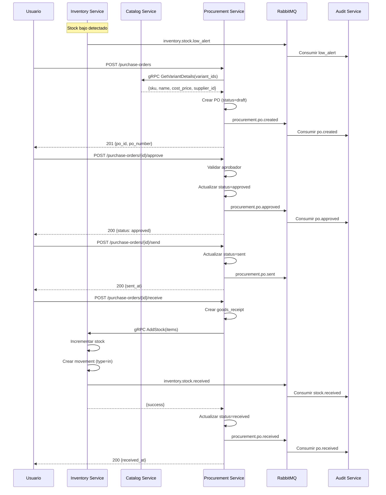
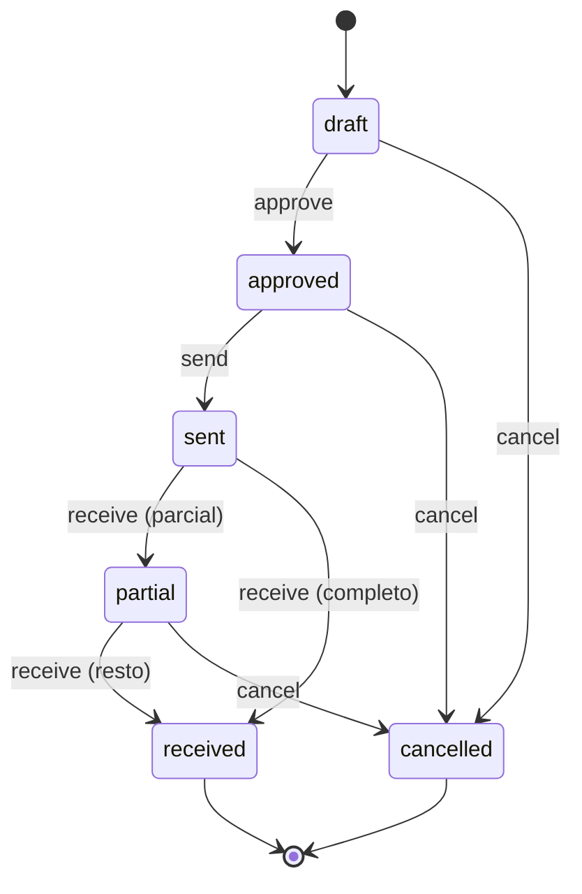

# Flujo de Compras (Procurement)

Flujo de adquisición de productos desde la solicitud hasta la recepción en inventario.

## Diagrama de Secuencia



## Servicios Involucrados

| Servicio | Responsabilidad |
|----------|----------------|
| **Catalog Service** | Información de productos, SKUs, proveedores sugeridos |
| **Inventory Service** | Alertas de stock bajo, recepción de mercancía |
| **Procurement Service** | Gestión de órdenes de compra |
| **Audit Service** | Registro de todos los eventos |

## Modelo de Datos - Procurement Service

### Tablas Principales

```sql
-- Proveedores
CREATE TABLE suppliers (
    id UUID PRIMARY KEY DEFAULT gen_random_uuid(),
    organization_id UUID NOT NULL,
    name VARCHAR(200) NOT NULL,
    code VARCHAR(50) NOT NULL,
    contact_name VARCHAR(100),
    email VARCHAR(255),
    phone VARCHAR(50),
    address TEXT,
    payment_terms VARCHAR(100),  -- 'net_30', 'net_60', 'cod'
    status VARCHAR(20) DEFAULT 'active',
    created_at TIMESTAMP DEFAULT NOW(),
    updated_at TIMESTAMP DEFAULT NOW(),

    CONSTRAINT uk_supplier_code UNIQUE (organization_id, code)
);

-- Órdenes de Compra
CREATE TABLE purchase_orders (
    id UUID PRIMARY KEY DEFAULT gen_random_uuid(),
    organization_id UUID NOT NULL,
    warehouse_id UUID NOT NULL,          -- Warehouse destino
    po_number VARCHAR(50) NOT NULL,      -- PO-2025-0001
    supplier_id UUID NOT NULL,
    status VARCHAR(20) DEFAULT 'draft',  -- draft, approved, sent, partial, received, cancelled

    subtotal DECIMAL(12,2) NOT NULL DEFAULT 0,
    tax_amount DECIMAL(12,2) DEFAULT 0,
    shipping_cost DECIMAL(12,2) DEFAULT 0,
    total_amount DECIMAL(12,2) NOT NULL DEFAULT 0,

    expected_date DATE,                  -- Fecha esperada de llegada
    notes TEXT,

    created_by UUID NOT NULL,
    approved_by UUID,
    approved_at TIMESTAMP,
    sent_at TIMESTAMP,
    received_at TIMESTAMP,
    created_at TIMESTAMP DEFAULT NOW(),
    updated_at TIMESTAMP DEFAULT NOW(),

    CONSTRAINT fk_po_org FOREIGN KEY (organization_id) REFERENCES organizations(id),
    CONSTRAINT fk_po_supplier FOREIGN KEY (supplier_id) REFERENCES suppliers(id),
    CONSTRAINT uk_po_number UNIQUE (organization_id, po_number)
);

-- Items de la Orden de Compra
CREATE TABLE purchase_order_items (
    id UUID PRIMARY KEY DEFAULT gen_random_uuid(),
    purchase_order_id UUID NOT NULL,
    variant_id UUID NOT NULL,            -- Referencia a Catalog
    sku VARCHAR(100) NOT NULL,
    name VARCHAR(255) NOT NULL,

    quantity_ordered INT NOT NULL,
    quantity_received INT DEFAULT 0,
    unit_cost DECIMAL(10,2) NOT NULL,
    total_cost DECIMAL(12,2) NOT NULL,

    CONSTRAINT fk_poi_po FOREIGN KEY (purchase_order_id) REFERENCES purchase_orders(id) ON DELETE CASCADE,
    CONSTRAINT chk_qty_positive CHECK (quantity_ordered > 0)
);

-- Recepciones de Mercancía
CREATE TABLE goods_receipts (
    id UUID PRIMARY KEY DEFAULT gen_random_uuid(),
    organization_id UUID NOT NULL,
    purchase_order_id UUID NOT NULL,
    warehouse_id UUID NOT NULL,
    receipt_number VARCHAR(50) NOT NULL,  -- GR-2025-0001

    received_by UUID NOT NULL,
    received_at TIMESTAMP DEFAULT NOW(),
    notes TEXT,

    CONSTRAINT fk_gr_po FOREIGN KEY (purchase_order_id) REFERENCES purchase_orders(id),
    CONSTRAINT uk_gr_number UNIQUE (organization_id, receipt_number)
);

-- Items Recibidos
CREATE TABLE goods_receipt_items (
    id UUID PRIMARY KEY DEFAULT gen_random_uuid(),
    goods_receipt_id UUID NOT NULL,
    po_item_id UUID NOT NULL,
    variant_id UUID NOT NULL,

    quantity_received INT NOT NULL,
    condition VARCHAR(20) DEFAULT 'good',  -- good, damaged, returned
    lot_number VARCHAR(100),
    expiry_date DATE,
    notes TEXT,

    CONSTRAINT fk_gri_gr FOREIGN KEY (goods_receipt_id) REFERENCES goods_receipts(id) ON DELETE CASCADE,
    CONSTRAINT fk_gri_poi FOREIGN KEY (po_item_id) REFERENCES purchase_order_items(id)
);

-- Índices
CREATE INDEX idx_po_org ON purchase_orders(organization_id);
CREATE INDEX idx_po_status ON purchase_orders(status);
CREATE INDEX idx_po_supplier ON purchase_orders(supplier_id);
CREATE INDEX idx_poi_variant ON purchase_order_items(variant_id);
CREATE INDEX idx_gr_po ON goods_receipts(purchase_order_id);
```

## Fase 1: Alerta de Stock Bajo

### Trigger en Inventory Service

```python
async def check_and_alert_low_stock(
    org_id: str,
    variant_id: str,
    warehouse_id: str,
    current_quantity: int,
    min_stock: int
):
    """Verificar si stock está bajo el mínimo y alertar."""
    if current_quantity <= min_stock:
        await event_publisher.publish(
            event_name="inventory.stock.low_alert",
            data={
                "organization_id": org_id,
                "variant_id": variant_id,
                "warehouse_id": warehouse_id,
                "current_quantity": current_quantity,
                "min_stock": min_stock,
                "severity": "warning" if current_quantity > 0 else "critical"
            }
        )
```

### Evento Publicado

```json
{
    "event": "inventory.stock.low_alert",
    "timestamp": "2025-11-24T10:00:00Z",
    "service": "inventory-service",
    "version": "1.0",
    "organization_id": "org_123",
    "data": {
        "variant_id": "var_456",
        "warehouse_id": "wh_01",
        "current_quantity": 15,
        "min_stock": 20,
        "severity": "warning"
    }
}
```

## Fase 2: Crear Orden de Compra

### Endpoint

```
POST /api/v1/purchase-orders
```

### Request

```json
{
    "warehouse_id": "wh_01",
    "supplier_id": "sup_123",
    "expected_date": "2025-12-01",
    "items": [
        {
            "variant_id": "var_456",
            "quantity": 100,
            "unit_cost": 15.00
        },
        {
            "variant_id": "var_789",
            "quantity": 50,
            "unit_cost": 25.00
        }
    ],
    "notes": "Reposición mensual"
}
```

### Proceso

```python
@router.post("/purchase-orders")
async def create_purchase_order(
    po_data: PurchaseOrderCreate,
    ctx: TenantContext = Depends(get_tenant_context)
) -> PurchaseOrderResponse:
    # 1. Obtener info de variantes desde Catalog
    variants_info = await catalog_client.get_variants_details(
        org_id=ctx.organization_id,
        variant_ids=[item.variant_id for item in po_data.items]
    )

    # 2. Generar número de PO
    po_number = await generate_po_number(ctx.organization_id)

    # 3. Crear PO
    po = PurchaseOrder(
        organization_id=ctx.organization_id,
        warehouse_id=po_data.warehouse_id,
        po_number=po_number,
        supplier_id=po_data.supplier_id,
        status="draft",
        expected_date=po_data.expected_date,
        notes=po_data.notes,
        created_by=ctx.user_id
    )

    # 4. Crear items
    subtotal = Decimal("0")
    for item_data in po_data.items:
        variant = variants_info[item_data.variant_id]
        total_cost = item_data.quantity * item_data.unit_cost
        subtotal += total_cost

        po_item = PurchaseOrderItem(
            purchase_order_id=po.id,
            variant_id=item_data.variant_id,
            sku=variant.sku,
            name=variant.name,
            quantity_ordered=item_data.quantity,
            unit_cost=item_data.unit_cost,
            total_cost=total_cost
        )
        po.items.append(po_item)

    # 5. Calcular totales
    po.subtotal = subtotal
    po.tax_amount = subtotal * Decimal("0.12")  # 12% IVA
    po.total_amount = po.subtotal + po.tax_amount

    # 6. Guardar
    await db.add(po)
    await db.commit()

    # 7. Publicar evento
    await event_publisher.publish(
        event_name="procurement.po.created",
        data={
            "po_id": str(po.id),
            "po_number": po.po_number,
            "supplier_id": str(po.supplier_id),
            "warehouse_id": str(po.warehouse_id),
            "total_amount": float(po.total_amount),
            "items_count": len(po.items)
        }
    )

    return PurchaseOrderResponse.from_orm(po)
```

### Response

```json
{
    "id": "po_123",
    "po_number": "PO-2025-0001",
    "status": "draft",
    "supplier": {
        "id": "sup_123",
        "name": "Proveedor ABC"
    },
    "warehouse_id": "wh_01",
    "items": [
        {
            "variant_id": "var_456",
            "sku": "CAFE-GRANO-KG",
            "name": "Café en Grano 1kg",
            "quantity_ordered": 100,
            "quantity_received": 0,
            "unit_cost": 15.00,
            "total_cost": 1500.00
        }
    ],
    "subtotal": 2750.00,
    "tax_amount": 330.00,
    "total_amount": 3080.00,
    "expected_date": "2025-12-01",
    "created_at": "2025-11-24T10:30:00Z"
}
```

## Fase 3: Aprobar Orden de Compra

### Endpoint

```
POST /api/v1/purchase-orders/{po_id}/approve
```

### Proceso

```python
@router.post("/purchase-orders/{po_id}/approve")
async def approve_purchase_order(
    po_id: str,
    ctx: TenantContext = Depends(get_tenant_context)
) -> PurchaseOrderResponse:
    # 1. Obtener PO
    po = await po_repo.get_by_id(ctx.organization_id, po_id)

    if po.status != "draft":
        raise HTTPException(400, f"PO cannot be approved from status: {po.status}")

    # 2. Verificar permisos de aprobación
    if not await can_approve_po(ctx.user_id, po.total_amount):
        raise HTTPException(403, "User not authorized to approve this amount")

    # 3. Actualizar
    po.status = "approved"
    po.approved_by = ctx.user_id
    po.approved_at = datetime.utcnow()

    await po_repo.update(po)

    # 4. Publicar evento
    await event_publisher.publish(
        event_name="procurement.po.approved",
        data={
            "po_id": str(po.id),
            "po_number": po.po_number,
            "approved_by": str(ctx.user_id),
            "total_amount": float(po.total_amount)
        }
    )

    return PurchaseOrderResponse.from_orm(po)
```

## Fase 4: Enviar a Proveedor

### Endpoint

```
POST /api/v1/purchase-orders/{po_id}/send
```

Este paso es informativo - marca que la PO fue enviada al proveedor (por email, fax, etc.)

```python
@router.post("/purchase-orders/{po_id}/send")
async def send_purchase_order(
    po_id: str,
    ctx: TenantContext = Depends(get_tenant_context)
) -> PurchaseOrderResponse:
    po = await po_repo.get_by_id(ctx.organization_id, po_id)

    if po.status != "approved":
        raise HTTPException(400, "PO must be approved before sending")

    po.status = "sent"
    po.sent_at = datetime.utcnow()

    await po_repo.update(po)

    await event_publisher.publish(
        event_name="procurement.po.sent",
        data={
            "po_id": str(po.id),
            "po_number": po.po_number,
            "supplier_id": str(po.supplier_id),
            "sent_at": po.sent_at.isoformat()
        }
    )

    return PurchaseOrderResponse.from_orm(po)
```

## Fase 5: Recepción de Mercancía

### Endpoint

```
POST /api/v1/purchase-orders/{po_id}/receive
```

### Request

```json
{
    "items": [
        {
            "po_item_id": "poi_001",
            "quantity_received": 100,
            "condition": "good",
            "lot_number": "LOT-2025-001",
            "expiry_date": "2026-06-30"
        },
        {
            "po_item_id": "poi_002",
            "quantity_received": 45,
            "condition": "good"
        },
        {
            "po_item_id": "poi_002",
            "quantity_received": 5,
            "condition": "damaged",
            "notes": "Empaque roto"
        }
    ],
    "notes": "Recibido completo excepto 5 unidades dañadas"
}
```

### Proceso

```python
@router.post("/purchase-orders/{po_id}/receive")
async def receive_goods(
    po_id: str,
    receipt_data: GoodsReceiptCreate,
    ctx: TenantContext = Depends(get_tenant_context)
) -> GoodsReceiptResponse:
    # 1. Obtener PO
    po = await po_repo.get_by_id_with_items(ctx.organization_id, po_id)

    if po.status not in ["sent", "partial"]:
        raise HTTPException(400, f"Cannot receive goods for PO in status: {po.status}")

    # 2. Generar número de recepción
    receipt_number = await generate_receipt_number(ctx.organization_id)

    # 3. Crear recepción
    receipt = GoodsReceipt(
        organization_id=ctx.organization_id,
        purchase_order_id=po.id,
        warehouse_id=po.warehouse_id,
        receipt_number=receipt_number,
        received_by=ctx.user_id,
        notes=receipt_data.notes
    )

    # 4. Procesar items y actualizar inventario
    items_to_add = []
    for item_data in receipt_data.items:
        po_item = next(i for i in po.items if str(i.id) == item_data.po_item_id)

        # Crear item de recepción
        receipt_item = GoodsReceiptItem(
            goods_receipt_id=receipt.id,
            po_item_id=po_item.id,
            variant_id=po_item.variant_id,
            quantity_received=item_data.quantity_received,
            condition=item_data.condition,
            lot_number=item_data.lot_number,
            expiry_date=item_data.expiry_date,
            notes=item_data.notes
        )
        receipt.items.append(receipt_item)

        # Actualizar cantidad recibida en PO item
        po_item.quantity_received += item_data.quantity_received

        # Solo agregar a inventario items en buena condición
        if item_data.condition == "good":
            items_to_add.append({
                "variant_id": str(po_item.variant_id),
                "quantity": item_data.quantity_received,
                "lot_number": item_data.lot_number,
                "expiry_date": item_data.expiry_date,
                "cost_price": float(po_item.unit_cost)
            })

    # 5. Agregar stock via gRPC
    if items_to_add:
        await inventory_client.add_stock(
            org_id=ctx.organization_id,
            warehouse_id=str(po.warehouse_id),
            items=items_to_add,
            reference_type="purchase_order",
            reference_id=str(po.id)
        )

    # 6. Actualizar status de PO
    total_ordered = sum(i.quantity_ordered for i in po.items)
    total_received = sum(i.quantity_received for i in po.items)

    if total_received >= total_ordered:
        po.status = "received"
        po.received_at = datetime.utcnow()
    else:
        po.status = "partial"

    # 7. Guardar
    await db.add(receipt)
    await po_repo.update(po)
    await db.commit()

    # 8. Publicar eventos
    await event_publisher.publish(
        event_name="procurement.goods.received",
        data={
            "receipt_id": str(receipt.id),
            "receipt_number": receipt.receipt_number,
            "po_id": str(po.id),
            "po_number": po.po_number,
            "warehouse_id": str(po.warehouse_id),
            "items": [
                {
                    "variant_id": str(i.variant_id),
                    "quantity": i.quantity_received,
                    "condition": i.condition
                }
                for i in receipt.items
            ]
        }
    )

    return GoodsReceiptResponse.from_orm(receipt)
```

### Response

```json
{
    "id": "gr_001",
    "receipt_number": "GR-2025-0001",
    "purchase_order": {
        "id": "po_123",
        "po_number": "PO-2025-0001",
        "status": "received"
    },
    "warehouse_id": "wh_01",
    "items": [
        {
            "variant_id": "var_456",
            "sku": "CAFE-GRANO-KG",
            "quantity_received": 100,
            "condition": "good",
            "lot_number": "LOT-2025-001"
        }
    ],
    "received_by": "user_789",
    "received_at": "2025-11-30T14:00:00Z"
}
```

## Inventory Service - Agregar Stock

### gRPC: AddStock

```python
async def AddStock(self, request, context) -> AddStockResponse:
    """Agregar stock recibido de compra."""

    for item in request.items:
        # Obtener o crear registro de stock
        stock = await stock_repo.get_or_create(
            org_id=request.organization_id,
            warehouse_id=request.warehouse_id,
            variant_id=item.variant_id
        )

        # Incrementar cantidad
        old_quantity = stock.quantity
        stock.quantity += item.quantity
        stock.available_quantity += item.quantity
        stock.updated_at = datetime.utcnow()

        # Actualizar costo promedio si aplica
        if item.cost_price:
            stock.average_cost = calculate_weighted_average(
                current_qty=old_quantity,
                current_cost=stock.average_cost,
                new_qty=item.quantity,
                new_cost=item.cost_price
            )

        await stock_repo.update(stock)

        # Crear movimiento
        await movement_repo.create(
            stock_id=stock.id,
            type="in",
            quantity_change=item.quantity,
            quantity_before=old_quantity,
            quantity_after=stock.quantity,
            reason="purchase",
            reference_type=request.reference_type,
            reference_id=request.reference_id,
            lot_number=item.lot_number,
            expiry_date=item.expiry_date
        )

    # Publicar evento
    await event_publisher.publish(
        event_name="inventory.stock.received",
        data={
            "warehouse_id": request.warehouse_id,
            "items": [
                {
                    "variant_id": item.variant_id,
                    "quantity": item.quantity
                }
                for item in request.items
            ],
            "reference_type": request.reference_type,
            "reference_id": request.reference_id
        }
    )

    return AddStockResponse(success=True)
```

## Eventos del Flujo

| Evento | Publicado por | Consumido por |
|--------|--------------|---------------|
| `inventory.stock.low_alert` | Inventory | Notificaciones |
| `procurement.po.created` | Procurement | Audit |
| `procurement.po.approved` | Procurement | Audit |
| `procurement.po.sent` | Procurement | Audit |
| `procurement.goods.received` | Procurement | Audit |
| `inventory.stock.received` | Inventory | Audit, Analytics |

## Estados de la Orden de Compra



## Próximos Pasos

- [Flujo de Venta Completo](./flujo-venta-completo)
- [Flujo de Devoluciones](./flujo-devoluciones)
- [Sistema de Pagos](./sistema-pagos)
