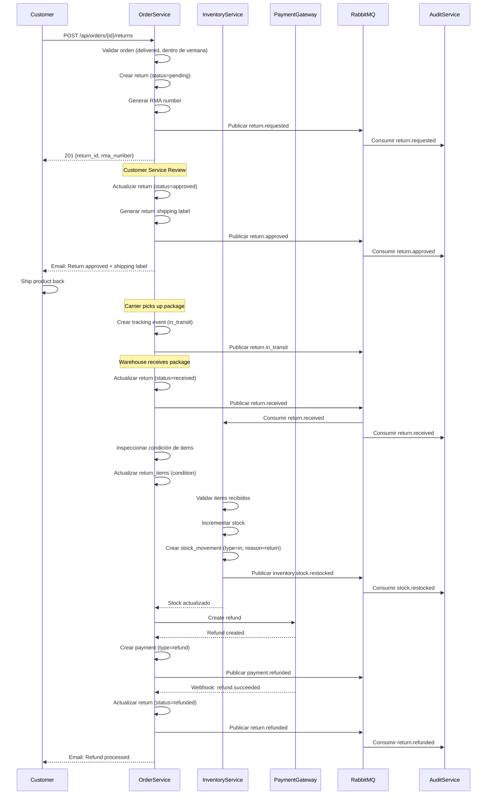

# Flujo de Devoluciones (Returns)

Flujo completo de devolución de productos desde la solicitud del cliente hasta el re-stock en inventario.

## Diagram de Secuencia



## Fases del Flujo

### Fase 1: Solicitar Devolución

**Endpoint**: `POST /api/v1/orders/{order_id}/returns`

**Request**:
```json
{
  "items": [
    {
      "order_item_id": "item_789",
      "variant_id": "var_123",
      "quantity": 1,
      "reason": "wrong_size",
      "notes": "El producto es más pequeño de lo esperado"
    }
  ],
  "return_reason": "wrong_size",
  "preferred_resolution": "refund"
}
```

**Validaciones**:
```python
async def create_return(order_id: str, return_request: ReturnCreate):
    """Crear solicitud de devolución."""
    order = await order_repo.get_by_id(order_id)

    # Validar estado de orden
    if order.status != 'delivered':
        raise HTTPException(
            status_code=400,
            detail="Order must be delivered to request return"
        )

    # Validar ventana de devolución (ej: 30 días)
    days_since_delivery = (datetime.utcnow() - order.delivered_at).days
    if days_since_delivery > 30:
        raise HTTPException(
            status_code=400,
            detail=f"Return window expired. Order delivered {days_since_delivery} days ago."
        )

    # Validar que items pertenecen a la orden
    order_item_ids = {str(item.order_item_id) for item in order.items}
    for item in return_request.items:
        if item.order_item_id not in order_item_ids:
            raise HTTPException(
                status_code=400,
                detail=f"Item {item.order_item_id} does not belong to order"
            )

    # Crear return
    return_obj = await return_repo.create(
        order_id=order.order_id,
        customer_id=order.customer_id,
        rma_number=generate_rma_number(),  # RMA-2025-0001
        status='pending',
        return_reason=return_request.return_reason,
        preferred_resolution=return_request.preferred_resolution
    )

    # Crear return items
    for item in return_request.items:
        await return_item_repo.create(
            return_id=return_obj.return_id,
            order_item_id=item.order_item_id,
            variant_id=item.variant_id,
            quantity=item.quantity,
            reason=item.reason
        )

    # Publicar evento
    await event_publisher.publish(
        event_type="return.requested",
        data={
            "return_id": str(return_obj.return_id),
            "order_id": str(order.order_id),
            "rma_number": return_obj.rma_number,
            "reason": return_request.return_reason,
            "items": [
                {
                    "order_item_id": str(item.order_item_id),
                    "variant_id": str(item.variant_id),
                    "quantity": item.quantity
                }
                for item in return_request.items
            ],
            "requested_at": return_obj.created_at.isoformat()
        }
    )

    return return_obj
```

**Response**:
```json
{
  "return_id": "ret_123",
  "rma_number": "RMA-2025-0001",
  "status": "pending",
  "items": [
    {
      "return_item_id": "ret_item_456",
      "variant_id": "var_123",
      "quantity": 1,
      "reason": "wrong_size"
    }
  ],
  "created_at": "2025-11-27T09:00:00Z",
  "message": "Return request submitted. You will receive an email when approved."
}
```

### Fase 2: Aprobar Devolución

**Endpoint**: `PUT /api/v1/returns/{return_id}/approve`

**Request**:
```json
{
  "approved_by": "user_manager",
  "notes": "Return approved. Customer will receive prepaid label.",
  "refund_amount": 50.00
}
```

**Proceso**:
```python
async def approve_return(return_id: str, approval: ReturnApproval):
    """Aprobar devolución."""
    return_obj = await return_repo.get_by_id(return_id)

    if return_obj.status != 'pending':
        raise HTTPException(
            status_code=400,
            detail=f"Return must be pending. Current status: {return_obj.status}"
        )

    # Generar shipping label para devolución
    label = await shipping_client.create_return_label(
        from_address=return_obj.order.shipping_address,
        to_address=warehouse.address,
        weight=estimate_weight(return_obj.items),
        carrier='fedex'
    )

    # Actualizar return
    return_obj.status = 'approved'
    return_obj.approved_by = approval.approved_by
    return_obj.approved_at = datetime.utcnow()
    return_obj.return_shipping_label_url = label.label_url
    return_obj.return_tracking_number = label.tracking_number
    return_obj.refund_amount = approval.refund_amount

    await return_repo.update(return_obj)

    # Publicar evento
    await event_publisher.publish(
        event_type="return.approved",
        data={
            "return_id": str(return_obj.return_id),
            "rma_number": return_obj.rma_number,
            "approved_by": approval.approved_by,
            "return_shipping_label_url": label.label_url,
            "refund_amount": float(approval.refund_amount)
        }
    )

    # Enviar email al cliente con label
    await notification_service.send_email(
        to=return_obj.order.customer_email,
        template="return_approved",
        data={
            "rma_number": return_obj.rma_number,
            "label_url": label.label_url,
            "instructions": "Print the label and attach it to the package"
        }
    )

    return return_obj
```

**Response**:
```json
{
  "return_id": "ret_123",
  "status": "approved",
  "return_shipping_label_url": "https://shipping.example.com/labels/ret_123.pdf",
  "return_tracking_number": "RET-987654321",
  "refund_amount": 50.00,
  "approved_at": "2025-11-27T10:00:00Z"
}
```

### Fase 3: Rastrear Envío de Devolución

**Webhook de Carrier**:
```python
@app.post("/webhooks/fedex/returns")
async def fedex_return_tracking(request: Request):
    """Recibir eventos de tracking de devoluciones."""
    payload = await request.json()

    return_obj = await return_repo.get_by_tracking(
        payload['tracking_number']
    )

    # Crear tracking event
    await return_tracking_repo.create(
        return_id=return_obj.return_id,
        status=payload['status'],
        location=payload['location'],
        event_timestamp=payload['timestamp']
    )

    if payload['status'] == 'in_transit':
        return_obj.status = 'in_transit'
        await return_repo.update(return_obj)

        await event_publisher.publish(
            event_type="return.in_transit",
            data={
                "return_id": str(return_obj.return_id),
                "tracking_number": return_obj.return_tracking_number
            }
        )
```

### Fase 4: Recibir en Warehouse

**Endpoint**: `POST /api/v1/returns/{return_id}/receive`

**Request**:
```json
{
  "received_by": "warehouse_user_123",
  "warehouse_id": "wh_101",
  "notes": "Package received in good condition"
}
```

**Proceso**:
```python
async def receive_return(return_id: str, receipt: ReturnReceipt):
    """Marcar devolución como recibida en warehouse."""
    return_obj = await return_repo.get_by_id(return_id)

    if return_obj.status not in ['approved', 'in_transit']:
        raise HTTPException(
            status_code=400,
            detail="Return must be approved or in transit"
        )

    # Actualizar return
    return_obj.status = 'received'
    return_obj.received_at = datetime.utcnow()
    return_obj.received_by = receipt.received_by
    return_obj.warehouse_id = receipt.warehouse_id

    await return_repo.update(return_obj)

    # Publicar evento (Inventory lo consumirá)
    await event_publisher.publish(
        event_type="return.received",
        data={
            "return_id": str(return_obj.return_id),
            "order_id": str(return_obj.order_id),
            "rma_number": return_obj.rma_number,
            "received_at": return_obj.received_at.isoformat(),
            "warehouse_id": str(receipt.warehouse_id),
            "returned_items": [
                {
                    "variant_id": str(item.variant_id),
                    "quantity": item.quantity,
                    "condition": item.condition or "pending_inspection",
                    "return_reason": item.reason
                }
                for item in return_obj.items
            ]
        }
    )

    return return_obj
```

### Fase 5: Inspeccionar Items

**Endpoint**: `POST /api/v1/returns/{return_id}/inspect`

**Request**:
```json
{
  "items": [
    {
      "return_item_id": "ret_item_456",
      "inspected_quantity": 1,
      "approved_quantity": 1,
      "rejected_quantity": 0,
      "condition": "good",
      "inspection_notes": "Item in perfect condition, original packaging"
    }
  ],
  "inspected_by": "qc_user_789"
}
```

**Proceso**:
```python
async def inspect_return(return_id: str, inspection: ReturnInspection):
    """Inspeccionar items de devolución."""
    return_obj = await return_repo.get_by_id(return_id)

    if return_obj.status != 'received':
        raise HTTPException(
            status_code=400,
            detail="Return must be received before inspection"
        )

    # Actualizar cada item
    for item_inspection in inspection.items:
        item = await return_item_repo.get_by_id(item_inspection.return_item_id)

        item.inspected_quantity = item_inspection.inspected_quantity
        item.approved_quantity = item_inspection.approved_quantity
        item.rejected_quantity = item_inspection.rejected_quantity
        item.condition = item_inspection.condition
        item.inspection_notes = item_inspection.inspection_notes

        await return_item_repo.update(item)

    # Marcar como inspeccionado
    return_obj.status = 'inspected'
    return_obj.inspected_at = datetime.utcnow()
    return_obj.inspected_by = inspection.inspected_by

    await return_repo.update(return_obj)

    # Publicar evento
    await event_publisher.publish(
        event_type="return.inspected",
        data={
            "return_id": str(return_obj.return_id),
            "items": [
                {
                    "variant_id": str(item.variant_id),
                    "approved_quantity": item.approved_quantity,
                    "rejected_quantity": item.rejected_quantity,
                    "condition": item.condition
                }
                for item in return_obj.items
            ]
        }
    )

    return return_obj
```

### Fase 6: Re-stock en Inventory

**Inventory Service consume `return.received`**:

```python
async def handle_return_received(event):
    """Re-stock items de devolución."""
    returned_items = event['data']['returned_items']
    warehouse_id = event['data']['warehouse_id']
    organization_id = event['organization_id']

    for item in returned_items:
        # Solo re-stock si está en buena condición
        if item['condition'] not in ['good', 'like_new']:
            logger.warning(
                f"Skipping restock for damaged item",
                extra={
                    "variant_id": item['variant_id'],
                    "condition": item['condition']
                }
            )
            continue

        # Obtener stock
        stock = await stock_repo.get_by_variant_warehouse(
            variant_id=item['variant_id'],
            warehouse_id=warehouse_id,
            organization_id=organization_id
        )

        if not stock:
            # Crear stock si no existe
            stock = await stock_repo.create(
                variant_id=item['variant_id'],
                warehouse_id=warehouse_id,
                organization_id=organization_id,
                total_quantity=0,
                available_quantity=0
            )

        # Incrementar stock
        quantity_before = stock.total_quantity
        stock.total_quantity += item['quantity']
        stock.available_quantity += item['quantity']
        stock.version += 1
        stock.last_movement_at = datetime.utcnow()

        await stock_repo.update(stock)

        # Crear movimiento
        await movement_repo.create(
            stock_id=stock.stock_id,
            organization_id=organization_id,
            type='in',
            quantity_before=quantity_before,
            quantity_after=stock.total_quantity,
            quantity_change=item['quantity'],
            reason='return',
            reference_id=event['data']['return_id'],
            reference_type='return'
        )

        logger.info(
            f"Stock restocked from return",
            extra={
                "variant_id": item['variant_id'],
                "quantity": item['quantity'],
                "warehouse_id": warehouse_id,
                "new_total": stock.total_quantity
            }
        )

    # Publicar evento
    await event_publisher.publish(
        event_type="inventory.stock.restocked",
        data={
            "return_id": event['data']['return_id'],
            "warehouse_id": warehouse_id,
            "items": returned_items
        }
    )
```

### Fase 7: Procesar Reembolso

**Proceso Automático** (después de inspección):

```python
async def process_return_refund(return_id: str):
    """Procesar reembolso de devolución."""
    return_obj = await return_repo.get_by_id(return_id)

    if return_obj.status != 'inspected':
        raise ValueError("Return must be inspected before refund")

    # Obtener pago original
    original_payment = await payment_repo.get_by_order(return_obj.order_id)

    # Calcular monto a reembolsar (basado en items aprobados)
    refund_amount = calculate_refund_amount(return_obj.items)

    # Crear refund en Stripe
    refund = stripe.Refund.create(
        payment_intent=original_payment.gateway_payment_id,
        amount=int(refund_amount * 100),  # centavos
        reason='requested_by_customer',
        metadata={
            'return_id': str(return_obj.return_id),
            'rma_number': return_obj.rma_number
        }
    )

    # Crear payment de tipo refund
    refund_payment = await payment_repo.create(
        order_id=return_obj.order_id,
        payment_type='refund',
        amount=refund_amount,
        status='pending',
        payment_method=original_payment.payment_method,
        gateway_payment_id=refund.id
    )

    # Publicar evento
    await event_publisher.publish(
        event_type="payment.refunded",
        data={
            "payment_id": str(refund_payment.payment_id),
            "order_id": str(return_obj.order_id),
            "return_id": str(return_obj.return_id),
            "refund_amount": float(refund_amount),
            "refund_reason": "customer_return",
            "refunded_at": datetime.utcnow().isoformat()
        }
    )

    return refund_payment
```

**Webhook de Stripe**:
```python
@app.post("/webhooks/stripe")
async def stripe_webhook(request: Request):
    event = stripe.Webhook.construct_event(...)

    if event['type'] == 'charge.refunded':
        refund = event['data']['object']['refunds']['data'][0]
        return_id = refund['metadata']['return_id']

        # Actualizar return
        return_obj = await return_repo.get_by_id(return_id)
        return_obj.status = 'refunded'
        return_obj.refunded_at = datetime.utcnow()
        await return_repo.update(return_obj)

        # Publicar evento
        await event_publisher.publish(
            event_type="return.refunded",
            data={
                "return_id": str(return_obj.return_id),
                "refund_amount": float(return_obj.refund_amount),
                "refund_method": "original_payment",
                "refunded_at": return_obj.refunded_at.isoformat()
            }
        )

        # Notificar cliente
        await notification_service.send_email(
            to=return_obj.order.customer_email,
            template="refund_processed",
            data={
                "rma_number": return_obj.rma_number,
                "refund_amount": float(return_obj.refund_amount)
            }
        )
```

## Escenarios Especiales

### 1. Devolución Parcial

```python
# Cliente solo devuelve algunos items de la orden
return_request = {
    "items": [
        {"order_item_id": "item_1", "quantity": 1},
        # item_2 no se devuelve
    ]
}

# Refund solo por items devueltos
refund_amount = sum(
    item.unit_price * item.approved_quantity
    for item in return_obj.items
)
```

### 2. Items Dañados

```python
# Durante inspección
if item.condition == 'damaged':
    item.approved_quantity = 0
    item.rejected_quantity = item.inspected_quantity

    # NO re-stock items dañados
    # NO reembolsar items dañados

    # Notificar cliente
    await notification_service.send_email(
        to=customer_email,
        template="return_rejected",
        data={
            "reason": "Item received damaged",
            "variant_id": item.variant_id
        }
    )
```

### 3. Restocking Fee

```python
# Aplicar fee de re-stocking (ej: 15%)
RESTOCKING_FEE_PERCENT = 0.15

refund_amount = original_amount * (1 - RESTOCKING_FEE_PERCENT)

await notification_service.send_email(
    template="refund_with_restocking_fee",
    data={
        "original_amount": original_amount,
        "restocking_fee": original_amount * RESTOCKING_FEE_PERCENT,
        "refund_amount": refund_amount
    }
)
```

### 4. Exchange en lugar de Refund

```python
if return_obj.preferred_resolution == 'exchange':
    # Crear nueva orden para item de reemplazo
    exchange_order = await order_repo.create(
        customer_id=return_obj.customer_id,
        order_type='exchange',
        original_order_id=return_obj.order_id,
        # ... items del exchange
    )

    # NO procesar refund
    # Reservar stock para nuevo item
    # ...
```

## Políticas de Devolución

### Ventana de Devolución

```python
RETURN_WINDOW_DAYS = {
    'clothing': 30,
    'electronics': 15,
    'food': 7,
    'custom': 0  # No returnable
}

def get_return_window(product_type: str) -> int:
    """Obtener ventana de devolución por tipo de producto."""
    return RETURN_WINDOW_DAYS.get(product_type, 30)  # default 30 días
```

### Condiciones Aceptables

```python
ACCEPTABLE_CONDITIONS = ['good', 'like_new', 'unopened']
REJECTABLE_CONDITIONS = ['damaged', 'used', 'missing_parts']

def can_restock(condition: str) -> bool:
    """Determinar si item puede ser re-stockeado."""
    return condition in ACCEPTABLE_CONDITIONS
```

## Métricas

```python
# Return rate
return_rate = Gauge('return_rate', 'Percentage of orders returned')

# Refund processing time
refund_processing_duration = Histogram(
    'refund_processing_duration_seconds',
    'Time to process refund'
)

# Restocking success rate
restock_success_rate = Gauge(
    'restock_success_rate',
    'Percentage of returned items restocked'
)
```

## SLAs

- **Aprobación de Devolución**: < 24 horas
- **Procesamiento de Reembolso**: < 3-5 días hábiles
- **Re-stock en Inventario**: < 2 horas (después de recepción)

## Próximos Pasos

- [Flujo de Venta Completo](./flujo-venta-completo)
- [Flujo de Transferencias de Stock](./flujo-transferencias)
- [Compensaciones y Rollbacks](./compensaciones)
