# Sistema de Pagos Simplificado

Documentación del sistema de pagos como **registro informativo** (sin procesamiento de pagos electrónicos).

## Filosofía

```
┌─────────────────────────────────────────────────────────────────────────────┐
│                        SISTEMA DE PAGOS SIMPLIFICADO                         │
│                                                                              │
│  El sistema NO procesa pagos electrónicos.                                  │
│  Solo REGISTRA qué método de pago usó el cliente.                          │
│                                                                              │
│  El dinero se maneja EXTERNAMENTE entre el negocio y el cliente.           │
│  (Terminal bancaria, efectivo en caja, transferencia bancaria)              │
└─────────────────────────────────────────────────────────────────────────────┘
```

## ¿Qué SÍ hace el sistema?

| Funcionalidad | Descripción |
|---------------|-------------|
| Registrar método de pago | Guardar qué método usó el cliente |
| Generar factura | Crear documento fiscal |
| Registrar venta | Guardar orden completada |
| Descontar inventario | Reducir stock vendido |
| Acumular puntos | Sumar puntos de lealtad |

## ¿Qué NO hace el sistema?

| Funcionalidad | Razón |
|---------------|-------|
| Procesar tarjetas | Terminal bancaria externa |
| Integrar Stripe/PayPal | Complejidad innecesaria para retail físico |
| Validar pagos | El cajero confirma manualmente |
| Manejar reembolsos | Proceso manual externo |
| Gateway de pagos | No hay e-commerce |

## Métodos de Pago Soportados

```python
PAYMENT_METHODS = {
    "cash": "Efectivo",
    "card": "Tarjeta (débito/crédito)",
    "transfer": "Transferencia bancaria",
    "credit": "Crédito del cliente",
    "mixed": "Combinación de métodos",
    "other": "Otro método"
}
```

### Flujo por Método

#### Efectivo (cash)


#### Tarjeta (card)


#### Transferencia (transfer)


#### Crédito del Cliente (credit)

Ver sección [Sistema de Crédito](#sistema-de-crédito-simplificado) más abajo.

#### Pago Mixto (mixed)

```python
# Ejemplo: Cliente paga parte en efectivo, parte en tarjeta
{
    "payment_method": "mixed",
    "notes": "Efectivo: $50.00, Tarjeta: $62.00"
}
```

## API de Venta

### Crear Venta

```http
POST /api/v1/orders
Authorization: Bearer {token}
Content-Type: application/json

{
  "local_id": "local_001",
  "customer_id": "cust_456",  // Opcional
  "payment_method": "cash",
  "items": [
    {
      "variant_id": "var_001",
      "sku": "PROD-001",
      "product_name": "Café Latte",
      "quantity": 2,
      "unit_price": 3.50,
      "tax_rate": 12
    }
  ],
  "notes": "Cliente frecuente"
}
```

### Response

```json
{
  "id": "order_123",
  "order_number": "ORD-2025-0001",
  "status": "completed",
  "subtotal": 7.00,
  "tax_amount": 0.84,
  "total_amount": 7.84,
  "payment_method": "cash",
  "created_at": "2025-01-15T10:30:00Z",
  "invoice": {
    "id": "inv_456",
    "invoice_number": "FAC-2025-0001",
    "pdf_url": "/api/v1/invoices/inv_456/pdf"
  }
}
```

## Sistema de Crédito Simplificado

### Concepto

El "crédito" en este sistema es simplemente una **venta sin pago inmediato**. No hay:
- Líneas de crédito
- Límites
- Intereses
- Cobro automatizado

Solo se registra que el cliente "debe" y se marca cuando paga.

### Modelo de Datos

```sql
-- Dentro de la tabla orders
-- payment_method = 'credit' indica venta a crédito

-- Vista de órdenes pendientes de pago
CREATE VIEW v_pending_credit_orders AS
SELECT
    o.id,
    o.order_number,
    o.customer_id,
    c.name as customer_name,
    o.total_amount,
    o.created_at,
    CURRENT_DATE - o.created_at::date as days_pending
FROM orders o
JOIN customers c ON o.customer_id = c.id
WHERE o.payment_method = 'credit'
  AND o.status = 'completed'
  AND NOT EXISTS (
    SELECT 1 FROM credit_payments cp
    WHERE cp.order_id = o.id
    AND cp.status = 'paid'
  );
```

### Tabla de Pagos de Crédito

```sql
CREATE TABLE credit_payments (
    id UUID PRIMARY KEY DEFAULT gen_random_uuid(),
    organization_id UUID NOT NULL,
    order_id UUID NOT NULL REFERENCES orders(id),
    customer_id UUID NOT NULL,

    -- Monto
    amount DECIMAL(12,2) NOT NULL,
    payment_method VARCHAR(30) NOT NULL,  -- cash, card, transfer

    -- Estado
    status VARCHAR(20) DEFAULT 'paid',  -- paid, partial

    -- Metadata
    notes TEXT,
    received_by UUID NOT NULL,
    received_at TIMESTAMP DEFAULT NOW(),

    CONSTRAINT chk_payment_method CHECK (
        payment_method IN ('cash', 'card', 'transfer')
    )
);

CREATE INDEX idx_credit_payments_order ON credit_payments(order_id);
CREATE INDEX idx_credit_payments_customer ON credit_payments(customer_id);
```

### Flujo de Venta a Crédito

```mermaid
sequenceDiagram
    participant Cajero
    participant POS
    participant Order
    participant Customer

    Cajero->>POS: Seleccionar cliente
    POS->>Customer: Verificar cliente existe
    Customer-->>POS: Cliente: "Juan Pérez"

    Cajero->>POS: Agregar items
    Cajero->>POS: Seleccionar pago: "Crédito"

    POS->>Order: Crear orden
    Note right of Order: payment_method: "credit"<br/>status: "completed"

    Order-->>POS: Orden creada
    POS-->>Cajero: Imprimir comprobante de crédito
```



### Flujo de Cobro de Crédito

```mermaid
sequenceDiagram
    participant Cajero
    participant POS
    participant Order
    participant CreditPayment

    Cajero->>POS: Buscar órdenes pendientes del cliente
    POS->>Order: GET /orders?customer_id=X&payment_method=credit&pending=true
    Order-->>POS: Lista de órdenes pendientes

    Cajero->>POS: Seleccionar orden a cobrar
    Cajero->>POS: Registrar pago recibido

    POS->>CreditPayment: POST /credit-payments
    Note right of CreditPayment: order_id, amount,<br/>payment_method: "cash"

    CreditPayment-->>POS: Pago registrado
    POS-->>Cajero: Crédito saldado
```



### API de Crédito

#### Listar Créditos Pendientes

```http
GET /api/v1/orders/credit/pending?customer_id=cust_123
Authorization: Bearer {token}

Response:
{
  "customer_id": "cust_123",
  "customer_name": "Juan Pérez",
  "total_pending": 150.00,
  "orders": [
    {
      "order_id": "order_001",
      "order_number": "ORD-2025-0010",
      "amount": 50.00,
      "created_at": "2025-01-10",
      "days_pending": 5
    },
    {
      "order_id": "order_002",
      "order_number": "ORD-2025-0015",
      "amount": 100.00,
      "created_at": "2025-01-12",
      "days_pending": 3
    }
  ]
}
```

#### Registrar Pago de Crédito

```http
POST /api/v1/credit-payments
Authorization: Bearer {token}
Content-Type: application/json

{
  "order_id": "order_001",
  "amount": 50.00,
  "payment_method": "cash",
  "notes": "Pago completo"
}

Response:
{
  "id": "cpay_123",
  "order_id": "order_001",
  "amount": 50.00,
  "status": "paid",
  "received_at": "2025-01-15T14:30:00Z"
}
```

#### Reporte de Créditos por Cliente

```http
GET /api/v1/customers/{id}/credit-summary
Authorization: Bearer {token}

Response:
{
  "customer_id": "cust_123",
  "customer_name": "Juan Pérez",
  "credit_summary": {
    "total_credit_orders": 10,
    "total_credit_amount": 500.00,
    "total_paid": 350.00,
    "total_pending": 150.00,
    "oldest_pending_days": 15
  }
}
```

## Caja y Arqueo

### Apertura de Caja

```http
POST /api/v1/pos/drawers/open
{
  "local_id": "local_001",
  "initial_cash": 100.00,
  "notes": "Apertura matutina"
}
```

> Para documentación completa de la API de Cajas, ver [POS Service - API Drawers](/microservicios/pos-service/api-drawers).

### Cierre de Caja

```http
POST /api/v1/pos/drawers/close
{
  "drawer_id": "drawer_123",
  "final_cash": 450.00,
  "notes": "Cierre sin novedad"
}

Response:
{
  "drawer_id": "drawer_123",
  "summary": {
    "initial_cash": 100.00,
    "sales_cash": 320.00,
    "sales_card": 150.00,
    "sales_transfer": 80.00,
    "expected_cash": 420.00,
    "actual_cash": 450.00,
    "difference": 30.00,
    "total_sales": 550.00,
    "transactions_count": 25
  }
}
```

## Resumen

```
┌─────────────────────────────────────────────────────────────────────────────┐
│                              RESUMEN                                         │
│                                                                              │
│  ✅ El sistema REGISTRA el método de pago                                   │
│  ✅ El sistema GENERA facturas/recibos                                      │
│  ✅ El sistema RASTREA créditos pendientes                                  │
│  ✅ El sistema DESCUENTA inventario                                         │
│                                                                              │
│  ❌ El sistema NO procesa tarjetas                                          │
│  ❌ El sistema NO integra con bancos                                        │
│  ❌ El sistema NO tiene gateway de pagos                                    │
│  ❌ El sistema NO cobra automáticamente créditos                            │
│                                                                              │
│  💡 El dinero físico/electrónico se maneja FUERA del sistema               │
└─────────────────────────────────────────────────────────────────────────────┘
```

## Próximos Pasos

- [Flujo de Venta POS](./01-flujo-venta-completo.md)
- [Order Service](/microservicios/order-service/overview)
- [POS Service](/microservicios/pos-service/overview)
