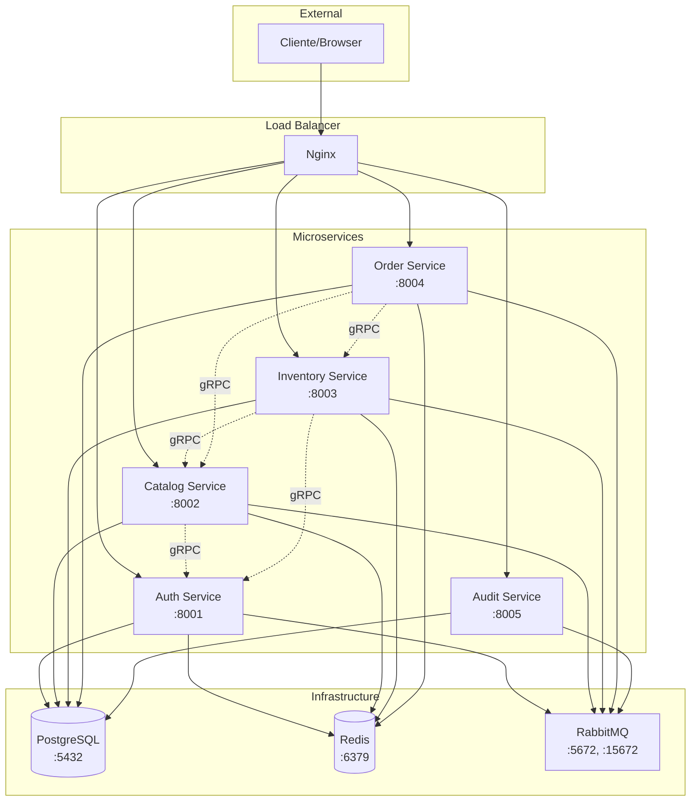

# Docker Compose - Deployment Completo

Configuración completa de Docker Compose para desplegar todo el sistema ERP con todos los microservicios e infraestructura.

## Arquitectura de Deployment



## Docker Compose Completo

```yaml
version: '3.8'

services:
  # ============================================================================
  # Infrastructure Services
  # ============================================================================

  postgres:
    image: postgres:15-alpine
    container_name: erp-postgres
    environment:
      POSTGRES_USER: erp_user
      POSTGRES_PASSWORD: ${POSTGRES_PASSWORD:-erp_secure_password_123}
      POSTGRES_DB: postgres
    ports:
      - "5432:5432"
    volumes:
      - postgres_data:/var/lib/postgresql/data
      - ./init-scripts:/docker-entrypoint-initdb.d
    networks:
      - erp-network
    healthcheck:
      test: ["CMD-SHELL", "pg_isready -U erp_user"]
      interval: 10s
      timeout: 5s
      retries: 5

  redis:
    image: redis:7.2-alpine
    container_name: erp-redis
    command: redis-server --requirepass ${REDIS_PASSWORD:-redis_secure_password_123}
    ports:
      - "6379:6379"
    volumes:
      - redis_data:/data
    networks:
      - erp-network
    healthcheck:
      test: ["CMD", "redis-cli", "ping"]
      interval: 10s
      timeout: 3s
      retries: 5

  rabbitmq:
    image: rabbitmq:3.12-management-alpine
    container_name: erp-rabbitmq
    environment:
      RABBITMQ_DEFAULT_USER: ${RABBITMQ_USER:-erp_user}
      RABBITMQ_DEFAULT_PASS: ${RABBITMQ_PASSWORD:-rabbitmq_secure_password_123}
      RABBITMQ_DEFAULT_VHOST: erp
    ports:
      - "5672:5672"   # AMQP
      - "15672:15672" # Management UI
    volumes:
      - rabbitmq_data:/var/lib/rabbitmq
      - ./rabbitmq/rabbitmq.conf:/etc/rabbitmq/rabbitmq.conf
    networks:
      - erp-network
    healthcheck:
      test: ["CMD", "rabbitmq-diagnostics", "ping"]
      interval: 30s
      timeout: 10s
      retries: 5

  # ============================================================================
  # Auth Service
  # ============================================================================

  auth-service:
    build:
      context: ./services/auth-service
      dockerfile: Dockerfile
    container_name: erp-auth-service
    environment:
      # Database
      DATABASE_URL: postgresql://erp_user:${POSTGRES_PASSWORD:-erp_secure_password_123}@postgres:5432/auth_db

      # Redis
      REDIS_URL: redis://:${REDIS_PASSWORD:-redis_secure_password_123}@redis:6379/0

      # RabbitMQ
      RABBITMQ_URL: amqp://${RABBITMQ_USER:-erp_user}:${RABBITMQ_PASSWORD:-rabbitmq_secure_password_123}@rabbitmq:5672/erp
      RABBITMQ_EXCHANGE: auth_events

      # Service Config
      HTTP_PORT: 8001
      GRPC_PORT: 50050
      SERVICE_NAME: auth-service

      # JWT
      JWT_SECRET_KEY: ${JWT_SECRET_KEY:-your-secret-key-change-in-production}
      JWT_ALGORITHM: HS256
      JWT_ACCESS_TOKEN_EXPIRE_MINUTES: 30
      JWT_REFRESH_TOKEN_EXPIRE_DAYS: 7

      # Security
      BCRYPT_ROUNDS: 12
      MAX_LOGIN_ATTEMPTS: 5
      LOCKOUT_DURATION_MINUTES: 30

      # Environment
      ENVIRONMENT: ${ENVIRONMENT:-development}
      LOG_LEVEL: ${LOG_LEVEL:-INFO}
    ports:
      - "8001:8001"  # HTTP
      - "50050:50050" # gRPC
    depends_on:
      postgres:
        condition: service_healthy
      redis:
        condition: service_healthy
      rabbitmq:
        condition: service_healthy
    networks:
      - erp-network
    volumes:
      - ./logs/auth:/app/logs
    healthcheck:
      test: ["CMD", "curl", "-f", "http://localhost:8001/health"]
      interval: 30s
      timeout: 10s
      retries: 3
      start_period: 40s

  # ============================================================================
  # Catalog Service
  # ============================================================================

  catalog-service:
    build:
      context: ./services/catalog-service
      dockerfile: Dockerfile
    container_name: erp-catalog-service
    environment:
      # Database
      DATABASE_URL: postgresql://erp_user:${POSTGRES_PASSWORD:-erp_secure_password_123}@postgres:5432/catalog_db

      # Redis
      REDIS_URL: redis://:${REDIS_PASSWORD:-redis_secure_password_123}@redis:6379/1
      CACHE_TTL_SECONDS: 3600

      # RabbitMQ
      RABBITMQ_URL: amqp://${RABBITMQ_USER:-erp_user}:${RABBITMQ_PASSWORD:-rabbitmq_secure_password_123}@rabbitmq:5672/erp
      RABBITMQ_EXCHANGE: catalog_events

      # Service Config
      HTTP_PORT: 8002
      GRPC_PORT: 50052
      SERVICE_NAME: catalog-service

      # gRPC Clients
      AUTH_GRPC_HOST: auth-service
      AUTH_GRPC_PORT: 50050

      # Environment
      ENVIRONMENT: ${ENVIRONMENT:-development}
      LOG_LEVEL: ${LOG_LEVEL:-INFO}
    ports:
      - "8002:8002"  # HTTP
      - "50052:50052" # gRPC
    depends_on:
      postgres:
        condition: service_healthy
      redis:
        condition: service_healthy
      rabbitmq:
        condition: service_healthy
      auth-service:
        condition: service_healthy
    networks:
      - erp-network
    volumes:
      - ./logs/catalog:/app/logs
    healthcheck:
      test: ["CMD", "curl", "-f", "http://localhost:8002/health"]
      interval: 30s
      timeout: 10s
      retries: 3
      start_period: 40s

  # ============================================================================
  # Inventory Service
  # ============================================================================

  inventory-service:
    build:
      context: ./services/inventory-service
      dockerfile: Dockerfile
    container_name: erp-inventory-service
    environment:
      # Database
      DATABASE_URL: postgresql://erp_user:${POSTGRES_PASSWORD:-erp_secure_password_123}@postgres:5432/inventory_db

      # Redis
      REDIS_URL: redis://:${REDIS_PASSWORD:-redis_secure_password_123}@redis:6379/3

      # RabbitMQ
      RABBITMQ_URL: amqp://${RABBITMQ_USER:-erp_user}:${RABBITMQ_PASSWORD:-rabbitmq_secure_password_123}@rabbitmq:5672/erp
      RABBITMQ_EXCHANGE: inventory_events
      RABBITMQ_PREFETCH_COUNT: 10

      # Service Config
      HTTP_PORT: 8003
      GRPC_PORT: 50053
      SERVICE_NAME: inventory-service

      # gRPC Clients
      CATALOG_GRPC_HOST: catalog-service
      CATALOG_GRPC_PORT: 50052
      AUTH_GRPC_HOST: auth-service
      AUTH_GRPC_PORT: 50050

      # Business Logic
      RESERVATION_TTL_MINUTES: 15
      DEFAULT_MIN_STOCK: 20
      DEFAULT_MAX_STOCK: 1000

      # Environment
      ENVIRONMENT: ${ENVIRONMENT:-development}
      LOG_LEVEL: ${LOG_LEVEL:-INFO}
    ports:
      - "8003:8003"  # HTTP
      - "50053:50053" # gRPC
    depends_on:
      postgres:
        condition: service_healthy
      redis:
        condition: service_healthy
      rabbitmq:
        condition: service_healthy
      catalog-service:
        condition: service_healthy
    networks:
      - erp-network
    volumes:
      - ./logs/inventory:/app/logs
    healthcheck:
      test: ["CMD", "curl", "-f", "http://localhost:8003/health"]
      interval: 30s
      timeout: 10s
      retries: 3
      start_period: 40s

  # ============================================================================
  # Order Service
  # ============================================================================

  order-service:
    build:
      context: ./services/order-service
      dockerfile: Dockerfile
    container_name: erp-order-service
    environment:
      # Database
      DATABASE_URL: postgresql://erp_user:${POSTGRES_PASSWORD:-erp_secure_password_123}@postgres:5432/order_db

      # Redis
      REDIS_URL: redis://:${REDIS_PASSWORD:-redis_secure_password_123}@redis:6379/4

      # RabbitMQ
      RABBITMQ_URL: amqp://${RABBITMQ_USER:-erp_user}:${RABBITMQ_PASSWORD:-rabbitmq_secure_password_123}@rabbitmq:5672/erp
      RABBITMQ_EXCHANGE: order_events

      # Service Config
      HTTP_PORT: 8004
      SERVICE_NAME: order-service

      # gRPC Clients
      CATALOG_GRPC_HOST: catalog-service
      CATALOG_GRPC_PORT: 50052
      INVENTORY_GRPC_HOST: inventory-service
      INVENTORY_GRPC_PORT: 50053

      # Payment Gateways
      STRIPE_API_KEY: ${STRIPE_API_KEY:-sk_test_...}
      STRIPE_WEBHOOK_SECRET: ${STRIPE_WEBHOOK_SECRET:-whsec_...}
      PAYPAL_CLIENT_ID: ${PAYPAL_CLIENT_ID:-}
      PAYPAL_CLIENT_SECRET: ${PAYPAL_CLIENT_SECRET:-}
      PAYPAL_MODE: sandbox

      # Shipping
      FEDEX_API_KEY: ${FEDEX_API_KEY:-}
      UPS_API_KEY: ${UPS_API_KEY:-}

      # Business Logic
      ORDER_RESERVATION_TTL_MINUTES: 15
      FREE_SHIPPING_THRESHOLD: 50.00
      DEFAULT_CURRENCY: USD

      # Environment
      ENVIRONMENT: ${ENVIRONMENT:-development}
      LOG_LEVEL: ${LOG_LEVEL:-INFO}
    ports:
      - "8004:8004"  # HTTP
    depends_on:
      postgres:
        condition: service_healthy
      redis:
        condition: service_healthy
      rabbitmq:
        condition: service_healthy
      inventory-service:
        condition: service_healthy
    networks:
      - erp-network
    volumes:
      - ./logs/order:/app/logs
    healthcheck:
      test: ["CMD", "curl", "-f", "http://localhost:8004/health"]
      interval: 30s
      timeout: 10s
      retries: 3
      start_period: 40s

  # ============================================================================
  # Audit Service
  # ============================================================================

  audit-service:
    build:
      context: ./services/audit-service
      dockerfile: Dockerfile
    container_name: erp-audit-service
    environment:
      # Database
      DATABASE_URL: postgresql://erp_user:${POSTGRES_PASSWORD:-erp_secure_password_123}@postgres:5432/audit_db

      # RabbitMQ (NO Redis - audit data is historical)
      RABBITMQ_URL: amqp://${RABBITMQ_USER:-erp_user}:${RABBITMQ_PASSWORD:-rabbitmq_secure_password_123}@rabbitmq:5672/erp
      RABBITMQ_PREFETCH_COUNT: 50

      # Event Consumers
      CONSUME_AUTH_EVENTS: "true"
      CONSUME_CATALOG_EVENTS: "true"
      CONSUME_INVENTORY_EVENTS: "true"
      CONSUME_ORDER_EVENTS: "true"

      # Service Config
      HTTP_PORT: 8005
      SERVICE_NAME: audit-service

      # Retention Policy
      AUDIT_RETENTION_DAYS: 2555  # 7 years
      BATCH_INSERT_SIZE: 100
      BATCH_TIMEOUT_SECONDS: 1

      # Environment
      ENVIRONMENT: ${ENVIRONMENT:-development}
      LOG_LEVEL: ${LOG_LEVEL:-INFO}
    ports:
      - "8005:8005"  # HTTP
    depends_on:
      postgres:
        condition: service_healthy
      rabbitmq:
        condition: service_healthy
    networks:
      - erp-network
    volumes:
      - ./logs/audit:/app/logs
    healthcheck:
      test: ["CMD", "curl", "-f", "http://localhost:8005/health"]
      interval: 30s
      timeout: 10s
      retries: 3
      start_period: 40s

  # ============================================================================
  # Nginx (Reverse Proxy / Load Balancer)
  # ============================================================================

  nginx:
    image: nginx:alpine
    container_name: erp-nginx
    ports:
      - "80:80"
      - "443:443"
    volumes:
      - ./nginx/nginx.conf:/etc/nginx/nginx.conf:ro
      - ./nginx/ssl:/etc/nginx/ssl:ro
    depends_on:
      - auth-service
      - catalog-service
      - inventory-service
      - order-service
      - audit-service
    networks:
      - erp-network
    healthcheck:
      test: ["CMD", "nginx", "-t"]
      interval: 30s
      timeout: 10s
      retries: 3

  # ============================================================================
  # Monitoring & Observability
  # ============================================================================

  prometheus:
    image: prom/prometheus:latest
    container_name: erp-prometheus
    command:
      - '--config.file=/etc/prometheus/prometheus.yml'
      - '--storage.tsdb.path=/prometheus'
      - '--web.console.libraries=/usr/share/prometheus/console_libraries'
      - '--web.console.templates=/usr/share/prometheus/consoles'
    ports:
      - "9090:9090"
    volumes:
      - ./prometheus/prometheus.yml:/etc/prometheus/prometheus.yml:ro
      - prometheus_data:/prometheus
    networks:
      - erp-network
    restart: unless-stopped

  grafana:
    image: grafana/grafana:latest
    container_name: erp-grafana
    environment:
      GF_SECURITY_ADMIN_USER: ${GRAFANA_USER:-admin}
      GF_SECURITY_ADMIN_PASSWORD: ${GRAFANA_PASSWORD:-admin}
      GF_USERS_ALLOW_SIGN_UP: "false"
    ports:
      - "3000:3000"
    volumes:
      - grafana_data:/var/lib/grafana
      - ./grafana/dashboards:/etc/grafana/provisioning/dashboards:ro
      - ./grafana/datasources:/etc/grafana/provisioning/datasources:ro
    networks:
      - erp-network
    depends_on:
      - prometheus
    restart: unless-stopped

  jaeger:
    image: jaegertracing/all-in-one:latest
    container_name: erp-jaeger
    environment:
      COLLECTOR_ZIPKIN_HOST_PORT: ":9411"
    ports:
      - "5775:5775/udp"  # Zipkin compact
      - "6831:6831/udp"  # Jaeger compact
      - "6832:6832/udp"  # Jaeger binary
      - "5778:5778"      # Config
      - "16686:16686"    # Web UI
      - "14268:14268"    # Jaeger collector
      - "14250:14250"    # gRPC
      - "9411:9411"      # Zipkin
    networks:
      - erp-network
    restart: unless-stopped

# ============================================================================
# Networks
# ============================================================================

networks:
  erp-network:
    driver: bridge
    ipam:
      config:
        - subnet: 172.20.0.0/16

# ============================================================================
# Volumes
# ============================================================================

volumes:
  postgres_data:
    driver: local
  redis_data:
    driver: local
  rabbitmq_data:
    driver: local
  prometheus_data:
    driver: local
  grafana_data:
    driver: local
```

## Scripts de Inicialización

### init-scripts/01-create-databases.sql

```sql
-- Crear databases para cada microservicio
CREATE DATABASE auth_db;
CREATE DATABASE catalog_db;
CREATE DATABASE inventory_db;
CREATE DATABASE order_db;
CREATE DATABASE audit_db;

-- Grant permissions
GRANT ALL PRIVILEGES ON DATABASE auth_db TO erp_user;
GRANT ALL PRIVILEGES ON DATABASE catalog_db TO erp_user;
GRANT ALL PRIVILEGES ON DATABASE inventory_db TO erp_user;
GRANT ALL PRIVILEGES ON DATABASE order_db TO erp_user;
GRANT ALL PRIVILEGES ON DATABASE audit_db TO erp_user;
```

### init-scripts/02-enable-extensions.sql

```sql
-- Auth DB
\c auth_db;
CREATE EXTENSION IF NOT EXISTS "uuid-ossp";
CREATE EXTENSION IF NOT EXISTS "pgcrypto";

-- Catalog DB
\c catalog_db;
CREATE EXTENSION IF NOT EXISTS "uuid-ossp";
CREATE EXTENSION IF NOT EXISTS "pg_trgm";  -- Para búsqueda full-text

-- Inventory DB
\c inventory_db;
CREATE EXTENSION IF NOT EXISTS "uuid-ossp";

-- Order DB
\c order_db;
CREATE EXTENSION IF NOT EXISTS "uuid-ossp";
CREATE EXTENSION IF NOT EXISTS "pgcrypto";

-- Audit DB
\c audit_db;
CREATE EXTENSION IF NOT EXISTS "uuid-ossp";
```

## Configuración de Nginx

### nginx/nginx.conf

```nginx
events {
    worker_connections 1024;
}

http {
    upstream auth_service {
        least_conn;
        server auth-service:8001 max_fails=3 fail_timeout=30s;
    }

    upstream catalog_service {
        least_conn;
        server catalog-service:8002 max_fails=3 fail_timeout=30s;
    }

    upstream inventory_service {
        least_conn;
        server inventory-service:8003 max_fails=3 fail_timeout=30s;
    }

    upstream order_service {
        least_conn;
        server order-service:8004 max_fails=3 fail_timeout=30s;
    }

    upstream audit_service {
        least_conn;
        server audit-service:8005 max_fails=3 fail_timeout=30s;
    }

    # Rate limiting
    limit_req_zone $binary_remote_addr zone=api_limit:10m rate=100r/s;
    limit_req_status 429;

    server {
        listen 80;
        server_name localhost;

        # Rate limiting
        limit_req zone=api_limit burst=20 nodelay;

        # Logging
        access_log /var/log/nginx/access.log;
        error_log /var/log/nginx/error.log;

        # Auth Service
        location /api/v1/auth/ {
            proxy_pass http://auth_service/api/v1/;
            proxy_set_header Host $host;
            proxy_set_header X-Real-IP $remote_addr;
            proxy_set_header X-Forwarded-For $proxy_add_x_forwarded_for;
            proxy_set_header X-Forwarded-Proto $scheme;

            # Timeouts
            proxy_connect_timeout 30s;
            proxy_send_timeout 30s;
            proxy_read_timeout 30s;
        }

        # Catalog Service
        location /api/v1/catalog/ {
            proxy_pass http://catalog_service/api/v1/;
            proxy_set_header Host $host;
            proxy_set_header X-Real-IP $remote_addr;
            proxy_set_header X-Forwarded-For $proxy_add_x_forwarded_for;
            proxy_set_header X-Forwarded-Proto $scheme;
        }

        # Inventory Service
        location /api/v1/inventory/ {
            proxy_pass http://inventory_service/api/v1/;
            proxy_set_header Host $host;
            proxy_set_header X-Real-IP $remote_addr;
            proxy_set_header X-Forwarded-For $proxy_add_x_forwarded_for;
            proxy_set_header X-Forwarded-Proto $scheme;
        }

        # Order Service
        location /api/v1/orders/ {
            proxy_pass http://order_service/api/v1/;
            proxy_set_header Host $host;
            proxy_set_header X-Real-IP $remote_addr;
            proxy_set_header X-Forwarded-For $proxy_add_x_forwarded_for;
            proxy_set_header X-Forwarded-Proto $scheme;

            # Longer timeout for order processing
            proxy_read_timeout 60s;
        }

        # Audit Service
        location /api/v1/audit/ {
            proxy_pass http://audit_service/api/v1/;
            proxy_set_header Host $host;
            proxy_set_header X-Real-IP $remote_addr;
            proxy_set_header X-Forwarded-For $proxy_add_x_forwarded_for;
            proxy_set_header X-Forwarded-Proto $scheme;
        }

        # Health check endpoint
        location /health {
            access_log off;
            return 200 "healthy\n";
            add_header Content-Type text/plain;
        }
    }
}
```

## Configuración de Prometheus

### prometheus/prometheus.yml

```yaml
global:
  scrape_interval: 15s
  evaluation_interval: 15s
  external_labels:
    cluster: 'erp-cluster'
    environment: 'development'

scrape_configs:
  - job_name: 'auth-service'
    static_configs:
      - targets: ['auth-service:8001']
    metrics_path: '/metrics'

  - job_name: 'catalog-service'
    static_configs:
      - targets: ['catalog-service:8002']
    metrics_path: '/metrics'

  - job_name: 'inventory-service'
    static_configs:
      - targets: ['inventory-service:8003']
    metrics_path: '/metrics'

  - job_name: 'order-service'
    static_configs:
      - targets: ['order-service:8004']
    metrics_path: '/metrics'

  - job_name: 'audit-service'
    static_configs:
      - targets: ['audit-service:8005']
    metrics_path: '/metrics'

  - job_name: 'postgres'
    static_configs:
      - targets: ['postgres-exporter:9187']

  - job_name: 'redis'
    static_configs:
      - targets: ['redis-exporter:9121']

  - job_name: 'rabbitmq'
    static_configs:
      - targets: ['rabbitmq:15692']
```

## Environment Variables (.env)

```bash
# PostgreSQL
POSTGRES_PASSWORD=change_me_in_production_123

# Redis
REDIS_PASSWORD=change_me_in_production_456

# RabbitMQ
RABBITMQ_USER=erp_user
RABBITMQ_PASSWORD=change_me_in_production_789

# JWT
JWT_SECRET_KEY=super_secret_jwt_key_change_in_production

# Stripe
STRIPE_API_KEY=sk_test_your_stripe_key
STRIPE_WEBHOOK_SECRET=whsec_your_webhook_secret

# PayPal
PAYPAL_CLIENT_ID=your_paypal_client_id
PAYPAL_CLIENT_SECRET=your_paypal_client_secret

# Grafana
GRAFANA_USER=admin
GRAFANA_PASSWORD=admin

# Environment
ENVIRONMENT=development
LOG_LEVEL=INFO
```

## Comandos de Deployment

### Iniciar todos los servicios

```bash
docker-compose up -d
```

### Ver logs de un servicio específico

```bash
docker-compose logs -f order-service
```

### Reiniciar un servicio

```bash
docker-compose restart catalog-service
```

### Escalar un servicio

```bash
docker-compose up -d --scale order-service=3
```

### Ver estado de servicios

```bash
docker-compose ps
```

### Detener todos los servicios

```bash
docker-compose down
```

### Detener y eliminar volúmenes

```bash
docker-compose down -v
```

## Health Checks

Verificar que todos los servicios están saludables:

```bash
# Auth Service
curl http://localhost:8001/health

# Catalog Service
curl http://localhost:8002/health

# Inventory Service
curl http://localhost:8003/health

# Order Service
curl http://localhost:8004/health

# Audit Service
curl http://localhost:8005/health

# Nginx
curl http://localhost/health

# RabbitMQ Management
curl http://localhost:15672

# Prometheus
curl http://localhost:9090/-/healthy

# Grafana
curl http://localhost:3000/api/health
```

## Acceso a UIs

- **RabbitMQ Management**: http://localhost:15672 (user: erp_user, pass: ver .env)
- **Prometheus**: http://localhost:9090
- **Grafana**: http://localhost:3000 (user: admin, pass: admin)
- **Jaeger UI**: http://localhost:16686

## Troubleshooting

### Ver logs de infraestructura

```bash
docker-compose logs postgres
docker-compose logs redis
docker-compose logs rabbitmq
```

### Conectar a PostgreSQL

```bash
docker-compose exec postgres psql -U erp_user -d catalog_db
```

### Conectar a Redis

```bash
docker-compose exec redis redis-cli -a redis_secure_password_123
```

### Verificar conectividad entre servicios

```bash
docker-compose exec order-service ping catalog-service
```

## Próximos Pasos

- [Deployment en Producción](./deployment-produccion)
- [Configuración de CI/CD](./ci-cd)
- [Backup y Restore](./backup-restore)
