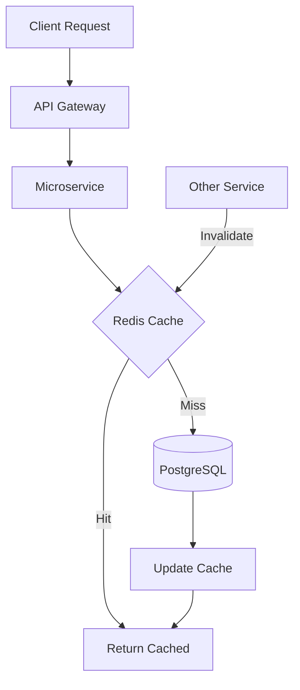

# Redis - Cache y Sesiones

Integración con Redis para cache distribuido y gestión de sesiones.

## Overview

Redis actúa como capa de cache para reducir latencia y carga en PostgreSQL, además de almacenar sesiones de usuarios y facilitar la invalidación de cache coordinada entre servicios.



## Configuración

### Instalación

```bash
# Docker Compose
version: '3.8'
services:
  redis:
    image: redis:7-alpine
    ports:
      - "6379:6379"
    command: redis-server --appendonly yes --maxmemory 256mb --maxmemory-policy allkeys-lru
    volumes:
      - redis_data:/data

volumes:
  redis_data:
```

### Variables de Entorno

```bash
# .env
REDIS_URL=redis://localhost:6379/0
REDIS_MAX_CONNECTIONS=50
REDIS_SOCKET_TIMEOUT=5
REDIS_DECODE_RESPONSES=true
```

### Cliente Async

```python
# app/cache/redis_client.py
import aioredis
from app.config import settings

class RedisClient:
    """Cliente Redis singleton."""

    _instance = None

    def __new__(cls):
        if cls._instance is None:
            cls._instance = super().__new__(cls)
            cls._client = None
        return cls._instance

    async def connect(self):
        """Conectar a Redis."""
        if self._client is None:
            self._client = await aioredis.from_url(
                settings.redis_url,
                max_connections=settings.redis_max_connections,
                decode_responses=True,
                socket_timeout=settings.redis_socket_timeout
            )
            logger.info(f"Connected to Redis: {settings.redis_url}")

    async def close(self):
        """Cerrar conexión."""
        if self._client:
            await self._client.close()

    def get_client(self):
        """Obtener cliente Redis."""
        if self._client is None:
            raise Exception("Redis not connected. Call connect() first.")
        return self._client

# Singleton instance
redis_client = RedisClient()
```

## Cache Service

### Implementación

```python
# app/cache/cache_service.py
import json
from typing import Any, Optional
from datetime import timedelta
from app.cache.redis_client import redis_client

class CacheService:
    """Servicio de cache con Redis."""

    def __init__(self):
        self.redis = redis_client.get_client()

    async def get(self, key: str) -> Optional[Any]:
        """Obtener valor del cache."""

        try:
            value = await self.redis.get(key)

            if value:
                cache_hits.inc()
                return json.loads(value)

            cache_misses.inc()
            return None

        except Exception as e:
            logger.error(f"Cache get error: {e}")
            return None  # Fail gracefully

    async def set(
        self,
        key: str,
        value: Any,
        ttl: int = 300  # 5 minutos por defecto
    ):
        """Guardar valor en cache con TTL."""

        try:
            serialized = json.dumps(value, default=str)
            await self.redis.setex(key, ttl, serialized)

        except Exception as e:
            logger.error(f"Cache set error: {e}")

    async def delete(self, key: str):
        """Eliminar clave del cache."""

        try:
            await self.redis.delete(key)
        except Exception as e:
            logger.error(f"Cache delete error: {e}")

    async def delete_pattern(self, pattern: str):
        """Eliminar múltiples claves por patrón."""

        try:
            cursor = 0
            while True:
                cursor, keys = await self.redis.scan(
                    cursor=cursor,
                    match=pattern,
                    count=100
                )

                if keys:
                    await self.redis.delete(*keys)

                if cursor == 0:
                    break

            logger.info(f"Deleted keys matching: {pattern}")

        except Exception as e:
            logger.error(f"Cache delete pattern error: {e}")

    async def exists(self, key: str) -> bool:
        """Verificar si clave existe."""
        try:
            return await self.redis.exists(key) > 0
        except Exception as e:
            logger.error(f"Cache exists error: {e}")
            return False
```

## Patrones de Cache

### 1. Cache-Aside (Lazy Loading)

```python
async def get_product(product_id: str) -> Product:
    """Obtener producto con cache."""

    # 1. Intentar obtener de cache
    cache_key = f"product:{product_id}"
    cached = await cache_service.get(cache_key)

    if cached:
        logger.debug(f"Cache hit: {cache_key}")
        return Product(**cached)

    # 2. Cache miss → obtener de DB
    logger.debug(f"Cache miss: {cache_key}")
    product = await db.query(Product).filter_by(id=product_id).first()

    if not product:
        raise HTTPException(404, "Product not found")

    # 3. Guardar en cache
    await cache_service.set(
        cache_key,
        product.dict(),
        ttl=300  # 5 minutos
    )

    return product
```

### 2. Write-Through Cache

```python
async def update_product(product_id: str, updates: dict) -> Product:
    """Actualizar producto y cache simultáneamente."""

    # 1. Actualizar en DB
    product = await db.query(Product).filter_by(id=product_id).first()
    for key, value in updates.items():
        setattr(product, key, value)

    await db.commit()
    await db.refresh(product)

    # 2. Actualizar cache inmediatamente
    cache_key = f"product:{product_id}"
    await cache_service.set(
        cache_key,
        product.dict(),
        ttl=300
    )

    return product
```

### 3. Cache Invalidation

```python
async def delete_product(product_id: str):
    """Eliminar producto e invalidar cache."""

    # 1. Eliminar de DB
    await db.execute(
        delete(Product).where(Product.id == product_id)
    )
    await db.commit()

    # 2. Invalidar cache
    await cache_service.delete(f"product:{product_id}")

    # 3. Invalidar cache de listas relacionadas
    await cache_service.delete_pattern(f"products:org:*")

    # 4. Publicar evento de invalidación
    await redis_pubsub.publish(
        "cache_invalidation",
        json.dumps({"pattern": f"product:{product_id}"})
    )
```

## Casos de Uso Específicos

### 1. Cache de Permisos de Usuario

```python
async def get_user_permissions(user_id: str) -> set[str]:
    """Obtener permisos de usuario con cache."""

    cache_key = f"permissions:{user_id}"

    # Intentar cache
    cached = await cache_service.get(cache_key)
    if cached:
        return set(cached)

    # Cache miss → query DB
    permissions = await auth_service.get_permissions(user_id)

    # Guardar en cache (TTL corto para permisos)
    await cache_service.set(
        cache_key,
        list(permissions),
        ttl=300  # 5 minutos
    )

    return permissions
```

### 2. Cache de Locales de Organización

```python
async def get_organization_locals(org_id: str) -> list[dict]:
    """Obtener locales de organización con cache."""

    cache_key = f"org:{org_id}:locals"

    # Intentar cache
    cached = await cache_service.get(cache_key)
    if cached:
        return cached

    # Cache miss → query DB
    locals = await db.query(Local).filter_by(
        organization_id=org_id,
        is_active=True
    ).all()

    locals_data = [local.dict() for local in locals]

    # Guardar en cache (TTL más largo)
    await cache_service.set(
        cache_key,
        locals_data,
        ttl=3600  # 1 hora
    )

    return locals_data
```

### 3. Session Store

```python
# Guardar sesión de usuario
async def create_session(user_id: str, data: dict) -> str:
    """Crear sesión de usuario."""

    session_id = str(uuid4())
    session_key = f"session:{session_id}"

    session_data = {
        "user_id": user_id,
        "created_at": datetime.utcnow().isoformat(),
        **data
    }

    # Guardar en Redis con TTL de sesión
    await cache_service.set(
        session_key,
        session_data,
        ttl=86400  # 24 horas
    )

    return session_id

# Obtener sesión
async def get_session(session_id: str) -> Optional[dict]:
    """Obtener sesión de usuario."""

    session_key = f"session:{session_id}"
    return await cache_service.get(session_key)

# Extender sesión (refresh TTL)
async def extend_session(session_id: str):
    """Extender TTL de sesión."""

    session_key = f"session:{session_id}"
    await redis_client.get_client().expire(session_key, 86400)

# Eliminar sesión (logout)
async def delete_session(session_id: str):
    """Eliminar sesión de usuario."""

    session_key = f"session:{session_id}"
    await cache_service.delete(session_key)
```

## Redis Pub/Sub para Invalidación

### Publisher

```python
# Servicio que actualiza datos
async def update_product_price(product_id: str, new_price: float):
    """Actualizar precio y notificar a otros servicios."""

    # Actualizar DB
    await db.execute(
        update(Product)
        .where(Product.id == product_id)
        .values(base_price=new_price)
    )
    await db.commit()

    # Publicar invalidación
    redis_pubsub = redis_client.get_client()
    await redis_pubsub.publish(
        "cache_invalidation",
        json.dumps({
            "pattern": f"product:{product_id}",
            "reason": "price_updated"
        })
    )
```

### Subscriber

```python
# Servicio que escucha invalidaciones
async def cache_invalidation_subscriber():
    """Escuchar invalidaciones de cache."""

    redis_pubsub = redis_client.get_client().pubsub()
    await redis_pubsub.subscribe("cache_invalidation")

    async for message in redis_pubsub.listen():
        if message["type"] == "message":
            data = json.loads(message["data"])
            pattern = data.get("pattern")

            logger.info(f"Cache invalidation: {pattern}")

            # Invalidar cache local
            await cache_service.delete_pattern(pattern)
```

## Estrategias de TTL

### TTLs Recomendados

```python
# Configuración de TTLs por tipo de dato
CACHE_TTL = {
    # Datos estáticos
    "permissions": 300,        # 5 minutos
    "roles": 600,              # 10 minutos
    "organizations": 3600,     # 1 hora

    # Datos semi-estáticos
    "locals": 3600,            # 1 hora
    "products": 300,           # 5 minutos
    "variants": 300,           # 5 minutos

    # Datos dinámicos
    "stock": 60,               # 1 minuto
    "prices": 300,             # 5 minutos

    # Sesiones
    "sessions": 86400,         # 24 horas
    "refresh_tokens": 604800,  # 7 días
}

def get_ttl(cache_type: str) -> int:
    """Obtener TTL para tipo de cache."""
    return CACHE_TTL.get(cache_type, 300)  # Default 5 min
```

## Monitoreo

### Métricas

```python
from prometheus_client import Counter, Gauge, Histogram

cache_hits = Counter(
    "cache_hits_total",
    "Total cache hits"
)

cache_misses = Counter(
    "cache_misses_total",
    "Total cache misses"
)

cache_operations = Histogram(
    "cache_operation_duration_seconds",
    "Cache operation duration",
    ["operation"]  # get, set, delete
)

redis_memory_usage = Gauge(
    "redis_memory_usage_bytes",
    "Redis memory usage in bytes"
)
```

### Health Check

```python
@router.get("/health/redis")
async def redis_health():
    """Health check de Redis."""

    try:
        redis = redis_client.get_client()

        # Ping
        await redis.ping()

        # Info
        info = await redis.info("memory")
        memory_used = info.get("used_memory", 0)

        return {
            "status": "healthy",
            "memory_used_mb": memory_used / (1024 * 1024)
        }

    except Exception as e:
        return JSONResponse(
            {"status": "unhealthy", "error": str(e)},
            status_code=503
        )
```

### Monitoreo de Memoria

```python
async def monitor_redis_memory():
    """Monitorear uso de memoria de Redis."""

    redis = redis_client.get_client()
    info = await redis.info("memory")

    memory_used = info["used_memory"]
    memory_max = info["maxmemory"]

    if memory_max > 0:
        usage_percentage = (memory_used / memory_max) * 100

        if usage_percentage > 80:
            logger.warning(
                f"Redis memory usage high: {usage_percentage:.2f}%"
            )

        redis_memory_usage.set(memory_used)
```

## Mejores Prácticas

### 1. Namespacing de Keys

```python
# ✅ BIEN: Keys con namespace
product_key = f"product:{product_id}"
user_perms_key = f"permissions:{user_id}"
org_locals_key = f"org:{org_id}:locals"

# ❌ MAL: Keys sin namespace
product_key = product_id
user_perms_key = user_id
```

### 2. Serialización Consistente

```python
# Siempre usar JSON para serialización
# NO usar pickle (no es portable)

# ✅ BIEN
await cache_service.set(key, json.dumps(data))

# ❌ MAL
await cache_service.set(key, pickle.dumps(data))
```

### 3. Fail Gracefully

```python
async def get_product_with_fallback(product_id: str):
    """Obtener producto con fallback si cache falla."""

    try:
        # Intentar cache
        cached = await cache_service.get(f"product:{product_id}")
        if cached:
            return cached
    except Exception as e:
        logger.warning(f"Cache error, falling back to DB: {e}")

    # Fallback a DB
    return await db.query(Product).filter_by(id=product_id).first()
```

### 4. Evitar Cache Stampede

```python
import asyncio
from asyncio import Lock

# Lock por clave para evitar stampede
locks: dict[str, Lock] = {}

async def get_with_lock(key: str, fetch_func):
    """Obtener con lock para evitar cache stampede."""

    # Intentar cache
    cached = await cache_service.get(key)
    if cached:
        return cached

    # Cache miss → adquirir lock
    if key not in locks:
        locks[key] = Lock()

    async with locks[key]:
        # Double-check cache
        cached = await cache_service.get(key)
        if cached:
            return cached

        # Fetch y cache
        data = await fetch_func()
        await cache_service.set(key, data)
        return data
```

## Troubleshooting

### Problema: Cache Hit Rate Bajo

**Causas**:
- TTL muy corto
- Claves incorrectas
- Datos muy dinámicos

**Solución**:
```python
# Calcular hit rate
hit_rate = cache_hits.get() / (cache_hits.get() + cache_misses.get())
logger.info(f"Cache hit rate: {hit_rate:.2%}")

# Si menor a 60%, investigar:
# 1. Aumentar TTLs
# 2. Revisar claves de cache
# 3. Identificar datos que no deberían cachearse
```

### Problema: Redis Out of Memory

**Causas**:
- Demasiados datos
- TTLs muy largos
- Memory leaks

**Solución**:
```bash
# Ver uso de memoria
redis-cli INFO memory

# Ver claves más grandes
redis-cli --bigkeys

# Configurar eviction policy
redis-cli CONFIG SET maxmemory-policy allkeys-lru
```

## Próximos Pasos

- [gRPC - Comunicación Interna](/integraciones/grpc)
- [Catalog Service - Cache Strategy](/microservicios/catalog-service/cache-strategy)
- [PostgreSQL](/integraciones/postgresql)
