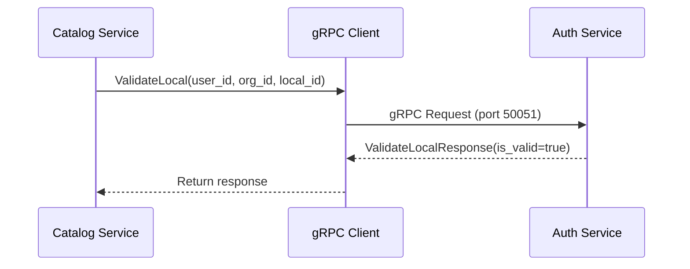

# gRPC - Comunicación Interna

Integración con gRPC para comunicación síncrona de baja latencia entre microservicios.

## Overview

gRPC se utiliza para comunicación interna síncrona cuando se requiere validación o consulta en tiempo real entre servicios.



## Proto Definitions

### auth.proto

```protobuf
// protos/auth.proto
syntax = "proto3";

package auth;

service AuthService {
    // Validar acceso a local
    rpc ValidateLocal(ValidateLocalRequest) returns (ValidateLocalResponse);

    // Verificar token JWT
    rpc VerifyToken(VerifyTokenRequest) returns (VerifyTokenResponse);

    // Obtener permisos de usuario
    rpc GetUserPermissions(GetUserPermissionsRequest) returns (GetUserPermissionsResponse);
}

message ValidateLocalRequest {
    string user_id = 1;
    string organization_id = 2;
    string local_id = 3;
}

message ValidateLocalResponse {
    bool is_valid = 1;
    string local_name = 2;
    string error_message = 3;
}

message VerifyTokenRequest {
    string token = 1;
}

message VerifyTokenResponse {
    bool is_valid = 1;
    string user_id = 2;
    string organization_id = 3;
    repeated string permissions = 4;
    string error_message = 5;
}

message GetUserPermissionsRequest {
    string user_id = 1;
}

message GetUserPermissionsResponse {
    repeated string permissions = 1;
}
```

## Generación de Código

```bash
# Script: scripts/generate_protos.sh
#!/bin/bash

python -m grpc_tools.protoc \
  --proto_path=./protos \
  --python_out=./app/grpc_generated \
  --grpc_python_out=./app/grpc_generated \
  ./protos/*.proto

echo "Proto files generated successfully"
```

## gRPC Server (Auth Service)

### Implementación

```python
# app/grpc_server/auth_servicer.py
import grpc
from app.grpc_generated import auth_pb2, auth_pb2_grpc
from app.services.auth_service import AuthService
from app.services.user_service import UserService

class AuthServicer(auth_pb2_grpc.AuthServiceServicer):
    """Implementación del servicio gRPC de Auth."""

    def __init__(self, auth_service: AuthService, user_service: UserService):
        self.auth_service = auth_service
        self.user_service = user_service

    async def ValidateLocal(
        self,
        request: auth_pb2.ValidateLocalRequest,
        context: grpc.aio.ServicerContext
    ) -> auth_pb2.ValidateLocalResponse:
        """Validar si usuario tiene acceso a un local."""

        try:
            is_valid, local_name = await self.user_service.validate_local(
                user_id=request.user_id,
                organization_id=request.organization_id,
                local_id=request.local_id
            )

            return auth_pb2.ValidateLocalResponse(
                is_valid=is_valid,
                local_name=local_name or ""
            )

        except Exception as e:
            logger.error(f"ValidateLocal error: {e}", exc_info=True)

            context.set_code(grpc.StatusCode.INTERNAL)
            context.set_details(str(e))

            return auth_pb2.ValidateLocalResponse(
                is_valid=False,
                error_message=str(e)
            )

    async def VerifyToken(
        self,
        request: auth_pb2.VerifyTokenRequest,
        context: grpc.aio.ServicerContext
    ) -> auth_pb2.VerifyTokenResponse:
        """Verificar token JWT."""

        try:
            payload = await self.auth_service.verify_token(request.token)

            return auth_pb2.VerifyTokenResponse(
                is_valid=True,
                user_id=payload["user_id"],
                organization_id=payload["organization_id"],
                permissions=payload.get("permissions", [])
            )

        except Exception as e:
            logger.error(f"VerifyToken error: {e}")

            return auth_pb2.VerifyTokenResponse(
                is_valid=False,
                error_message=str(e)
            )

    async def GetUserPermissions(
        self,
        request: auth_pb2.GetUserPermissionsRequest,
        context: grpc.aio.ServicerContext
    ) -> auth_pb2.GetUserPermissionsResponse:
        """Obtener permisos de usuario."""

        try:
            permissions = await self.user_service.get_permissions(request.user_id)

            return auth_pb2.GetUserPermissionsResponse(
                permissions=list(permissions)
            )

        except Exception as e:
            logger.error(f"GetUserPermissions error: {e}")
            context.set_code(grpc.StatusCode.INTERNAL)
            context.set_details(str(e))
            return auth_pb2.GetUserPermissionsResponse()
```

### Iniciar Servidor

```python
# app/grpc_server/server.py
import grpc
from app.grpc_generated import auth_pb2_grpc
from app.grpc_server.auth_servicer import AuthServicer
from app.config import settings

async def serve():
    """Iniciar servidor gRPC."""

    server = grpc.aio.server()

    # Registrar servicer
    auth_pb2_grpc.add_AuthServiceServicer_to_server(
        AuthServicer(auth_service, user_service),
        server
    )

    # Puerto
    listen_addr = f"[::]:{settings.grpc_port}"
    server.add_insecure_port(listen_addr)

    # Iniciar
    await server.start()
    logger.info(f"gRPC server started on {listen_addr}")

    # Mantener corriendo
    await server.wait_for_termination()

# app/main.py
import asyncio

@app.on_event("startup")
async def startup():
    # Iniciar gRPC server en background
    asyncio.create_task(serve())
```

## gRPC Client (Catalog Service)

### Implementación

```python
# app/clients/auth_client.py
import grpc
from app.grpc_generated import auth_pb2, auth_pb2_grpc
from app.config import settings
from typing import Tuple

class AuthClient:
    """Cliente gRPC para Auth Service."""

    def __init__(self):
        self.channel = None
        self.stub = None

    async def connect(self):
        """Conectar a Auth Service gRPC."""

        self.channel = grpc.aio.insecure_channel(
            settings.auth_grpc_url,
            options=[
                ('grpc.lb_policy_name', 'round_robin'),
                ('grpc.keepalive_time_ms', 10000),
                ('grpc.keepalive_timeout_ms', 5000),
                ('grpc.http2.max_pings_without_data', 0),
            ]
        )

        self.stub = auth_pb2_grpc.AuthServiceStub(self.channel)

        logger.info(f"Connected to Auth gRPC: {settings.auth_grpc_url}")

    async def validate_local(
        self,
        user_id: str,
        organization_id: str,
        local_id: str
    ) -> Tuple[bool, str]:
        """
        Validar acceso a local.

        Returns:
            (is_valid, local_name)
        """

        request = auth_pb2.ValidateLocalRequest(
            user_id=user_id,
            organization_id=organization_id,
            local_id=local_id
        )

        try:
            response = await self.stub.ValidateLocal(
                request,
                timeout=5.0
            )

            # Métricas
            grpc_request_duration.labels(
                service="auth",
                method="ValidateLocal"
            ).observe(0.005)  # Ejemplo

            return response.is_valid, response.local_name

        except grpc.RpcError as e:
            logger.error(
                f"gRPC error: {e.code()} - {e.details()}",
                extra={
                    "user_id": user_id,
                    "local_id": local_id
                }
            )

            # Métricas de error
            grpc_errors.labels(
                service="auth",
                method="ValidateLocal",
                code=e.code().name
            ).inc()

            return False, ""

    async def verify_token(self, token: str) -> dict:
        """Verificar token JWT."""

        request = auth_pb2.VerifyTokenRequest(token=token)

        try:
            response = await self.stub.VerifyToken(request, timeout=5.0)

            if not response.is_valid:
                raise ValueError(response.error_message)

            return {
                "user_id": response.user_id,
                "organization_id": response.organization_id,
                "permissions": list(response.permissions)
            }

        except grpc.RpcError as e:
            logger.error(f"VerifyToken gRPC error: {e.code()}")
            raise

    async def close(self):
        """Cerrar conexión."""
        if self.channel:
            await self.channel.close()
```

### Uso con Circuit Breaker

```python
# app/clients/auth_client_with_circuit_breaker.py
from circuitbreaker import CircuitBreaker, CircuitBreakerError
from app.clients.auth_rest_client import AuthRestClient

class AuthClientWithCircuitBreaker:
    """Cliente Auth con circuit breaker y fallback."""

    def __init__(self, grpc_client: AuthClient, rest_client: AuthRestClient):
        self.grpc_client = grpc_client
        self.rest_client = rest_client
        self.circuit_breaker = CircuitBreaker(
            failure_threshold=5,
            recovery_timeout=60,
            expected_exception=grpc.RpcError
        )

    async def validate_local(
        self,
        user_id: str,
        org_id: str,
        local_id: str
    ) -> Tuple[bool, str]:
        """Validar con fallback a REST."""

        try:
            return await self._validate_local_grpc(user_id, org_id, local_id)
        except CircuitBreakerError:
            logger.warning("gRPC circuit breaker open, falling back to REST")
            return await self._validate_local_rest(user_id, org_id, local_id)

    @CircuitBreaker(failure_threshold=5, recovery_timeout=60)
    async def _validate_local_grpc(self, user_id, org_id, local_id):
        """Intentar vía gRPC."""
        return await self.grpc_client.validate_local(user_id, org_id, local_id)

    async def _validate_local_rest(self, user_id, org_id, local_id):
        """Fallback vía REST."""
        response = await self.rest_client.get(
            f"/api/v1/locals/{local_id}/validate",
            params={"user_id": user_id, "organization_id": org_id}
        )
        data = response.json()
        return data["is_valid"], data.get("local_name", "")
```

## Interceptors

### Logging Interceptor

```python
# app/grpc_server/interceptors.py
import grpc
import time

class LoggingInterceptor(grpc.aio.ServerInterceptor):
    """Interceptor para logging de requests."""

    async def intercept_service(self, continuation, handler_call_details):
        method = handler_call_details.method
        start_time = time.time()

        logger.info(f"gRPC request: {method}")

        # Continuar
        response = await continuation(handler_call_details)

        # Log duración
        duration = time.time() - start_time
        logger.info(f"gRPC request completed: {method} ({duration:.3f}s)")

        return response
```

## Health Check

```python
@router.get("/health/grpc")
async def grpc_health():
    """Health check de gRPC server."""

    try:
        # Intentar conexión
        async with grpc.aio.insecure_channel(
            f"localhost:{settings.grpc_port}",
            options=[('grpc.keepalive_time_ms', 10000)]
        ) as channel:
            # Esperar a que esté ready
            await channel.channel_ready()

            return {"status": "healthy"}

    except Exception as e:
        return JSONResponse(
            {"status": "unhealthy", "error": str(e)},
            status_code=503
        )
```

## Próximos Pasos

- [ADR-004: gRPC para Comunicación Interna](/adrs/adr-004-grpc-internal)
- [Catalog Service - Auth Client gRPC](/microservicios/catalog-service/auth-client-grpc)
- [PostgreSQL](/integraciones/postgresql)
