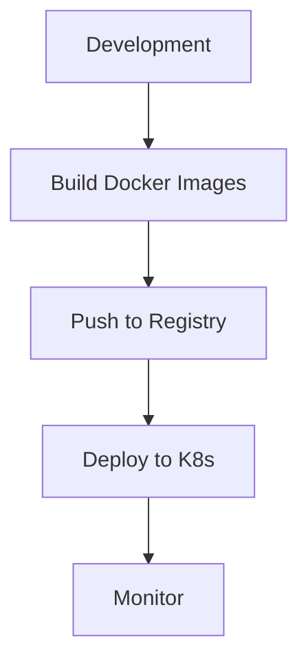

# Deployment

Guía de deployment de zenLogic a producción usando Docker y Kubernetes.

## Estrategia de Deployment



## Docker Production

### Dockerfile Optimizado

```dockerfile
# Multi-stage build
FROM python:3.11-slim as builder

WORKDIR /app

# Dependencies
COPY requirements.txt .
RUN pip install --no-cache-dir --user -r requirements.txt

FROM python:3.11-slim

WORKDIR /app

# Copy dependencies from builder
COPY --from=builder /root/.local /root/.local
ENV PATH=/root/.local/bin:$PATH

# Copy code
COPY . .

# Non-root user
RUN useradd -m appuser && chown -R appuser:appuser /app
USER appuser

# Health check
HEALTHCHECK --interval=30s --timeout=3s \
  CMD python -c "import requests; requests.get('http://localhost:8001/health')"

# Run
CMD ["uvicorn", "app.main:app", "--host", "0.0.0.0", "--port", "8001", "--workers", "4"]
```

### Docker Compose Production

```yaml
version: '3.8'

services:
  auth-service:
    image: registry.example.com/auth-service:latest
    deploy:
      replicas: 3
      restart_policy:
        condition: on-failure
    environment:
      DATABASE_URL: ${AUTH_DB_URL}
      REDIS_URL: ${REDIS_URL}
      RABBITMQ_URL: ${RABBITMQ_URL}
    secrets:
      - jwt_private_key
      - jwt_public_key

secrets:
  jwt_private_key:
    file: ./secrets/private_key.pem
  jwt_public_key:
    file: ./secrets/public_key.pem
```

## Kubernetes

### Namespace

```yaml
# k8s/namespace.yaml
apiVersion: v1
kind: Namespace
metadata:
  name: zenlogic
```

### ConfigMap

```yaml
# k8s/configmap.yaml
apiVersion: v1
kind: ConfigMap
metadata:
  name: zenlogic-config
  namespace: zenlogic
data:
  RABBITMQ_EXCHANGE: "erp.events"
  LOG_LEVEL: "INFO"
  CORS_ORIGINS: "https://app.zenlogic.com"
```

### Secrets

```yaml
# k8s/secrets.yaml
apiVersion: v1
kind: Secret
metadata:
  name: zenlogic-secrets
  namespace: zenlogic
type: Opaque
data:
  DATABASE_URL: <base64-encoded>
  REDIS_URL: <base64-encoded>
  RABBITMQ_URL: <base64-encoded>
  JWT_SECRET_KEY: <base64-encoded>
```

### Deployment

```yaml
# k8s/auth-service-deployment.yaml
apiVersion: apps/v1
kind: Deployment
metadata:
  name: auth-service
  namespace: zenlogic
spec:
  replicas: 3
  selector:
    matchLabels:
      app: auth-service
  template:
    metadata:
      labels:
        app: auth-service
    spec:
      containers:
      - name: auth-service
        image: registry.example.com/auth-service:v1.0.0
        ports:
        - containerPort: 8001
          name: http
        - containerPort: 50051
          name: grpc
        env:
        - name: SERVICE_NAME
          value: "auth-service"
        envFrom:
        - configMapRef:
            name: zenlogic-config
        - secretRef:
            name: zenlogic-secrets
        resources:
          requests:
            memory: "256Mi"
            cpu: "250m"
          limits:
            memory: "512Mi"
            cpu: "500m"
        livenessProbe:
          httpGet:
            path: /health
            port: 8001
          initialDelaySeconds: 30
          periodSeconds: 10
        readinessProbe:
          httpGet:
            path: /health
            port: 8001
          initialDelaySeconds: 5
          periodSeconds: 5
```

### Service

```yaml
# k8s/auth-service-service.yaml
apiVersion: v1
kind: Service
metadata:
  name: auth-service
  namespace: zenlogic
spec:
  selector:
    app: auth-service
  ports:
  - name: http
    port: 8001
    targetPort: 8001
  - name: grpc
    port: 50051
    targetPort: 50051
  type: ClusterIP
```

### Ingress

```yaml
# k8s/ingress.yaml
apiVersion: networking.k8s.io/v1
kind: Ingress
metadata:
  name: zenlogic-ingress
  namespace: zenlogic
  annotations:
    cert-manager.io/cluster-issuer: "letsencrypt-prod"
    nginx.ingress.kubernetes.io/ssl-redirect: "true"
spec:
  tls:
  - hosts:
    - api.zenlogic.com
    secretName: zenlogic-tls
  rules:
  - host: api.zenlogic.com
    http:
      paths:
      - path: /auth
        pathType: Prefix
        backend:
          service:
            name: auth-service
            port:
              number: 8001
      - path: /catalog
        pathType: Prefix
        backend:
          service:
            name: catalog-service
            port:
              number: 8002
```

## CI/CD Pipeline

### GitHub Actions

```yaml
# .github/workflows/deploy.yml
name: Deploy to Production

on:
  push:
    branches: [main]

jobs:
  build-and-deploy:
    runs-on: ubuntu-latest

    steps:
    - uses: actions/checkout@v3

    - name: Login to Registry
      uses: docker/login-action@v2
      with:
        registry: registry.example.com
        username: ${{ secrets.REGISTRY_USERNAME }}
        password: ${{ secrets.REGISTRY_PASSWORD }}

    - name: Build and Push
      run: |
        docker build -t registry.example.com/auth-service:${{ github.sha }} services/auth-service
        docker push registry.example.com/auth-service:${{ github.sha }}

    - name: Deploy to Kubernetes
      uses: azure/k8s-deploy@v4
      with:
        manifests: |
          k8s/auth-service-deployment.yaml
        images: |
          registry.example.com/auth-service:${{ github.sha }}
        kubeconfig: ${{ secrets.KUBECONFIG }}
```

## Database Migrations

```bash
# Script de migración segura
#!/bin/bash

# Backup DB
pg_dump -U user -d prod_db > backup_$(date +%Y%m%d).sql

# Run migrations
kubectl exec -it auth-service-pod -- alembic upgrade head

# Verify
kubectl exec -it auth-service-pod -- alembic current
```

## Monitoring

### Prometheus

```yaml
# k8s/prometheus-config.yaml
apiVersion: v1
kind: ConfigMap
metadata:
  name: prometheus-config
data:
  prometheus.yml: |
    scrape_configs:
    - job_name: 'auth-service'
      static_configs:
      - targets: ['auth-service:8001']
```

### Grafana Dashboard

```json
{
  "dashboard": {
    "title": "zenLogic Services",
    "panels": [
      {
        "title": "Request Rate",
        "targets": [{
          "expr": "rate(http_requests_total[5m])"
        }]
      }
    ]
  }
}
```

## Rollback

```bash
# Rollback a versión anterior
kubectl rollout undo deployment/auth-service -n zenlogic

# Ver historial
kubectl rollout history deployment/auth-service -n zenlogic

# Rollback a versión específica
kubectl rollout undo deployment/auth-service --to-revision=2 -n zenlogic
```

## Próximos Pasos

- [Troubleshooting](/guias/troubleshooting)
- [Monitoring](/arquitectura/vision-general)
