# Diagramas de Arquitectura

Colección completa de diagramas de arquitectura de zenLogic ERP.

## Arquitectura General

### Vista de Alto Nivel

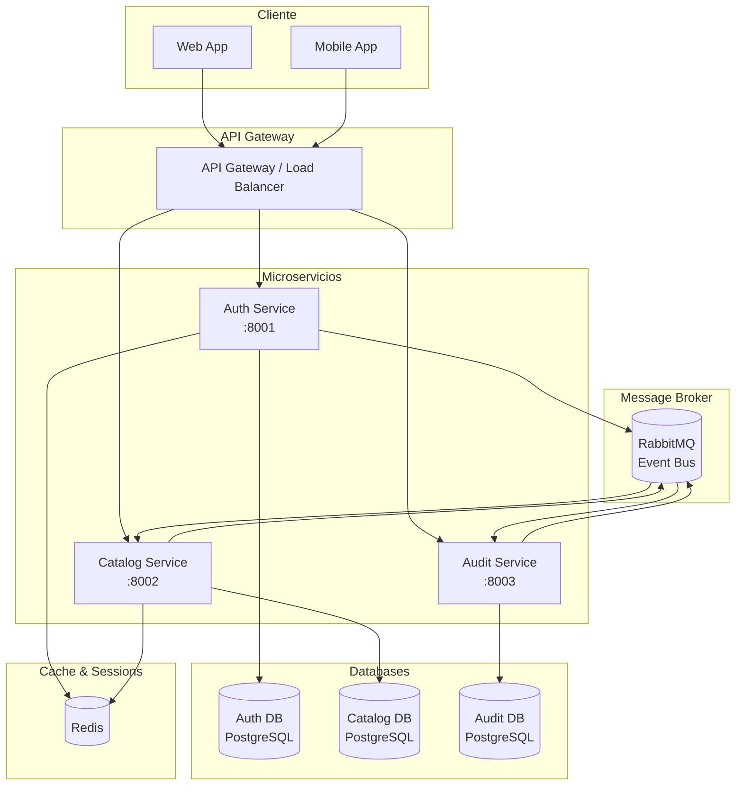
```mermaid
graph TB
    subgraph "Cliente"
        Web[Web App]
        Mobile[Mobile App]
    end

    subgraph "API Gateway"
        Gateway[API Gateway / Load Balancer]
    end

    subgraph "Microservicios"
        Auth[Auth Service<br/>:8001]
        Catalog[Catalog Service<br/>:8002]
        Audit[Audit Service<br/>:8003]
    end

    subgraph "Message Broker"
        RabbitMQ[(RabbitMQ<br/>Event Bus)]
    end

    subgraph "Databases"
        AuthDB[(Auth DB<br/>PostgreSQL)]
        CatalogDB[(Catalog DB<br/>PostgreSQL)]
        AuditDB[(Audit DB<br/>PostgreSQL)]
    end

    subgraph "Cache & Sessions"
        Redis[(Redis)]
    end

    Web --> Gateway
    Mobile --> Gateway

    Gateway --> Auth
    Gateway --> Catalog
    Gateway --> Audit

    Auth --> RabbitMQ
    Catalog --> RabbitMQ
    Audit --> RabbitMQ

    Auth --> AuthDB
    Catalog --> CatalogDB
    Audit --> AuditDB

    Auth --> Redis
    Catalog --> Redis

    RabbitMQ --> Catalog
    RabbitMQ --> Audit
```

### Stack Tecnológico

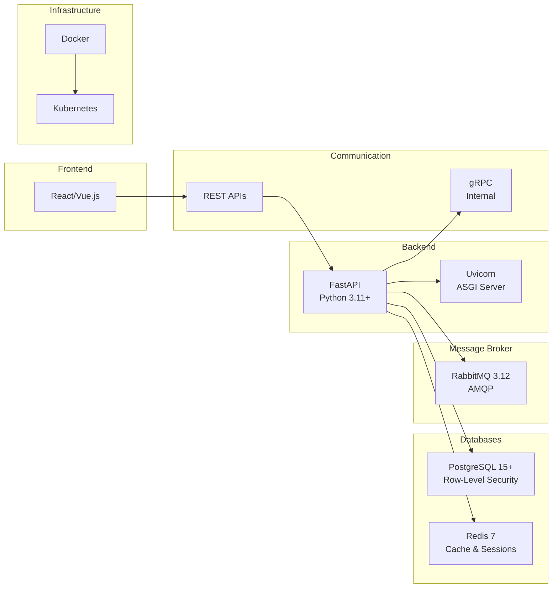
```mermaid
graph LR
    subgraph "Frontend"
        React[React/Vue.js]
    end

    subgraph "Backend"
        FastAPI[FastAPI<br/>Python 3.11+]
        Uvicorn[Uvicorn<br/>ASGI Server]
    end

    subgraph "Databases"
        PostgreSQL[PostgreSQL 15+<br/>Row-Level Security]
        Redis[Redis 7<br/>Cache & Sessions]
    end

    subgraph "Message Broker"
        RabbitMQ[RabbitMQ 3.12<br/>AMQP]
    end

    subgraph "Communication"
        REST[REST APIs]
        gRPC[gRPC<br/>Internal]
    end

    subgraph "Infrastructure"
        Docker[Docker]
        Kubernetes[Kubernetes]
    end

    React --> REST
    REST --> FastAPI
    FastAPI --> Uvicorn
    FastAPI --> PostgreSQL
    FastAPI --> Redis
    FastAPI --> RabbitMQ
    FastAPI --> gRPC
    Docker --> Kubernetes
```

## Arquitectura Event-Driven

### Flujo de Eventos

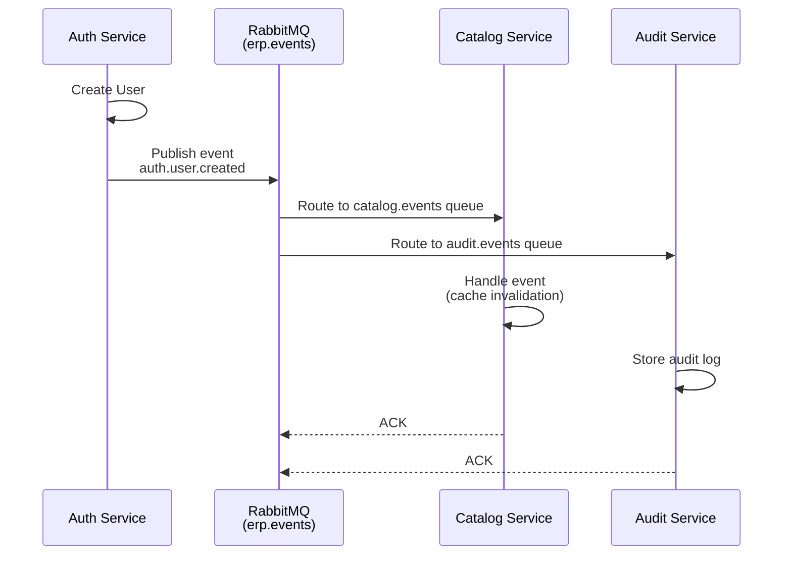
```mermaid
sequenceDiagram
    participant Auth as Auth Service
    participant RabbitMQ as RabbitMQ<br/>(erp.events)
    participant Catalog as Catalog Service
    participant Audit as Audit Service

    Auth->>Auth: Create User
    Auth->>RabbitMQ: Publish event<br/>auth.user.created
    RabbitMQ->>Catalog: Route to catalog.events queue
    RabbitMQ->>Audit: Route to audit.events queue
    Catalog->>Catalog: Handle event<br/>(cache invalidation)
    Audit->>Audit: Store audit log
    Catalog-->>RabbitMQ: ACK
    Audit-->>RabbitMQ: ACK
```

### Exchange y Queues

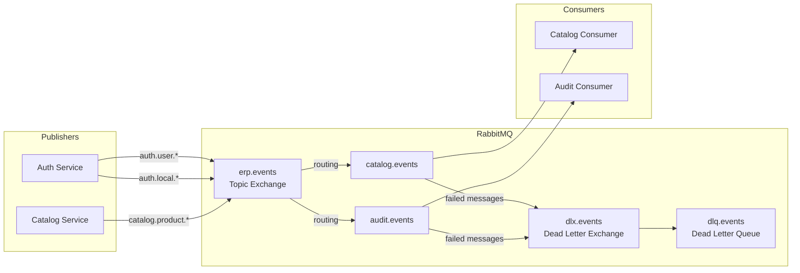
```mermaid
graph LR
    subgraph "Publishers"
        Auth[Auth Service]
        Catalog[Catalog Service]
    end

    subgraph "RabbitMQ"
        Exchange[erp.events<br/>Topic Exchange]
        Q1[catalog.events]
        Q2[audit.events]
        DLX[dlx.events<br/>Dead Letter Exchange]
        DLQ[dlq.events<br/>Dead Letter Queue]
    end

    subgraph "Consumers"
        CatalogConsumer[Catalog Consumer]
        AuditConsumer[Audit Consumer]
    end

    Auth -->|auth.user.*| Exchange
    Auth -->|auth.local.*| Exchange
    Catalog -->|catalog.product.*| Exchange

    Exchange -->|routing| Q1
    Exchange -->|routing| Q2

    Q1 -->|failed messages| DLX
    Q2 -->|failed messages| DLX
    DLX --> DLQ

    Q1 --> CatalogConsumer
    Q2 --> AuditConsumer
```

## Comunicación entre Microservicios

### gRPC - Validación de Local

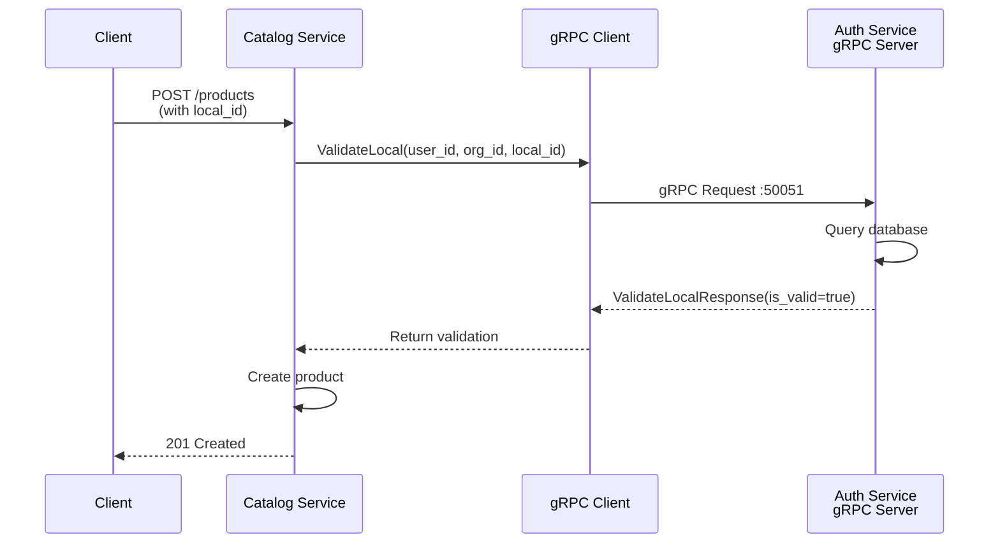
```mermaid
sequenceDiagram
    participant Client as Client
    participant Catalog as Catalog Service
    participant gRPC as gRPC Client
    participant Auth as Auth Service<br/>gRPC Server

    Client->>Catalog: POST /products<br/>(with local_id)
    Catalog->>gRPC: ValidateLocal(user_id, org_id, local_id)
    gRPC->>Auth: gRPC Request :50051
    Auth->>Auth: Query database
    Auth-->>gRPC: ValidateLocalResponse(is_valid=true)
    gRPC-->>Catalog: Return validation
    Catalog->>Catalog: Create product
    Catalog-->>Client: 201 Created
```

### Circuit Breaker Pattern

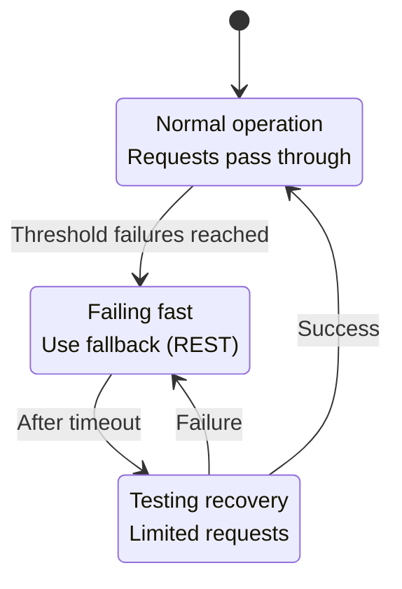
```mermaid
stateDiagram-v2
    [*] --> Closed
    Closed --> Open: Threshold failures reached
    Open --> HalfOpen: After timeout
    HalfOpen --> Closed: Success
    HalfOpen --> Open: Failure

    Closed: Normal operation<br/>Requests pass through
    Open: Failing fast<br/>Use fallback (REST)
    HalfOpen: Testing recovery<br/>Limited requests
```

## Multi-tenancy

### Row-Level Security

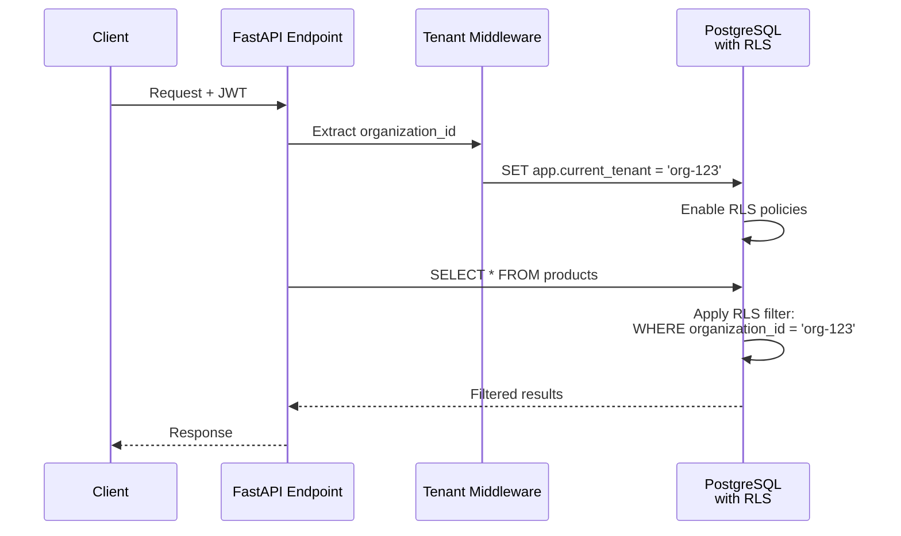
```mermaid
sequenceDiagram
    participant Client
    participant API as FastAPI Endpoint
    participant Middleware as Tenant Middleware
    participant DB as PostgreSQL<br/>with RLS

    Client->>API: Request + JWT
    API->>Middleware: Extract organization_id
    Middleware->>DB: SET app.current_tenant = 'org-123'
    DB->>DB: Enable RLS policies
    API->>DB: SELECT * FROM products
    DB->>DB: Apply RLS filter:<br/>WHERE organization_id = 'org-123'
    DB-->>API: Filtered results
    API-->>Client: Response
```

### Jerarquía Multi-tenant

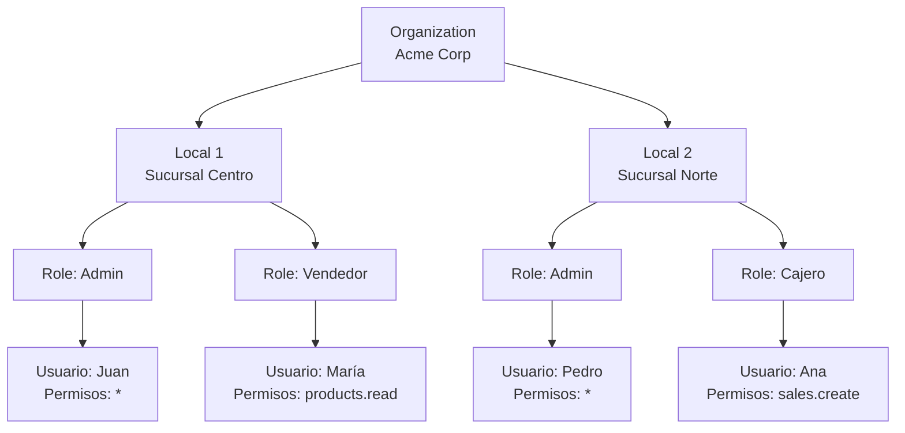
```mermaid
graph TD
    Org[Organization<br/>Acme Corp]

    Org --> Local1[Local 1<br/>Sucursal Centro]
    Org --> Local2[Local 2<br/>Sucursal Norte]

    Local1 --> Role1A[Role: Admin]
    Local1 --> Role1B[Role: Vendedor]

    Local2 --> Role2A[Role: Admin]
    Local2 --> Role2B[Role: Cajero]

    Role1A --> User1[Usuario: Juan<br/>Permisos: *]
    Role1B --> User2[Usuario: María<br/>Permisos: products.read]

    Role2A --> User3[Usuario: Pedro<br/>Permisos: *]
    Role2B --> User4[Usuario: Ana<br/>Permisos: sales.create]
```

## RBAC - Control de Acceso

### Flujo de Autorización

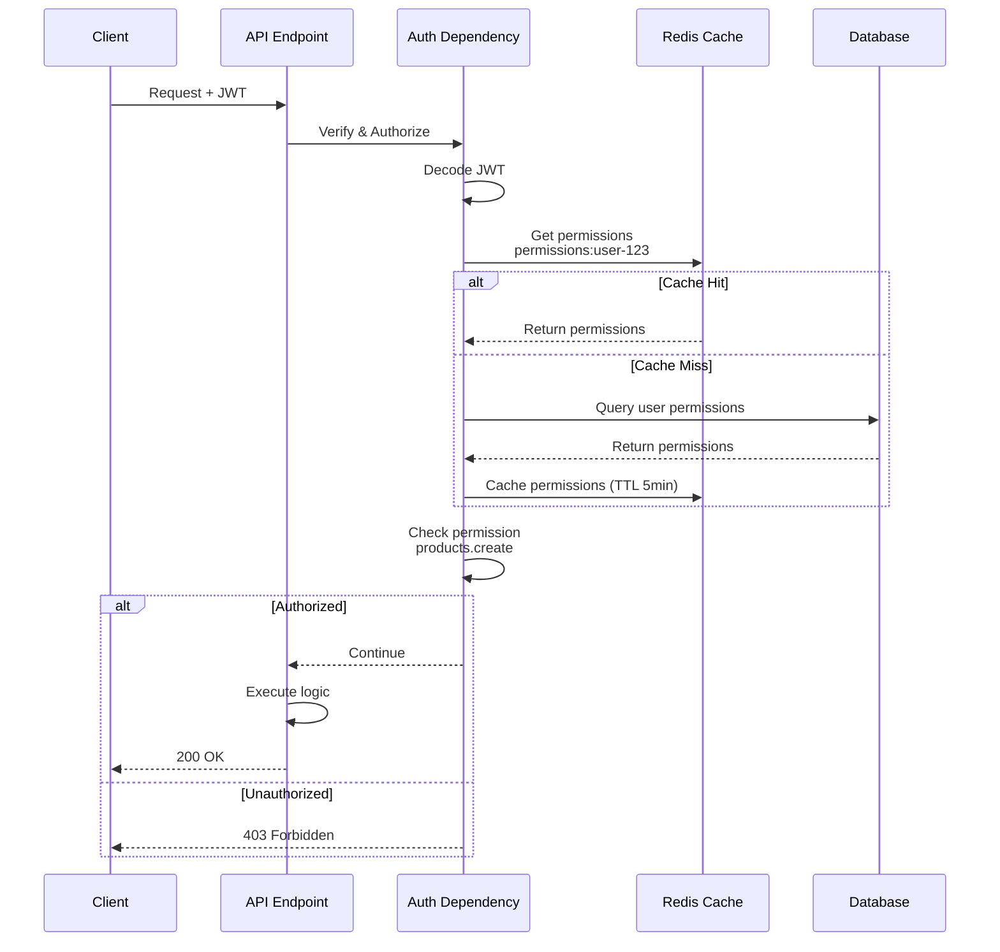
```mermaid
sequenceDiagram
    participant Client
    participant API as API Endpoint
    participant Auth as Auth Dependency
    participant Cache as Redis Cache
    participant DB as Database

    Client->>API: Request + JWT
    API->>Auth: Verify & Authorize
    Auth->>Auth: Decode JWT
    Auth->>Cache: Get permissions<br/>permissions:user-123

    alt Cache Hit
        Cache-->>Auth: Return permissions
    else Cache Miss
        Auth->>DB: Query user permissions
        DB-->>Auth: Return permissions
        Auth->>Cache: Cache permissions (TTL 5min)
    end

    Auth->>Auth: Check permission<br/>products.create

    alt Authorized
        Auth-->>API: Continue
        API->>API: Execute logic
        API-->>Client: 200 OK
    else Unauthorized
        Auth-->>Client: 403 Forbidden
    end
```

### Modelo de Permisos

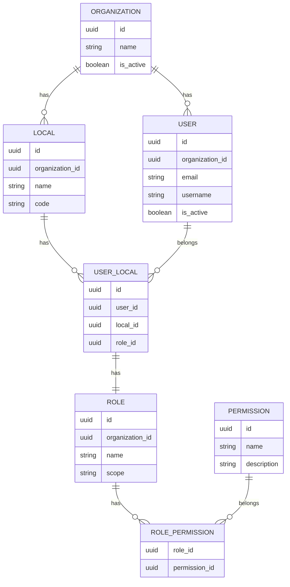
```mermaid
erDiagram
    ORGANIZATION ||--o{ LOCAL : has
    ORGANIZATION ||--o{ USER : has
    LOCAL ||--o{ USER_LOCAL : has
    USER ||--o{ USER_LOCAL : belongs
    USER_LOCAL ||--|| ROLE : has
    ROLE ||--o{ ROLE_PERMISSION : has
    PERMISSION ||--o{ ROLE_PERMISSION : belongs

    ORGANIZATION {
        uuid id
        string name
        boolean is_active
    }

    LOCAL {
        uuid id
        uuid organization_id
        string name
        string code
    }

    USER {
        uuid id
        uuid organization_id
        string email
        string username
        boolean is_active
    }

    USER_LOCAL {
        uuid id
        uuid user_id
        uuid local_id
        uuid role_id
    }

    ROLE {
        uuid id
        uuid organization_id
        string name
        string scope
    }

    PERMISSION {
        uuid id
        string name
        string description
    }

    ROLE_PERMISSION {
        uuid role_id
        uuid permission_id
    }
```

## Cache Strategy

### Cache-Aside Pattern

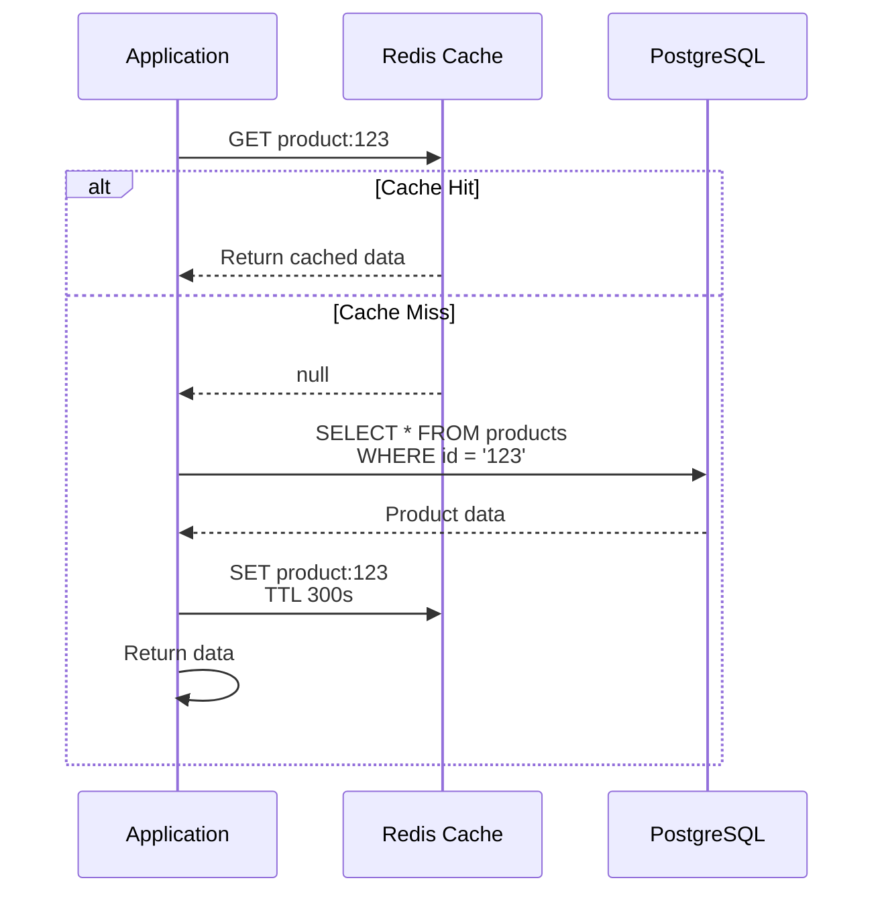
```mermaid
sequenceDiagram
    participant App as Application
    participant Cache as Redis Cache
    participant DB as PostgreSQL

    App->>Cache: GET product:123

    alt Cache Hit
        Cache-->>App: Return cached data
    else Cache Miss
        Cache-->>App: null
        App->>DB: SELECT * FROM products<br/>WHERE id = '123'
        DB-->>App: Product data
        App->>Cache: SET product:123<br/>TTL 300s
        App->>App: Return data
    end
```

### Cache Invalidation

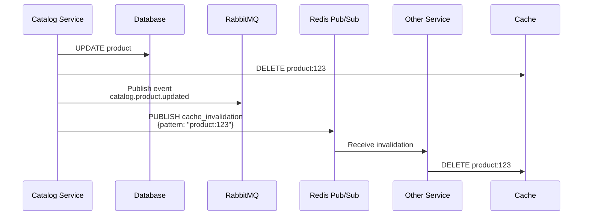
```mermaid
sequenceDiagram
    participant Service1 as Catalog Service
    participant DB as Database
    participant RabbitMQ as RabbitMQ
    participant PubSub as Redis Pub/Sub
    participant Service2 as Other Service
    participant Cache as Cache

    Service1->>DB: UPDATE product
    Service1->>Cache: DELETE product:123
    Service1->>RabbitMQ: Publish event<br/>catalog.product.updated
    Service1->>PubSub: PUBLISH cache_invalidation<br/>{pattern: "product:123"}

    PubSub->>Service2: Receive invalidation
    Service2->>Cache: DELETE product:123
```

## Paginación Cursor-based

### Flujo de Paginación

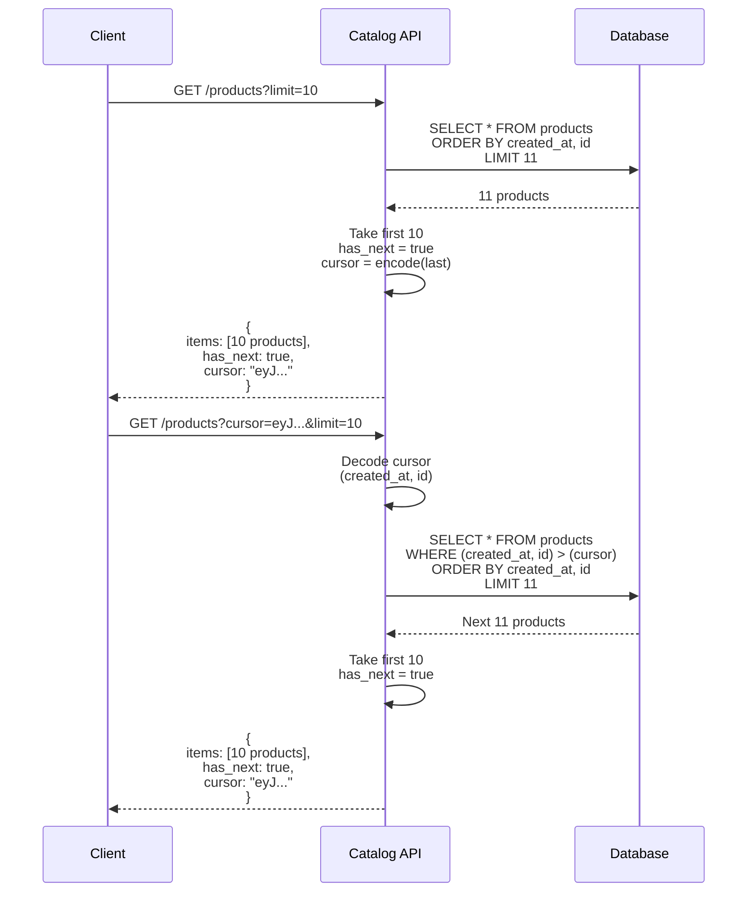
```mermaid
sequenceDiagram
    participant Client
    participant API as Catalog API
    participant DB as Database

    Client->>API: GET /products?limit=10
    API->>DB: SELECT * FROM products<br/>ORDER BY created_at, id<br/>LIMIT 11
    DB-->>API: 11 products
    API->>API: Take first 10<br/>has_next = true<br/>cursor = encode(last)
    API-->>Client: {<br/>  items: [10 products],<br/>  has_next: true,<br/>  cursor: "eyJ..."<br/>}

    Client->>API: GET /products?cursor=eyJ...&limit=10
    API->>API: Decode cursor<br/>(created_at, id)
    API->>DB: SELECT * FROM products<br/>WHERE (created_at, id) > (cursor)<br/>ORDER BY created_at, id<br/>LIMIT 11
    DB-->>API: Next 11 products
    API->>API: Take first 10<br/>has_next = true
    API-->>Client: {<br/>  items: [10 products],<br/>  has_next: true,<br/>  cursor: "eyJ..."<br/>}
```

## Deployment

### Docker Compose - Local

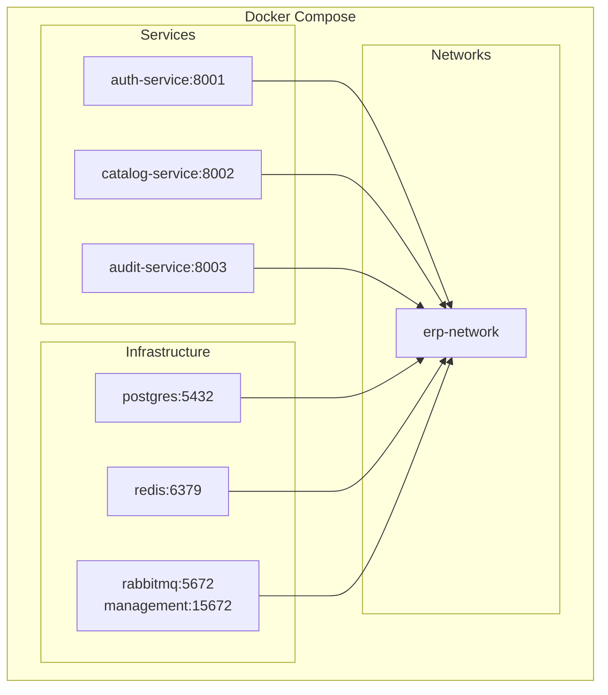
```mermaid
graph TB
    subgraph "Docker Compose"
        subgraph "Services"
            Auth[auth-service:8001]
            Catalog[catalog-service:8002]
            Audit[audit-service:8003]
        end

        subgraph "Infrastructure"
            PostgreSQL[postgres:5432]
            Redis[redis:6379]
            RabbitMQ[rabbitmq:5672<br/>management:15672]
        end

        subgraph "Networks"
            Network[erp-network]
        end

        Auth --> Network
        Catalog --> Network
        Audit --> Network
        PostgreSQL --> Network
        Redis --> Network
        RabbitMQ --> Network
    end
```

### Kubernetes - Production

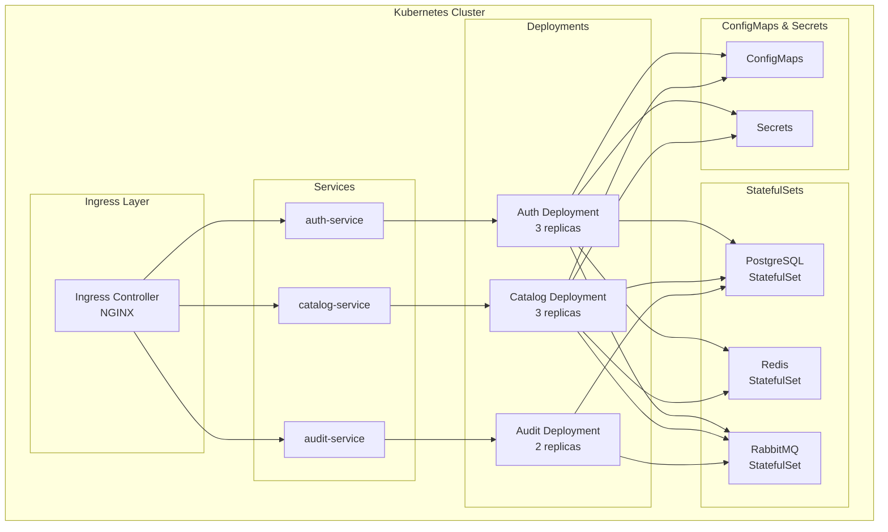
```mermaid
graph TB
    subgraph "Kubernetes Cluster"
        subgraph "Ingress Layer"
            Ingress[Ingress Controller<br/>NGINX]
        end

        subgraph "Deployments"
            AuthDeploy[Auth Deployment<br/>3 replicas]
            CatalogDeploy[Catalog Deployment<br/>3 replicas]
            AuditDeploy[Audit Deployment<br/>2 replicas]
        end

        subgraph "Services"
            AuthSvc[auth-service]
            CatalogSvc[catalog-service]
            AuditSvc[audit-service]
        end

        subgraph "StatefulSets"
            PostgreSQL[PostgreSQL<br/>StatefulSet]
            Redis[Redis<br/>StatefulSet]
            RabbitMQ[RabbitMQ<br/>StatefulSet]
        end

        subgraph "ConfigMaps & Secrets"
            ConfigMap[ConfigMaps]
            Secrets[Secrets]
        end

        Ingress --> AuthSvc
        Ingress --> CatalogSvc
        Ingress --> AuditSvc

        AuthSvc --> AuthDeploy
        CatalogSvc --> CatalogDeploy
        AuditSvc --> AuditDeploy

        AuthDeploy --> PostgreSQL
        AuthDeploy --> Redis
        AuthDeploy --> RabbitMQ

        CatalogDeploy --> PostgreSQL
        CatalogDeploy --> Redis
        CatalogDeploy --> RabbitMQ

        AuditDeploy --> PostgreSQL
        AuditDeploy --> RabbitMQ

        AuthDeploy --> ConfigMap
        AuthDeploy --> Secrets
        CatalogDeploy --> ConfigMap
        CatalogDeploy --> Secrets
    end
```

## CI/CD Pipeline

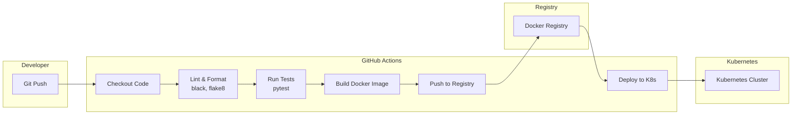
```mermaid
graph LR
    subgraph "Developer"
        Dev[Git Push]
    end

    subgraph "GitHub Actions"
        Checkout[Checkout Code]
        Lint[Lint & Format<br/>black, flake8]
        Test[Run Tests<br/>pytest]
        Build[Build Docker Image]
        Push[Push to Registry]
        Deploy[Deploy to K8s]
    end

    subgraph "Registry"
        DockerHub[Docker Registry]
    end

    subgraph "Kubernetes"
        K8s[Kubernetes Cluster]
    end

    Dev --> Checkout
    Checkout --> Lint
    Lint --> Test
    Test --> Build
    Build --> Push
    Push --> DockerHub
    DockerHub --> Deploy
    Deploy --> K8s
```

## Monitoring y Observabilidad

### Métricas y Logs

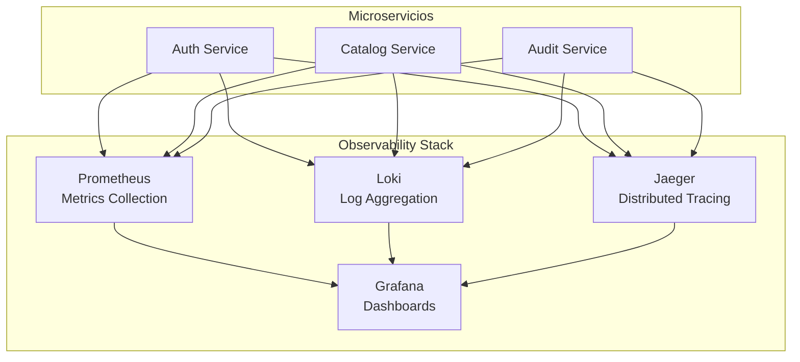
```mermaid
graph TB
    subgraph "Microservicios"
        Auth[Auth Service]
        Catalog[Catalog Service]
        Audit[Audit Service]
    end

    subgraph "Observability Stack"
        Prometheus[Prometheus<br/>Metrics Collection]
        Grafana[Grafana<br/>Dashboards]
        Loki[Loki<br/>Log Aggregation]
        Jaeger[Jaeger<br/>Distributed Tracing]
    end

    Auth --> Prometheus
    Catalog --> Prometheus
    Audit --> Prometheus

    Auth --> Loki
    Catalog --> Loki
    Audit --> Loki

    Auth --> Jaeger
    Catalog --> Jaeger
    Audit --> Jaeger

    Prometheus --> Grafana
    Loki --> Grafana
    Jaeger --> Grafana
```

### Health Checks

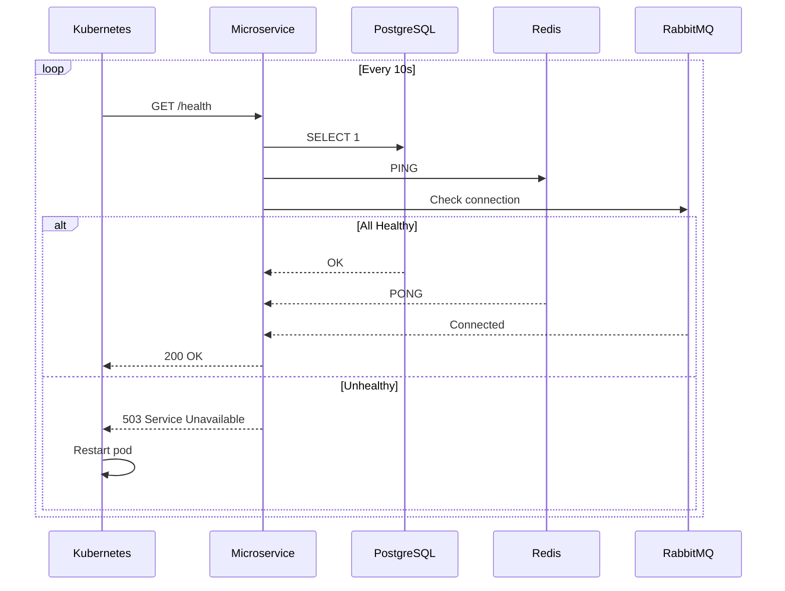
```mermaid
sequenceDiagram
    participant K8s as Kubernetes
    participant Service as Microservice
    participant DB as PostgreSQL
    participant Redis
    participant RabbitMQ

    loop Every 10s
        K8s->>Service: GET /health
        Service->>DB: SELECT 1
        Service->>Redis: PING
        Service->>RabbitMQ: Check connection

        alt All Healthy
            DB-->>Service: OK
            Redis-->>Service: PONG
            RabbitMQ-->>Service: Connected
            Service-->>K8s: 200 OK
        else Unhealthy
            Service-->>K8s: 503 Service Unavailable
            K8s->>K8s: Restart pod
        end
    end
```

## Resiliencia

### Retry Pattern

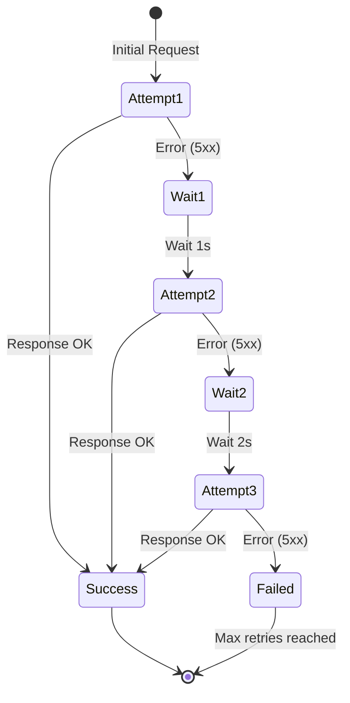
```mermaid
stateDiagram-v2
    [*] --> Attempt1: Initial Request
    Attempt1 --> Success: Response OK
    Attempt1 --> Wait1: Error (5xx)
    Wait1 --> Attempt2: Wait 1s
    Attempt2 --> Success: Response OK
    Attempt2 --> Wait2: Error (5xx)
    Wait2 --> Attempt3: Wait 2s
    Attempt3 --> Success: Response OK
    Attempt3 --> Failed: Error (5xx)
    Success --> [*]
    Failed --> [*]: Max retries reached
```

### Fallback Strategy

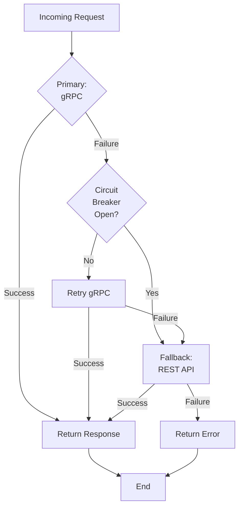
```mermaid
graph TD
    Request[Incoming Request]

    Request --> Primary{Primary:<br/>gRPC}

    Primary -->|Success| Response[Return Response]
    Primary -->|Failure| CB{Circuit<br/>Breaker<br/>Open?}

    CB -->|Yes| Fallback[Fallback:<br/>REST API]
    CB -->|No| Retry[Retry gRPC]

    Retry -->|Success| Response
    Retry -->|Failure| Fallback

    Fallback -->|Success| Response
    Fallback -->|Failure| Error[Return Error]

    Response --> End[End]
    Error --> End
```

## Referencias

Estos diagramas están integrados a lo largo de toda la documentación. Para más detalles:

- [Arquitectura General - Visión General](/arquitectura/vision-general)
- [Event-Driven Architecture](/arquitectura/arquitectura-event-driven)
- [Multi-tenancy](/arquitectura/multi-tenancy)
- [RBAC](/arquitectura/seguridad-rbac)
- [Catalog Service - Cache Strategy](/microservicios/catalog-service/cache-strategy)
- [Catalog Service - Cursor Pagination](/microservicios/catalog-service/paginacion-cursor)
