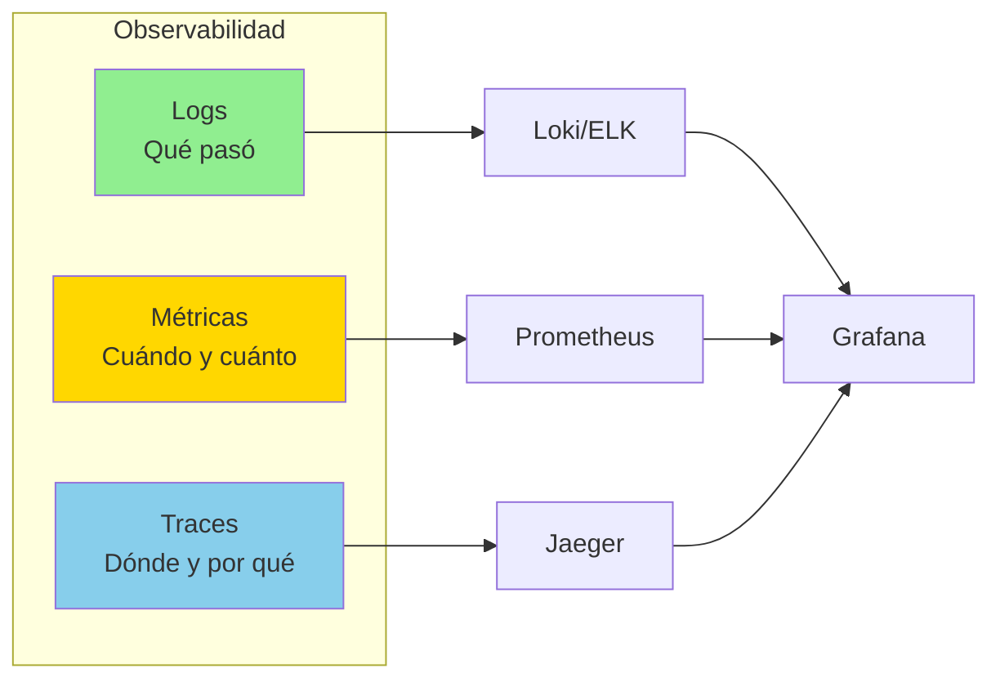

# Guía de Observabilidad

Sistema completo de observabilidad para microservicios: logging, métricas y tracing distribuido.

## Los Tres Pilares



## 1. Logging Estructurado

### Configuración con Structlog

```python
# src/logging_config.py
import structlog
import logging
import sys
from typing import Any

def setup_logging(
    service_name: str,
    environment: str,
    log_level: str = "INFO"
) -> None:
    """Configurar logging estructurado con structlog."""

    # Procesadores de structlog
    shared_processors = [
        structlog.contextvars.merge_contextvars,
        structlog.stdlib.add_log_level,
        structlog.stdlib.add_logger_name,
        structlog.processors.TimeStamper(fmt="iso"),
        structlog.processors.StackInfoRenderer(),
        structlog.processors.format_exc_info,
        structlog.processors.UnicodeDecoder(),
    ]

    # Configuración para producción (JSON)
    if environment == "production":
        structlog.configure(
            processors=shared_processors + [
                structlog.processors.dict_tracebacks,
                structlog.processors.JSONRenderer()
            ],
            wrapper_class=structlog.stdlib.BoundLogger,
            context_class=dict,
            logger_factory=structlog.stdlib.LoggerFactory(),
            cache_logger_on_first_use=True,
        )
    # Configuración para desarrollo (human-readable)
    else:
        structlog.configure(
            processors=shared_processors + [
                structlog.dev.ConsoleRenderer()
            ],
            wrapper_class=structlog.stdlib.BoundLogger,
            context_class=dict,
            logger_factory=structlog.stdlib.LoggerFactory(),
            cache_logger_on_first_use=True,
        )

    # Configurar logging estándar
    logging.basicConfig(
        format="%(message)s",
        stream=sys.stdout,
        level=getattr(logging, log_level.upper()),
    )

    # Log de inicio
    logger = structlog.get_logger()
    logger.info(
        "logging_configured",
        service=service_name,
        environment=environment,
        log_level=log_level
    )
```

### Uso en la Aplicación

```python
# src/services/product_service.py
import structlog

logger = structlog.get_logger(__name__)

class ProductService:
    """Servicio de productos con logging estructurado."""

    async def create_product(
        self,
        organization_id: str,
        product_data: dict,
        user_id: str
    ) -> Product:
        """Crear producto con logging completo."""

        # Bind context para todos los logs subsecuentes
        log = logger.bind(
            organization_id=organization_id,
            user_id=user_id,
            operation="create_product"
        )

        log.info(
            "product_creation_started",
            product_name=product_data.get("name"),
            sku=product_data.get("sku")
        )

        try:
            # Validar SKU único
            existing = await self.repo.get_by_sku(
                product_data["sku"],
                organization_id
            )

            if existing:
                log.warning(
                    "product_creation_failed_duplicate_sku",
                    sku=product_data["sku"],
                    existing_product_id=existing.product_id
                )
                raise DuplicateSKUError(f"SKU {product_data['sku']} already exists")

            # Crear producto
            product = await self.repo.create(product_data)

            log.info(
                "product_created_successfully",
                product_id=product.product_id,
                sku=product.sku,
                name=product.name
            )

            # Publicar evento
            await self.event_publisher.publish(
                ProductCreatedEvent(
                    product_id=product.product_id,
                    organization_id=organization_id,
                    **product_data
                )
            )

            return product

        except DuplicateSKUError:
            raise

        except Exception as e:
            log.error(
                "product_creation_failed",
                error=str(e),
                error_type=type(e).__name__,
                exc_info=True
            )
            raise
```

### Middleware de Request Logging

```python
# src/middleware/logging_middleware.py
import structlog
from starlette.middleware.base import BaseHTTPMiddleware
from starlette.requests import Request
import time
import uuid

logger = structlog.get_logger(__name__)

class RequestLoggingMiddleware(BaseHTTPMiddleware):
    """Middleware para logging de requests HTTP."""

    async def dispatch(self, request: Request, call_next):
        # Generar request ID
        request_id = str(uuid.uuid4())
        request.state.request_id = request_id

        # Bind context
        log = logger.bind(
            request_id=request_id,
            method=request.method,
            path=request.url.path,
            client_ip=request.client.host,
            user_agent=request.headers.get("user-agent")
        )

        # Extraer organization_id de header
        org_id = request.headers.get("X-Organization-ID")
        if org_id:
            log = log.bind(organization_id=org_id)

        # Log de inicio
        log.info("request_started")

        start_time = time.time()

        try:
            response = await call_next(request)
            duration = time.time() - start_time

            # Log de éxito
            log.info(
                "request_completed",
                status_code=response.status_code,
                duration_ms=round(duration * 1000, 2)
            )

            # Agregar headers de tracing
            response.headers["X-Request-ID"] = request_id

            return response

        except Exception as e:
            duration = time.time() - start_time

            # Log de error
            log.error(
                "request_failed",
                error=str(e),
                error_type=type(e).__name__,
                duration_ms=round(duration * 1000, 2),
                exc_info=True
            )
            raise
```

### Logging de Eventos

```python
# src/events/consumer.py
import structlog

logger = structlog.get_logger(__name__)

class EventConsumer:
    """Consumer de eventos con logging."""

    async def handle_message(self, message: dict) -> None:
        """Procesar mensaje con logging completo."""

        event_id = message.get("event_id")
        event_type = message.get("event_type")

        log = logger.bind(
            event_id=event_id,
            event_type=event_type,
            organization_id=message.get("organization_id")
        )

        log.info("event_received")

        try:
            # Verificar idempotencia
            if await self.is_duplicate(event_id):
                log.warning(
                    "event_duplicate_ignored",
                    event_id=event_id
                )
                return

            # Procesar evento
            handler = self.handlers.get(event_type)
            if not handler:
                log.warning(
                    "event_handler_not_found",
                    event_type=event_type
                )
                return

            await handler(message)

            log.info("event_processed_successfully")

        except Exception as e:
            log.error(
                "event_processing_failed",
                error=str(e),
                error_type=type(e).__name__,
                exc_info=True
            )
            # Re-raise para retry
            raise
```

### Formato de Logs en Producción

```json
{
  "event": "product_created_successfully",
  "timestamp": "2025-11-23T10:30:45.123456Z",
  "level": "info",
  "logger": "src.services.product_service",
  "service": "catalog-service",
  "environment": "production",
  "organization_id": "org-abc-123",
  "user_id": "user-xyz-789",
  "request_id": "req-uuid-456",
  "operation": "create_product",
  "product_id": "prod-def-321",
  "sku": "LAPTOP-15-001",
  "name": "Dell Laptop 15\"",
  "duration_ms": 125.45
}
```

## 2. Métricas con Prometheus

### Setup de Prometheus Client

```python
# src/metrics.py
from prometheus_client import (
    Counter,
    Histogram,
    Gauge,
    Info,
    generate_latest,
    REGISTRY
)
from starlette.responses import Response

# Métricas de HTTP requests
http_requests_total = Counter(
    "http_requests_total",
    "Total HTTP requests",
    ["method", "endpoint", "status_code", "organization_id"]
)

http_request_duration_seconds = Histogram(
    "http_request_duration_seconds",
    "HTTP request duration in seconds",
    ["method", "endpoint"],
    buckets=[0.01, 0.05, 0.1, 0.5, 1.0, 2.5, 5.0, 10.0]
)

# Métricas de negocio
products_created_total = Counter(
    "products_created_total",
    "Total products created",
    ["organization_id"]
)

orders_total = Counter(
    "orders_total",
    "Total orders",
    ["organization_id", "status"]
)

order_value_dollars = Histogram(
    "order_value_dollars",
    "Order value in dollars",
    ["organization_id"],
    buckets=[10, 50, 100, 500, 1000, 5000, 10000]
)

# Métricas de stock
stock_level = Gauge(
    "stock_level",
    "Current stock level",
    ["variant_id", "warehouse_id", "organization_id"]
)

stock_reservations_active = Gauge(
    "stock_reservations_active",
    "Active stock reservations",
    ["warehouse_id", "organization_id"]
)

# Métricas de eventos
events_published_total = Counter(
    "events_published_total",
    "Total events published",
    ["event_type", "service"]
)

events_consumed_total = Counter(
    "events_consumed_total",
    "Total events consumed",
    ["event_type", "service", "status"]
)

event_processing_duration_seconds = Histogram(
    "event_processing_duration_seconds",
    "Event processing duration",
    ["event_type"],
    buckets=[0.01, 0.1, 0.5, 1.0, 5.0, 10.0]
)

# Métricas de database
db_connections_active = Gauge(
    "db_connections_active",
    "Active database connections"
)

db_query_duration_seconds = Histogram(
    "db_query_duration_seconds",
    "Database query duration",
    ["query_type"],
    buckets=[0.001, 0.01, 0.05, 0.1, 0.5, 1.0]
)

# Información del servicio
service_info = Info(
    "service",
    "Service information"
)

# Endpoint para Prometheus
async def metrics_endpoint():
    """Endpoint /metrics para Prometheus."""
    return Response(
        content=generate_latest(REGISTRY),
        media_type="text/plain"
    )
```

### Middleware de Métricas

```python
# src/middleware/metrics_middleware.py
from prometheus_client import Histogram
import time
from starlette.middleware.base import BaseHTTPMiddleware
from src.metrics import (
    http_requests_total,
    http_request_duration_seconds
)

class MetricsMiddleware(BaseHTTPMiddleware):
    """Middleware para recolectar métricas HTTP."""

    async def dispatch(self, request, call_next):
        # Extraer datos
        method = request.method
        path = request.url.path
        org_id = request.headers.get("X-Organization-ID", "unknown")

        # Timing
        start_time = time.time()

        try:
            response = await call_next(request)
            duration = time.time() - start_time

            # Registrar métricas
            http_requests_total.labels(
                method=method,
                endpoint=path,
                status_code=response.status_code,
                organization_id=org_id
            ).inc()

            http_request_duration_seconds.labels(
                method=method,
                endpoint=path
            ).observe(duration)

            return response

        except Exception as e:
            duration = time.time() - start_time

            # Métrica de error
            http_requests_total.labels(
                method=method,
                endpoint=path,
                status_code=500,
                organization_id=org_id
            ).inc()

            raise
```

### Uso en Servicios

```python
# src/services/product_service.py
from src.metrics import (
    products_created_total,
    db_query_duration_seconds
)
import time

class ProductService:
    """Servicio con métricas."""

    async def create_product(
        self,
        organization_id: str,
        product_data: dict
    ) -> Product:
        """Crear producto y registrar métricas."""

        # Timing de DB query
        start_time = time.time()

        product = await self.repo.create(product_data)

        duration = time.time() - start_time
        db_query_duration_seconds.labels(
            query_type="insert_product"
        ).observe(duration)

        # Contador de productos creados
        products_created_total.labels(
            organization_id=organization_id
        ).inc()

        return product

    async def get_low_stock_products(
        self,
        organization_id: str,
        threshold: int = 10
    ) -> list[Product]:
        """Obtener productos con stock bajo."""

        products = await self.repo.get_low_stock(threshold)

        # Actualizar gauge de stock
        for product in products:
            for variant in product.variants:
                stock_level.labels(
                    variant_id=variant.variant_id,
                    warehouse_id=variant.stock.warehouse_id,
                    organization_id=organization_id
                ).set(variant.stock.available_quantity)

        return products
```

### Métricas de Eventos

```python
# src/events/publisher.py
from src.metrics import events_published_total
import time

class EventPublisher:
    """Publisher con métricas."""

    async def publish(
        self,
        exchange: str,
        routing_key: str,
        event: dict
    ) -> None:
        """Publicar evento y registrar métrica."""

        event_type = event.get("event_type")

        await self._publish_to_rabbitmq(exchange, routing_key, event)

        # Incrementar contador
        events_published_total.labels(
            event_type=event_type,
            service=self.service_name
        ).inc()

# src/events/consumer.py
from src.metrics import (
    events_consumed_total,
    event_processing_duration_seconds
)

class EventConsumer:
    """Consumer con métricas."""

    async def handle_message(self, message: dict) -> None:
        """Procesar mensaje y registrar métricas."""

        event_type = message.get("event_type")
        start_time = time.time()

        try:
            await self._process_event(message)

            # Métrica de éxito
            events_consumed_total.labels(
                event_type=event_type,
                service=self.service_name,
                status="success"
            ).inc()

        except Exception as e:
            # Métrica de error
            events_consumed_total.labels(
                event_type=event_type,
                service=self.service_name,
                status="error"
            ).inc()
            raise

        finally:
            # Duración
            duration = time.time() - start_time
            event_processing_duration_seconds.labels(
                event_type=event_type
            ).observe(duration)
```

### Configuración de Prometheus

```yaml
# prometheus/prometheus.yml
global:
  scrape_interval: 15s
  evaluation_interval: 15s
  external_labels:
    cluster: 'erp-production'
    environment: 'prod'

scrape_configs:
  # Auth Service
  - job_name: 'auth-service'
    static_configs:
      - targets: ['auth-service:8001']
    metrics_path: '/metrics'
    scrape_interval: 10s

  # Catalog Service
  - job_name: 'catalog-service'
    static_configs:
      - targets: ['catalog-service:8002']
    metrics_path: '/metrics'

  # Inventory Service
  - job_name: 'inventory-service'
    static_configs:
      - targets: ['inventory-service:8003']
    metrics_path: '/metrics'

  # Order Service
  - job_name: 'order-service'
    static_configs:
      - targets: ['order-service:8004']
    metrics_path: '/metrics'

  # Audit Service
  - job_name: 'audit-service'
    static_configs:
      - targets: ['audit-service:8005']
    metrics_path: '/metrics'

  # PostgreSQL Exporter
  - job_name: 'postgres'
    static_configs:
      - targets: ['postgres-exporter:9187']

  # Redis Exporter
  - job_name: 'redis'
    static_configs:
      - targets: ['redis-exporter:9121']

  # RabbitMQ
  - job_name: 'rabbitmq'
    static_configs:
      - targets: ['rabbitmq:15692']

# Alerting rules
rule_files:
  - 'alerts.yml'

alerting:
  alertmanagers:
    - static_configs:
        - targets: ['alertmanager:9093']
```

### Alertas de Prometheus

```yaml
# prometheus/alerts.yml
groups:
  - name: erp_alerts
    interval: 30s
    rules:
      # Alta latencia en requests
      - alert: HighRequestLatency
        expr: |
          histogram_quantile(0.95,
            rate(http_request_duration_seconds_bucket[5m])
          ) > 2
        for: 5m
        labels:
          severity: warning
        annotations:
          summary: "High request latency on {{ $labels.instance }}"
          description: "95th percentile latency is {{ $value }}s"

      # Alto error rate
      - alert: HighErrorRate
        expr: |
          rate(http_requests_total{status_code=~"5.."}[5m])
          /
          rate(http_requests_total[5m])
          > 0.05
        for: 5m
        labels:
          severity: critical
        annotations:
          summary: "High error rate on {{ $labels.instance }}"
          description: "Error rate is {{ $value | humanizePercentage }}"

      # Stock bajo
      - alert: LowStockLevel
        expr: stock_level < 10
        for: 1h
        labels:
          severity: warning
        annotations:
          summary: "Low stock for variant {{ $labels.variant_id }}"
          description: "Only {{ $value }} units remaining"

      # Reservas acumuladas
      - alert: HighReservationBacklog
        expr: stock_reservations_active > 1000
        for: 10m
        labels:
          severity: warning
        annotations:
          summary: "High number of active reservations"
          description: "{{ $value }} active reservations"

      # Event processing lento
      - alert: SlowEventProcessing
        expr: |
          histogram_quantile(0.95,
            rate(event_processing_duration_seconds_bucket[5m])
          ) > 5
        for: 10m
        labels:
          severity: warning
        annotations:
          summary: "Slow event processing for {{ $labels.event_type }}"
          description: "95th percentile is {{ $value }}s"

      # Database connections
      - alert: HighDatabaseConnections
        expr: db_connections_active > 80
        for: 5m
        labels:
          severity: warning
        annotations:
          summary: "High number of database connections"
          description: "{{ $value }} active connections"
```

## 3. Distributed Tracing con Jaeger

### Setup de OpenTelemetry

```python
# src/tracing.py
from opentelemetry import trace
from opentelemetry.exporter.jaeger.thrift import JaegerExporter
from opentelemetry.sdk.resources import Resource
from opentelemetry.sdk.trace import TracerProvider
from opentelemetry.sdk.trace.export import BatchSpanProcessor
from opentelemetry.instrumentation.fastapi import FastAPIInstrumentor
from opentelemetry.instrumentation.sqlalchemy import SQLAlchemyInstrumentor
from opentelemetry.instrumentation.redis import RedisInstrumentor
from opentelemetry.instrumentation.httpx import HTTPXClientInstrumentor

def setup_tracing(
    service_name: str,
    jaeger_host: str = "jaeger",
    jaeger_port: int = 6831
) -> None:
    """Configurar distributed tracing con Jaeger."""

    # Resource con información del servicio
    resource = Resource.create({
        "service.name": service_name,
        "service.version": "1.0.0",
        "deployment.environment": "production"
    })

    # Tracer provider
    provider = TracerProvider(resource=resource)

    # Jaeger exporter
    jaeger_exporter = JaegerExporter(
        agent_host_name=jaeger_host,
        agent_port=jaeger_port,
    )

    # Span processor
    processor = BatchSpanProcessor(jaeger_exporter)
    provider.add_span_processor(processor)

    # Set global tracer provider
    trace.set_tracer_provider(provider)

def instrument_app(app, engine, redis_client) -> None:
    """Instrumentar aplicación y dependencias."""

    # FastAPI auto-instrumentation
    FastAPIInstrumentor.instrument_app(app)

    # SQLAlchemy instrumentation
    SQLAlchemyInstrumentor().instrument(engine=engine.sync_engine)

    # Redis instrumentation
    RedisInstrumentor().instrument(redis_client=redis_client)

    # HTTPX (para llamadas gRPC/HTTP)
    HTTPXClientInstrumentor().instrument()
```

### Uso en la Aplicación

```python
# src/main.py
from fastapi import FastAPI
from src.tracing import setup_tracing, instrument_app
from src.database import engine
from src.cache import redis_client

app = FastAPI()

# Setup tracing
setup_tracing(service_name="catalog-service")
instrument_app(app, engine, redis_client)

@app.on_event("startup")
async def startup():
    # Tracing ya configurado automáticamente
    pass
```

### Tracing Manual de Operaciones

```python
# src/services/order_service.py
from opentelemetry import trace

tracer = trace.get_tracer(__name__)

class OrderService:
    """Servicio con tracing manual."""

    async def create_order(
        self,
        organization_id: str,
        order_data: dict
    ) -> Order:
        """Crear orden con tracing detallado."""

        with tracer.start_as_current_span("create_order") as span:
            # Agregar atributos al span
            span.set_attribute("organization_id", organization_id)
            span.set_attribute("customer_id", order_data["customer_id"])
            span.set_attribute("items_count", len(order_data["items"]))

            # 1. Validar items
            with tracer.start_as_current_span("validate_items"):
                await self._validate_items(order_data["items"])

            # 2. Calcular totales
            with tracer.start_as_current_span("calculate_totals") as calc_span:
                total = await self._calculate_total(order_data["items"])
                calc_span.set_attribute("total_amount", float(total))

            # 3. Crear orden en BD
            with tracer.start_as_current_span("database.insert_order"):
                order = await self.repo.create({
                    **order_data,
                    "total_amount": total
                })

            # 4. Reservar stock (gRPC call - auto-traced)
            with tracer.start_as_current_span("inventory.reserve_stock") as inv_span:
                reservation = await self.inventory_client.reserve_stock(
                    organization_id=organization_id,
                    order_id=order.order_id,
                    items=order_data["items"]
                )
                inv_span.set_attribute("reservation_id", reservation.reservation_id)

            # 5. Publicar evento
            with tracer.start_as_current_span("events.publish_order_created"):
                await self.event_publisher.publish(
                    OrderCreatedEvent(
                        order_id=order.order_id,
                        organization_id=organization_id,
                        total_amount=total
                    )
                )

            span.set_attribute("order_id", str(order.order_id))
            span.set_attribute("order_status", order.status)

            return order
```

### Propagación de Context en gRPC

```python
# src/grpc/client.py
from opentelemetry import trace
from opentelemetry.propagate import inject
import grpc

tracer = trace.get_tracer(__name__)

class InventoryGRPCClient:
    """Cliente gRPC con propagación de tracing context."""

    async def reserve_stock(
        self,
        organization_id: str,
        order_id: str,
        items: list
    ):
        """Reservar stock con context propagation."""

        with tracer.start_as_current_span(
            "grpc.inventory.reserve_stock"
        ) as span:
            # Preparar metadata para propagación
            metadata = {}
            inject(metadata)  # Inyecta trace context

            # Agregar org_id
            metadata["organization-id"] = organization_id

            # Llamada gRPC
            async with grpc.aio.insecure_channel(
                f"{self.host}:{self.port}"
            ) as channel:
                stub = inventory_pb2_grpc.InventoryServiceStub(channel)

                request = inventory_pb2.ReserveStockRequest(
                    organization_id=organization_id,
                    order_id=order_id,
                    items=[
                        inventory_pb2.ReserveItem(
                            variant_id=item["variant_id"],
                            quantity=item["quantity"]
                        )
                        for item in items
                    ]
                )

                response = await stub.ReserveStock(
                    request,
                    metadata=list(metadata.items())
                )

                span.set_attribute("reservation_id", response.reservation_id)
                span.set_attribute("items_reserved", len(items))

                return response

# src/grpc/server.py
from opentelemetry.propagate import extract

class InventoryServicer(inventory_pb2_grpc.InventoryServiceServicer):
    """Servidor gRPC que extrae tracing context."""

    async def ReserveStock(self, request, context):
        """Reservar stock con context extraction."""

        # Extraer metadata
        metadata = dict(context.invocation_metadata())

        # Extraer trace context
        ctx = extract(metadata)

        # Usar context extraído
        with tracer.start_as_current_span(
            "inventory.reserve_stock_handler",
            context=ctx
        ) as span:
            span.set_attribute("organization_id", request.organization_id)
            span.set_attribute("order_id", request.order_id)

            # Procesar reserva
            reservation = await self.service.reserve_stock(
                organization_id=request.organization_id,
                order_id=request.order_id,
                items=request.items
            )

            return inventory_pb2.ReserveStockResponse(
                reservation_id=reservation.reservation_id,
                status="success"
            )
```

### Tracing de Event Consumers

```python
# src/events/consumer.py
from opentelemetry import trace
from opentelemetry.propagate import extract, inject

tracer = trace.get_tracer(__name__)

class EventConsumer:
    """Consumer con distributed tracing."""

    async def handle_message(self, message: dict) -> None:
        """Procesar mensaje con context propagation."""

        # Extraer trace context del mensaje
        # (debe ser inyectado por el publisher)
        trace_context = message.get("_trace_context", {})
        ctx = extract(trace_context)

        event_type = message.get("event_type")
        event_id = message.get("event_id")

        with tracer.start_as_current_span(
            f"consume.{event_type}",
            context=ctx
        ) as span:
            span.set_attribute("event_id", event_id)
            span.set_attribute("event_type", event_type)
            span.set_attribute("organization_id", message.get("organization_id"))

            try:
                handler = self.handlers.get(event_type)

                if not handler:
                    span.set_status(trace.Status(trace.StatusCode.ERROR))
                    span.set_attribute("error", "handler_not_found")
                    return

                await handler(message)

                span.set_status(trace.Status(trace.StatusCode.OK))

            except Exception as e:
                span.set_status(trace.Status(trace.StatusCode.ERROR))
                span.record_exception(e)
                raise

# Publisher que inyecta context
class EventPublisher:
    """Publisher que propaga trace context."""

    async def publish(self, exchange: str, routing_key: str, event: dict):
        """Publicar evento con trace context."""

        with tracer.start_as_current_span("publish." + event["event_type"]) as span:
            # Inyectar trace context en el mensaje
            trace_context = {}
            inject(trace_context)

            event["_trace_context"] = trace_context

            await self._publish_to_rabbitmq(exchange, routing_key, event)

            span.set_attribute("event_id", event["event_id"])
            span.set_attribute("routing_key", routing_key)
```

## 4. Dashboards de Grafana

### Dashboard de Overview

```json
{
  "dashboard": {
    "title": "ERP Microservices Overview",
    "panels": [
      {
        "title": "Request Rate",
        "targets": [
          {
            "expr": "sum(rate(http_requests_total[5m])) by (service)"
          }
        ],
        "type": "graph"
      },
      {
        "title": "Error Rate",
        "targets": [
          {
            "expr": "sum(rate(http_requests_total{status_code=~\"5..\"}[5m])) by (service) / sum(rate(http_requests_total[5m])) by (service)"
          }
        ],
        "type": "graph"
      },
      {
        "title": "P95 Latency",
        "targets": [
          {
            "expr": "histogram_quantile(0.95, sum(rate(http_request_duration_seconds_bucket[5m])) by (service, le))"
          }
        ],
        "type": "graph"
      },
      {
        "title": "Active Orders",
        "targets": [
          {
            "expr": "sum(orders_total{status=\"pending\"}) by (organization_id)"
          }
        ],
        "type": "stat"
      }
    ]
  }
}
```

### Dashboard de Order Service

```json
{
  "dashboard": {
    "title": "Order Service Metrics",
    "panels": [
      {
        "title": "Orders by Status",
        "targets": [
          {
            "expr": "sum(orders_total) by (status)"
          }
        ],
        "type": "piechart"
      },
      {
        "title": "Order Value Distribution",
        "targets": [
          {
            "expr": "histogram_quantile(0.50, sum(rate(order_value_dollars_bucket[1h])) by (le))",
            "legendFormat": "P50"
          },
          {
            "expr": "histogram_quantile(0.95, sum(rate(order_value_dollars_bucket[1h])) by (le))",
            "legendFormat": "P95"
          }
        ],
        "type": "graph"
      },
      {
        "title": "Event Processing Time",
        "targets": [
          {
            "expr": "rate(event_processing_duration_seconds_sum[5m]) / rate(event_processing_duration_seconds_count[5m])"
          }
        ],
        "type": "graph"
      }
    ]
  }
}
```

## Próximos Pasos

- [Manejo de Errores](/observabilidad/error-handling)
- [Alerting Strategy](/observabilidad/alerting)
- [Log Aggregation](/observabilidad/log-aggregation)
