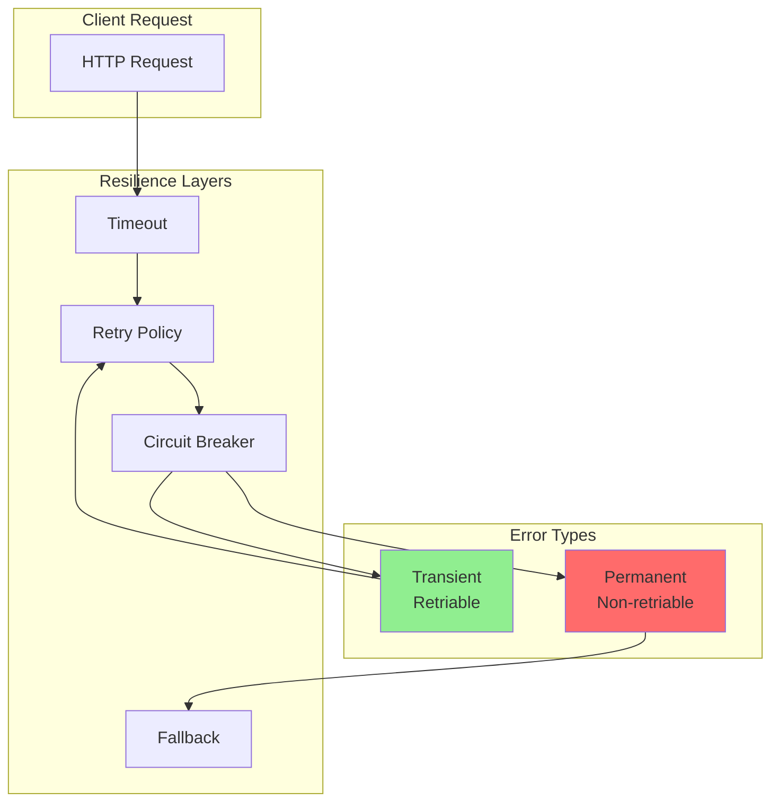

# Error Handling y Retry Policies

Estrategias completas de manejo de errores y políticas de reintentos para resiliencia de microservicios.

## Arquitectura de Resiliencia



## 1. Jerarquía de Excepciones

### Base Exception Classes

```python
# src/exceptions/base.py
from typing import Optional, Dict, Any

class ERPException(Exception):
    """Excepción base para todo el sistema ERP."""

    def __init__(
        self,
        message: str,
        code: str,
        status_code: int = 500,
        details: Optional[Dict[str, Any]] = None
    ):
        self.message = message
        self.code = code
        self.status_code = status_code
        self.details = details or {}
        super().__init__(self.message)

    def to_dict(self) -> Dict[str, Any]:
        """Convertir excepción a diccionario para respuesta."""
        return {
            "error": {
                "code": self.code,
                "message": self.message,
                "details": self.details
            }
        }

class ValidationError(ERPException):
    """Error de validación de datos."""

    def __init__(self, message: str, field: Optional[str] = None):
        super().__init__(
            message=message,
            code="VALIDATION_ERROR",
            status_code=422,
            details={"field": field} if field else {}
        )

class NotFoundError(ERPException):
    """Recurso no encontrado."""

    def __init__(self, resource: str, resource_id: str):
        super().__init__(
            message=f"{resource} not found",
            code="NOT_FOUND",
            status_code=404,
            details={
                "resource": resource,
                "resource_id": resource_id
            }
        )

class ConflictError(ERPException):
    """Conflicto de estado (e.g., duplicado)."""

    def __init__(self, message: str, conflicting_field: Optional[str] = None):
        super().__init__(
            message=message,
            code="CONFLICT",
            status_code=409,
            details={"conflicting_field": conflicting_field}
        )

class UnauthorizedError(ERPException):
    """Error de autenticación."""

    def __init__(self, message: str = "Authentication required"):
        super().__init__(
            message=message,
            code="UNAUTHORIZED",
            status_code=401
        )

class ForbiddenError(ERPException):
    """Error de autorización."""

    def __init__(self, message: str = "Access forbidden"):
        super().__init__(
            message=message,
            code="FORBIDDEN",
            status_code=403
        )
```

### Business Logic Exceptions

```python
# src/exceptions/business.py
from src.exceptions.base import ERPException

class InsufficientStockError(ERPException):
    """Stock insuficiente para operación."""

    def __init__(
        self,
        variant_id: str,
        requested: int,
        available: int
    ):
        super().__init__(
            message=f"Insufficient stock for variant {variant_id}",
            code="INSUFFICIENT_STOCK",
            status_code=409,
            details={
                "variant_id": variant_id,
                "requested": requested,
                "available": available,
                "shortage": requested - available
            }
        )
        self.variant_id = variant_id
        self.requested = requested
        self.available = available

class ReservationExpiredError(ERPException):
    """Reserva de stock expirada."""

    def __init__(self, reservation_id: str, expired_at: str):
        super().__init__(
            message=f"Reservation {reservation_id} has expired",
            code="RESERVATION_EXPIRED",
            status_code=409,
            details={
                "reservation_id": reservation_id,
                "expired_at": expired_at
            }
        )

class PaymentFailedError(ERPException):
    """Fallo en procesamiento de pago."""

    def __init__(self, reason: str, gateway_error: Optional[str] = None):
        super().__init__(
            message=f"Payment failed: {reason}",
            code="PAYMENT_FAILED",
            status_code=402,
            details={
                "reason": reason,
                "gateway_error": gateway_error
            }
        )

class InvalidStateTransitionError(ERPException):
    """Transición de estado inválida."""

    def __init__(
        self,
        resource: str,
        current_state: str,
        target_state: str
    ):
        super().__init__(
            message=f"Cannot transition {resource} from {current_state} to {target_state}",
            code="INVALID_STATE_TRANSITION",
            status_code=409,
            details={
                "resource": resource,
                "current_state": current_state,
                "target_state": target_state
            }
        )

class DuplicateSKUError(ConflictError):
    """SKU duplicado."""

    def __init__(self, sku: str):
        super().__init__(
            message=f"SKU '{sku}' already exists",
            conflicting_field="sku"
        )
        self.details["sku"] = sku
```

### Infrastructure Exceptions

```python
# src/exceptions/infrastructure.py
from src.exceptions.base import ERPException

class DatabaseError(ERPException):
    """Error de base de datos."""

    def __init__(self, operation: str, original_error: str):
        super().__init__(
            message=f"Database error during {operation}",
            code="DATABASE_ERROR",
            status_code=500,
            details={
                "operation": operation,
                "original_error": original_error
            }
        )

class CacheError(ERPException):
    """Error de cache (Redis)."""

    def __init__(self, operation: str, original_error: str):
        super().__init__(
            message=f"Cache error during {operation}",
            code="CACHE_ERROR",
            status_code=500,
            details={
                "operation": operation,
                "original_error": original_error
            }
        )

class EventPublishError(ERPException):
    """Error al publicar evento."""

    def __init__(self, event_type: str, original_error: str):
        super().__init__(
            message=f"Failed to publish event {event_type}",
            code="EVENT_PUBLISH_ERROR",
            status_code=500,
            details={
                "event_type": event_type,
                "original_error": original_error
            }
        )

class ExternalServiceError(ERPException):
    """Error en servicio externo."""

    def __init__(
        self,
        service: str,
        operation: str,
        status_code: Optional[int] = None,
        response_body: Optional[str] = None
    ):
        super().__init__(
            message=f"External service {service} failed during {operation}",
            code="EXTERNAL_SERVICE_ERROR",
            status_code=502,
            details={
                "service": service,
                "operation": operation,
                "upstream_status_code": status_code,
                "response_body": response_body
            }
        )

class CircuitBreakerOpenError(ERPException):
    """Circuit breaker abierto."""

    def __init__(self, service: str):
        super().__init__(
            message=f"Circuit breaker open for {service}",
            code="CIRCUIT_BREAKER_OPEN",
            status_code=503,
            details={"service": service}
        )
```

## 2. Exception Handler Middleware

```python
# src/middleware/exception_handler.py
from fastapi import Request, status
from fastapi.responses import JSONResponse
from fastapi.exceptions import RequestValidationError
from starlette.exceptions import HTTPException as StarletteHTTPException
import structlog
from src.exceptions.base import ERPException
from sqlalchemy.exc import IntegrityError, OperationalError

logger = structlog.get_logger(__name__)

async def erp_exception_handler(request: Request, exc: ERPException):
    """Handler para excepciones de negocio."""

    logger.warning(
        "business_exception",
        error_code=exc.code,
        error_message=exc.message,
        path=request.url.path,
        details=exc.details
    )

    return JSONResponse(
        status_code=exc.status_code,
        content=exc.to_dict()
    )

async def validation_exception_handler(
    request: Request,
    exc: RequestValidationError
):
    """Handler para errores de validación de Pydantic."""

    errors = []
    for error in exc.errors():
        errors.append({
            "field": ".".join(str(loc) for loc in error["loc"]),
            "message": error["msg"],
            "type": error["type"]
        })

    logger.warning(
        "validation_error",
        path=request.url.path,
        errors=errors
    )

    return JSONResponse(
        status_code=status.HTTP_422_UNPROCESSABLE_ENTITY,
        content={
            "error": {
                "code": "VALIDATION_ERROR",
                "message": "Request validation failed",
                "details": {"errors": errors}
            }
        }
    )

async def integrity_error_handler(request: Request, exc: IntegrityError):
    """Handler para errores de integridad de BD."""

    logger.error(
        "database_integrity_error",
        path=request.url.path,
        error=str(exc.orig),
        exc_info=True
    )

    # Intentar determinar la causa
    error_msg = str(exc.orig).lower()

    if "duplicate key" in error_msg or "unique constraint" in error_msg:
        return JSONResponse(
            status_code=status.HTTP_409_CONFLICT,
            content={
                "error": {
                    "code": "DUPLICATE_RESOURCE",
                    "message": "Resource already exists",
                    "details": {"db_error": str(exc.orig)}
                }
            }
        )

    if "foreign key" in error_msg:
        return JSONResponse(
            status_code=status.HTTP_409_CONFLICT,
            content={
                "error": {
                    "code": "INVALID_REFERENCE",
                    "message": "Referenced resource does not exist",
                    "details": {"db_error": str(exc.orig)}
                }
            }
        )

    # Error genérico de integridad
    return JSONResponse(
        status_code=status.HTTP_500_INTERNAL_SERVER_ERROR,
        content={
            "error": {
                "code": "DATABASE_ERROR",
                "message": "Database integrity error"
            }
        }
    )

async def operational_error_handler(request: Request, exc: OperationalError):
    """Handler para errores operacionales de BD."""

    logger.error(
        "database_operational_error",
        path=request.url.path,
        error=str(exc.orig),
        exc_info=True
    )

    return JSONResponse(
        status_code=status.HTTP_503_SERVICE_UNAVAILABLE,
        content={
            "error": {
                "code": "DATABASE_UNAVAILABLE",
                "message": "Database is temporarily unavailable"
            }
        }
    )

async def generic_exception_handler(request: Request, exc: Exception):
    """Handler genérico para excepciones no capturadas."""

    logger.error(
        "unhandled_exception",
        path=request.url.path,
        error=str(exc),
        error_type=type(exc).__name__,
        exc_info=True
    )

    return JSONResponse(
        status_code=status.HTTP_500_INTERNAL_SERVER_ERROR,
        content={
            "error": {
                "code": "INTERNAL_ERROR",
                "message": "An internal error occurred"
            }
        }
    )

# Registrar handlers en FastAPI
def register_exception_handlers(app):
    """Registrar todos los exception handlers."""

    app.add_exception_handler(ERPException, erp_exception_handler)
    app.add_exception_handler(RequestValidationError, validation_exception_handler)
    app.add_exception_handler(IntegrityError, integrity_error_handler)
    app.add_exception_handler(OperationalError, operational_error_handler)
    app.add_exception_handler(Exception, generic_exception_handler)
```

## 3. Retry Policies

### Retry Decorator con Tenacity

```python
# src/retry.py
from tenacity import (
    retry,
    stop_after_attempt,
    wait_exponential,
    retry_if_exception_type,
    retry_if_exception,
    before_sleep_log,
    after_log
)
import structlog
from typing import Callable

logger = structlog.get_logger(__name__)

# Determinar si excepción es retriable
def is_retriable_error(exception: Exception) -> bool:
    """Determinar si error es retriable."""

    # Errores de red/timeout siempre retriables
    if isinstance(exception, (
        ConnectionError,
        TimeoutError,
        OSError
    )):
        return True

    # Errores de BD transitorios
    from sqlalchemy.exc import OperationalError, DBAPIError
    if isinstance(exception, (OperationalError, DBAPIError)):
        return True

    # Errores de cache
    from src.exceptions.infrastructure import CacheError
    if isinstance(exception, CacheError):
        return True

    # Errores HTTP 5xx (server errors)
    if hasattr(exception, 'status_code'):
        return 500 <= exception.status_code < 600

    return False

# Retry policy para operaciones de BD
retry_database = retry(
    stop=stop_after_attempt(3),
    wait=wait_exponential(multiplier=1, min=1, max=10),
    retry=retry_if_exception(is_retriable_error),
    before_sleep=before_sleep_log(logger, logging.WARNING),
    after=after_log(logger, logging.INFO)
)

# Retry policy para llamadas externas
retry_external_call = retry(
    stop=stop_after_attempt(5),
    wait=wait_exponential(multiplier=2, min=2, max=60),
    retry=retry_if_exception(is_retriable_error),
    before_sleep=before_sleep_log(logger, logging.WARNING)
)

# Retry policy para eventos
retry_event_publish = retry(
    stop=stop_after_attempt(3),
    wait=wait_exponential(multiplier=1, min=1, max=5),
    retry=retry_if_exception_type((
        ConnectionError,
        TimeoutError
    )),
    before_sleep=before_sleep_log(logger, logging.WARNING)
)

# Retry policy para cache
retry_cache = retry(
    stop=stop_after_attempt(2),
    wait=wait_exponential(multiplier=0.5, min=0.5, max=2),
    retry=retry_if_exception_type((
        ConnectionError,
        TimeoutError
    ))
)
```

### Uso de Retry Policies

```python
# src/services/product_service.py
from src.retry import retry_database, retry_cache, retry_event_publish
import structlog

logger = structlog.get_logger(__name__)

class ProductService:
    """Servicio con retry policies."""

    @retry_database
    async def get_product(
        self,
        product_id: str,
        organization_id: str
    ) -> Product:
        """Obtener producto con retry en BD."""

        logger.info(
            "fetching_product",
            product_id=product_id,
            organization_id=organization_id
        )

        # Esta operación se reintentará automáticamente
        # si hay errores transitorios de BD
        product = await self.repo.get_by_id(
            product_id,
            organization_id
        )

        if not product:
            raise NotFoundError("Product", product_id)

        return product

    async def create_product(
        self,
        organization_id: str,
        product_data: dict
    ) -> Product:
        """Crear producto con retry en operaciones fallibles."""

        # 1. DB operation con retry
        product = await self._create_in_database(organization_id, product_data)

        # 2. Cache invalidation con retry
        await self._invalidate_cache(organization_id)

        # 3. Event publishing con retry
        await self._publish_product_created_event(product)

        return product

    @retry_database
    async def _create_in_database(
        self,
        organization_id: str,
        product_data: dict
    ) -> Product:
        """Crear producto en BD con retry."""
        return await self.repo.create({
            **product_data,
            "organization_id": organization_id
        })

    @retry_cache
    async def _invalidate_cache(self, organization_id: str) -> None:
        """Invalidar cache con retry."""
        try:
            await self.cache.invalidate_pattern(f"org:{organization_id}:products:*")
        except Exception as e:
            # Si cache falla después de retries, log pero no fallar
            logger.warning(
                "cache_invalidation_failed",
                organization_id=organization_id,
                error=str(e)
            )

    @retry_event_publish
    async def _publish_product_created_event(self, product: Product) -> None:
        """Publicar evento con retry."""
        await self.event_publisher.publish(
            exchange="catalog.events",
            routing_key="product.created",
            event=ProductCreatedEvent.from_orm(product)
        )
```

## 4. Circuit Breaker

### Implementación con pybreaker

```python
# src/circuit_breaker.py
from pybreaker import CircuitBreaker, CircuitBreakerError
import structlog
from typing import Callable

logger = structlog.get_logger(__name__)

# Circuit breaker para llamadas gRPC a Inventory
inventory_circuit_breaker = CircuitBreaker(
    fail_max=5,  # Abrir después de 5 fallos
    reset_timeout=60,  # Intentar cerrar después de 60s
    exclude=[
        # No contar estos errores
        NotFoundError,
        ValidationError
    ],
    name="inventory_grpc"
)

# Circuit breaker para llamadas a Stripe
payment_gateway_circuit_breaker = CircuitBreaker(
    fail_max=3,
    reset_timeout=120,
    name="stripe_api"
)

# Circuit breaker para base de datos
database_circuit_breaker = CircuitBreaker(
    fail_max=10,
    reset_timeout=30,
    name="database"
)

# Listeners para logging
def on_circuit_open(breaker, error):
    """Callback cuando circuit se abre."""
    logger.error(
        "circuit_breaker_opened",
        breaker_name=breaker.name,
        error=str(error)
    )

def on_circuit_close(breaker):
    """Callback cuando circuit se cierra."""
    logger.info(
        "circuit_breaker_closed",
        breaker_name=breaker.name
    )

def on_circuit_half_open(breaker):
    """Callback cuando circuit entra en half-open."""
    logger.warning(
        "circuit_breaker_half_open",
        breaker_name=breaker.name
    )

# Registrar listeners
for breaker in [
    inventory_circuit_breaker,
    payment_gateway_circuit_breaker,
    database_circuit_breaker
]:
    breaker.add_listener(on_circuit_open)
    breaker.add_listener(on_circuit_close)
    breaker.add_listener(on_circuit_half_open)
```

### Uso de Circuit Breaker

```python
# src/grpc/inventory_client.py
from src.circuit_breaker import inventory_circuit_breaker
from src.exceptions.infrastructure import CircuitBreakerOpenError
from pybreaker import CircuitBreakerError

class InventoryGRPCClient:
    """Cliente gRPC con circuit breaker."""

    async def reserve_stock(
        self,
        organization_id: str,
        order_id: str,
        items: list
    ):
        """Reservar stock con circuit breaker."""

        try:
            # Envolver llamada con circuit breaker
            return await inventory_circuit_breaker.call(
                self._reserve_stock_internal,
                organization_id,
                order_id,
                items
            )

        except CircuitBreakerError:
            # Circuit abierto - usar fallback
            logger.warning(
                "inventory_circuit_open_using_fallback",
                organization_id=organization_id,
                order_id=order_id
            )

            raise CircuitBreakerOpenError("inventory-service")

    async def _reserve_stock_internal(
        self,
        organization_id: str,
        order_id: str,
        items: list
    ):
        """Implementación real de reserva."""

        async with grpc.aio.insecure_channel(
            f"{self.host}:{self.port}"
        ) as channel:
            stub = inventory_pb2_grpc.InventoryServiceStub(channel)

            request = inventory_pb2.ReserveStockRequest(
                organization_id=organization_id,
                order_id=order_id,
                items=[
                    inventory_pb2.ReserveItem(
                        variant_id=item["variant_id"],
                        quantity=item["quantity"]
                    )
                    for item in items
                ]
            )

            response = await stub.ReserveStock(request, timeout=5.0)

            return response

# src/services/order_service.py
from src.exceptions.infrastructure import CircuitBreakerOpenError

class OrderService:
    """Servicio con manejo de circuit breaker."""

    async def create_order(
        self,
        organization_id: str,
        order_data: dict
    ) -> Order:
        """Crear orden con fallback si inventory no disponible."""

        # Crear orden en BD
        order = await self.repo.create(order_data)

        try:
            # Intentar reservar stock
            reservation = await self.inventory_client.reserve_stock(
                organization_id=organization_id,
                order_id=order.order_id,
                items=order_data["items"]
            )

            # Actualizar orden con reservation_id
            order.reservation_id = reservation.reservation_id
            await self.repo.update(order)

        except CircuitBreakerOpenError:
            # Inventory no disponible - marcar orden como "pending_stock"
            logger.warning(
                "order_created_without_reservation",
                order_id=order.order_id,
                reason="inventory_circuit_open"
            )

            order.status = "pending_stock"
            order.notes = "Stock reservation pending - inventory service unavailable"
            await self.repo.update(order)

            # Publicar evento para retry asíncrono
            await self.event_publisher.publish(
                OrderCreatedWithoutReservationEvent(
                    order_id=order.order_id,
                    organization_id=organization_id,
                    items=order_data["items"]
                )
            )

        return order
```

## 5. Timeouts

### Configuración de Timeouts

```python
# src/config.py
from pydantic_settings import BaseSettings

class Settings(BaseSettings):
    """Configuración con timeouts."""

    # HTTP client timeouts
    HTTP_CONNECT_TIMEOUT: float = 5.0
    HTTP_READ_TIMEOUT: float = 30.0
    HTTP_TOTAL_TIMEOUT: float = 60.0

    # gRPC timeouts
    GRPC_CALL_TIMEOUT: float = 10.0
    GRPC_CONNECTION_TIMEOUT: float = 5.0

    # Database timeouts
    DB_CONNECTION_TIMEOUT: float = 10.0
    DB_QUERY_TIMEOUT: float = 30.0

    # Redis timeouts
    REDIS_SOCKET_TIMEOUT: float = 5.0
    REDIS_SOCKET_CONNECT_TIMEOUT: float = 3.0

    # RabbitMQ timeouts
    RABBITMQ_CONNECTION_TIMEOUT: float = 10.0
    RABBITMQ_HEARTBEAT: int = 60

settings = Settings()
```

### Aplicar Timeouts

```python
# src/database.py
from sqlalchemy.ext.asyncio import create_async_engine
from src.config import settings

engine = create_async_engine(
    settings.DATABASE_URL,
    connect_args={
        "timeout": settings.DB_CONNECTION_TIMEOUT,
        "command_timeout": settings.DB_QUERY_TIMEOUT
    },
    pool_pre_ping=True,  # Verificar conexiones antes de usar
    pool_recycle=3600    # Reciclar conexiones cada hora
)

# src/cache.py
import redis.asyncio as redis

redis_client = redis.from_url(
    settings.REDIS_URL,
    socket_timeout=settings.REDIS_SOCKET_TIMEOUT,
    socket_connect_timeout=settings.REDIS_SOCKET_CONNECT_TIMEOUT,
    retry_on_timeout=True,
    health_check_interval=30
)

# src/grpc/client.py
import grpc

class InventoryGRPCClient:
    """Cliente gRPC con timeouts."""

    async def reserve_stock(self, organization_id: str, order_id: str, items: list):
        """Reservar con timeout."""

        async with grpc.aio.insecure_channel(
            f"{self.host}:{self.port}",
            options=[
                ('grpc.keepalive_time_ms', 10000),
                ('grpc.keepalive_timeout_ms', 5000),
                ('grpc.http2.max_pings_without_data', 0),
            ]
        ) as channel:
            stub = inventory_pb2_grpc.InventoryServiceStub(channel)

            # Timeout específico para esta operación
            response = await stub.ReserveStock(
                request,
                timeout=settings.GRPC_CALL_TIMEOUT
            )

            return response

# src/http_client.py
import httpx
from src.config import settings

async def create_http_client() -> httpx.AsyncClient:
    """Crear cliente HTTP con timeouts."""

    timeout = httpx.Timeout(
        connect=settings.HTTP_CONNECT_TIMEOUT,
        read=settings.HTTP_READ_TIMEOUT,
        write=10.0,
        pool=5.0
    )

    return httpx.AsyncClient(
        timeout=timeout,
        limits=httpx.Limits(
            max_connections=100,
            max_keepalive_connections=20
        )
    )
```

## 6. Graceful Degradation

### Fallback Strategies

```python
# src/services/catalog_service.py
import structlog

logger = structlog.get_logger(__name__)

class CatalogService:
    """Servicio con graceful degradation."""

    async def get_product_with_stock(
        self,
        product_id: str,
        organization_id: str
    ) -> dict:
        """Obtener producto con información de stock (best effort)."""

        # 1. Obtener producto (critical)
        product = await self.product_repo.get_by_id(
            product_id,
            organization_id
        )

        if not product:
            raise NotFoundError("Product", product_id)

        product_dict = product.to_dict()

        # 2. Intentar obtener stock (optional - con fallback)
        try:
            stock_info = await self._get_stock_info(product_id)
            product_dict["stock"] = stock_info

        except CircuitBreakerOpenError:
            logger.warning(
                "stock_unavailable_circuit_open",
                product_id=product_id
            )
            product_dict["stock"] = {
                "available": None,
                "status": "unavailable"
            }

        except Exception as e:
            logger.error(
                "stock_fetch_failed",
                product_id=product_id,
                error=str(e)
            )
            product_dict["stock"] = {
                "available": None,
                "status": "error"
            }

        # 3. Intentar obtener precios dinámicos (optional)
        try:
            pricing = await self._get_dynamic_pricing(product_id)
            product_dict["pricing"] = pricing

        except Exception as e:
            logger.warning(
                "dynamic_pricing_failed_using_base_price",
                product_id=product_id,
                error=str(e)
            )
            # Fallback a precio base
            product_dict["pricing"] = {
                "price": product.base_price,
                "type": "base"
            }

        return product_dict

    @inventory_circuit_breaker
    async def _get_stock_info(self, product_id: str) -> dict:
        """Obtener info de stock (con circuit breaker)."""
        return await self.inventory_client.get_stock(product_id)
```

### Cache como Fallback

```python
# src/services/product_service.py
class ProductService:
    """Servicio con cache como fallback."""

    async def get_product(
        self,
        product_id: str,
        organization_id: str
    ) -> Product:
        """Obtener producto con cache fallback."""

        # 1. Intentar cache primero
        try:
            cached = await self.cache.get_product(product_id)
            if cached:
                logger.info("product_served_from_cache", product_id=product_id)
                return Product(**cached)

        except Exception as e:
            logger.warning(
                "cache_read_failed",
                product_id=product_id,
                error=str(e)
            )

        # 2. Obtener de BD
        try:
            product = await self.repo.get_by_id(product_id, organization_id)

            if not product:
                raise NotFoundError("Product", product_id)

            # 3. Actualizar cache (best effort)
            try:
                await self.cache.set_product(
                    product_id,
                    product.to_dict(),
                    ttl=3600
                )
            except Exception as e:
                logger.warning(
                    "cache_write_failed",
                    product_id=product_id,
                    error=str(e)
                )

            return product

        except OperationalError as e:
            # BD no disponible - intentar servir desde cache stale
            logger.error(
                "database_unavailable_attempting_stale_cache",
                product_id=product_id,
                error=str(e)
            )

            try:
                # Intentar cache sin TTL check
                stale_cached = await self.cache.get_product(
                    product_id,
                    allow_stale=True
                )

                if stale_cached:
                    logger.warning(
                        "serving_stale_cache_data",
                        product_id=product_id
                    )
                    return Product(**stale_cached)

            except Exception:
                pass

            # Sin fallback disponible
            raise DatabaseError("get_product", str(e))
```

## 7. Dead Letter Queue

### Configuración DLQ

```python
# src/events/setup.py
import aio_pika

async def setup_event_queues(channel: aio_pika.Channel):
    """Configurar queues con DLQ."""

    # Dead Letter Exchange
    dlx = await channel.declare_exchange(
        "dlx.events",
        aio_pika.ExchangeType.TOPIC,
        durable=True
    )

    # Dead Letter Queue
    dlq = await channel.declare_queue(
        "dlq.events",
        durable=True
    )

    await dlq.bind(dlx, routing_key="#")

    # Main exchange
    exchange = await channel.declare_exchange(
        "order.events",
        aio_pika.ExchangeType.TOPIC,
        durable=True
    )

    # Queue con DLQ configurado
    queue = await channel.declare_queue(
        "order.created.inventory",
        durable=True,
        arguments={
            # Enviar a DLX después de rechazar
            "x-dead-letter-exchange": "dlx.events",
            "x-dead-letter-routing-key": "order.created.failed",

            # Max retries antes de DLQ
            "x-max-delivery-count": 3,

            # TTL para mensajes (opcional)
            "x-message-ttl": 3600000  # 1 hora
        }
    )

    await queue.bind(exchange, routing_key="order.created")

    return queue
```

### Consumer con DLQ

```python
# src/events/consumer.py
import aio_pika

class EventConsumer:
    """Consumer que envía mensajes fallidos a DLQ."""

    async def handle_message(
        self,
        message: aio_pika.IncomingMessage
    ) -> None:
        """Procesar mensaje con manejo de DLQ."""

        try:
            # Extraer datos
            event_data = json.loads(message.body)

            # Procesar
            await self._process_event(event_data)

            # ACK si exitoso
            await message.ack()

        except Exception as e:
            logger.error(
                "event_processing_failed",
                event_id=event_data.get("event_id"),
                error=str(e),
                delivery_count=message.headers.get("x-delivery-count", 0),
                exc_info=True
            )

            # NACK - será reencolado o enviado a DLQ
            # según x-max-delivery-count
            await message.nack(requeue=True)
```

## Próximos Pasos

- [Circuit Breaker Patterns](/resiliencia/circuit-breaker)
- [Chaos Engineering](/resiliencia/chaos-engineering)
- [Disaster Recovery](/resiliencia/disaster-recovery)
